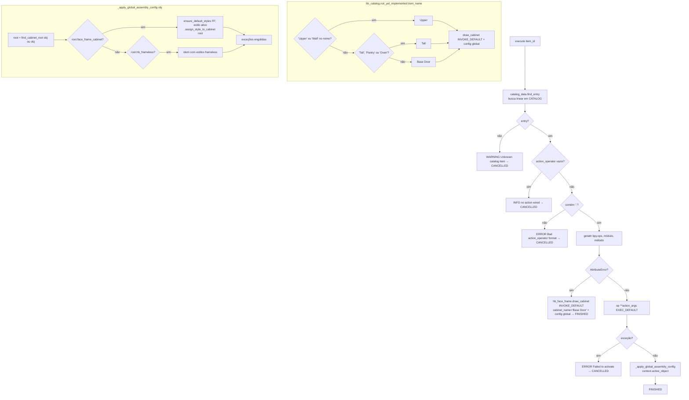

# `hb_catalog.activate_item` — item do catálogo → produto na cena

Local: `blendertomob/catalog/ops_catalog.py:45` (operador), `:16` (`_apply_global_assembly_config`), `:89` (`not_yet_implemented`).

## Explicação

- 🟢 Cada entrada do catálogo carrega `action_operator` + `action_args`; o operador faz despacho dinâmico em `bpy.ops` — `ops_catalog.py:59-80`.
- 🟢 Entradas `_todo(...)` apontam para `hb_catalog.not_yet_implemented`, que coloca um armário face frame genérico mapeado por palavras-chave do nome — `catalog_data.py:37-42`, `ops_catalog.py:99-108`.
- 🟢 `hb_face_frame.draw_cabinet.execute` apenas dispara modais `INVOKE_DEFAULT` (`place_cabinet`, `place_corner_cabinet`, `place_appliance`) e retorna FINISHED imediatamente — `product_libraries/face_frame/operators/ops_cabinet.py:37-68`.
- 🟡 Consequência: `_apply_global_assembly_config(context.active_object)` roda **antes** do usuário confirmar o posicionamento no modal, sobre o objeto ativo anterior (ou sobre o cabinet-preview, dependendo de como o modal cria o objeto) — possível aplicação de estilo no objeto errado.
- 🟡 `getattr(bpy.ops.<mod>, <op>)` em geral não levanta `AttributeError` para operadores inexistentes (o erro surge na chamada), então o ramo de fallback é provavelmente inalcançável; um operador inexistente cai no `except Exception` → CANCELLED.
