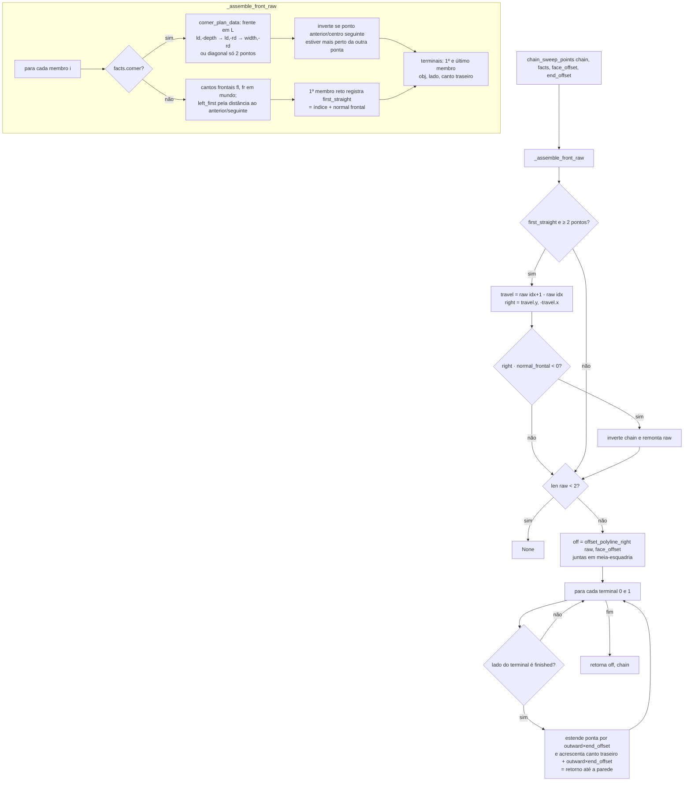

# `engine.chain_sweep_points` — caminho de crown / light rail / cap

Local: `blendertomob/molding/engine.py:348` (auxiliares `_assemble_front_raw` em `:260`, `offset_polyline_right` em `:159`, `corner_plan_data` em `:231`).

## Explicação

1. 🟢 Monta uma polilinha "crua" pelas frentes dos membros em ordem de cadeia. Membros de canto (L) contribuem com a frente do nicho (3 pontos) ou a diagonal (2 pontos) — `engine.py:241-253`. Sem `ld`/`rd`, assume 24" (`engine.py:241-242`).
2. 🟢 **Normalização de sentido**: o engine sempre desloca "à direita do percurso"; se a direita do primeiro trecho reto apontar para trás (produto escalar negativo com a normal frontal `-Y` local), a cadeia é invertida — `engine.py:355-364`.
3. 🟢 `offset_polyline_right` calcula a interseção das linhas deslocadas de trechos consecutivos (`t = ((p2-p1)×d2)/(d1×d2)`); trechos paralelos (|cross| < 1e-6) recebem dois pontos (degrau) — `engine.py:176-185`.
4. 🟢 **Retornos em laterais acabadas**: apenas se `facts['finished_left'|'finished_right']` do membro terminal for True, a moldura contorna a extremidade até o canto traseiro da caixa; caso contrário termina rente — `engine.py:371-387`.
5. 🟡 `end_offset` é sempre chamado com o mesmo valor de `face_offset` (dx da pilha) em `ops.py:212`, então o retorno fica alinhado ao deslocamento frontal da peça.
