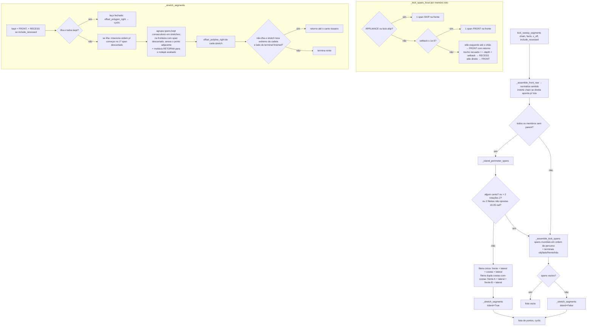

# `engine.kick_sweep_segments` — rodapé (base molding) por spans de rodapé

Local: `blendertomob/molding/engine.py:711`; auxiliares `_kick_spans_local` (`:395`), `_assemble_kick_spans` (`:425`), `_island_perimeter_spans` (`:613`), `_stretch_segments` (`:531`), `offset_polygon_right` (`:195`).

## Explicação

- 🟢 **Três tipos de span**: `FRONT` sempre recebe moldura; `RECESS` (rodapé recuado entre stiles) só com `include_recessed`; `SKIP` (eletrodomésticos, `RefrigeratorCabinet`, `kick.skip`) nunca — `engine.py:395-422`, `adapters.py:182-183`.
- 🟢 **Stiles até o chão** (face frame com rodapé `NOTCH`/`LOOSE`/`FLOATING`): cada stile vira um span FRONT em "L" que inclui o retorno lateral até o plano recuado — `engine.py:416-421`, `adapters.py:73`.
- 🟢 **Ilhas**: se nenhum membro da cadeia tem `parent` (não está preso a parede), tenta-se o perímetro; dupla fileira exige diferença de rotação Z ≈ π (tolerância 0,05) — `engine.py:622-631`, `engine.py:726-730`. 🟡 A heurística "sem parent = ilha" pode classificar corridas encostadas em parede mas não parentadas como ilha.
- 🟢 Cantos em L com setback têm a frente deslocada para dentro (`offset_polyline_right(local_pts, -setback)`) e viram `RECESS` — `engine.py:456-459`.
- 🟢 Eletrodomésticos de piso ("bridges") entram na cadeia para manter a corrida contínua mas geram span SKIP, forçando retornos dos dois lados — `adapters.py:55-66`, `ops.py:195-197`.
