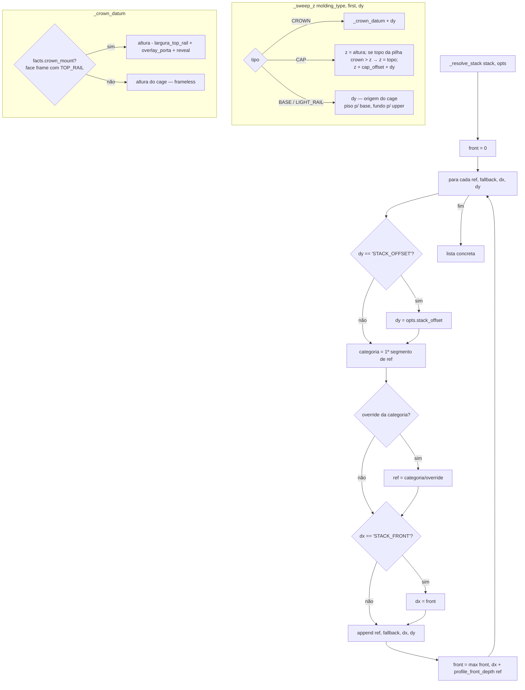

# `ops._resolve_stack` + `_sweep_z` — pilhas de moldura e cotas verticais

Local: `blendertomob/molding/ops.py:46` (`_resolve_stack`), `:75` (`_crown_datum`), `:88` (`_crown_stack_top`), `:106` (`_sweep_z`), `:226` (`_base_stack`); métricas de perfil em `blendertomob/molding/packages.py:278`.

## Explicação

- 🟢 **Sentinelas**: `STACK_OFFSET` (dy) vira a altura ajustável `molding_crown_stack_offset` (padrão 3,5"); `STACK_FRONT` (dx) vira a "frente acumulada" das entradas anteriores, i.e. `max(dx + espessura medida)` — permite crown montada sobre spacer e base shoe na face do rodapé — `ops.py:58-72`.
- 🟢 **Métricas de perfil** `(top, depth)`: `top = max(Y)`, `depth = max(X) - min(X)` do contorno; carregadas de um `.blend` de pack (append temporário e remoção) ou do contorno embutido, com cache por `profile_ref` — `packages.py:262-311`. 🟡 A chave do cache é só `profile_ref`, ignorando `fallback_key`.
- 🟢 **Datum da crown** (face frame): `altura - TOP_RAIL.Width + max(default_top_overlay,0) + molding_crown_reveal` (reveal padrão 0,625") — `ops.py:80-85`, `adapters.py:199-207`, `hb_props.py:520-525`.
- 🟢 **Furniture cap**: nunca abaixo do topo do cage; sobe até o topo da pilha crown ativa (datum + dy + altura do perfil mais alto), depois soma `molding_cap_offset` — `ops.py:88-122`.
- 🟢 **Base**: override `molding_base_profile` aplica-se a refs da categoria `Base Molding`; base shoe é anexada com `STACK_FRONT` mesmo sem pacote (frente acumulada 0 → rente à face do rodapé) — `ops.py:226-243`, `ops.py:284-287`.
