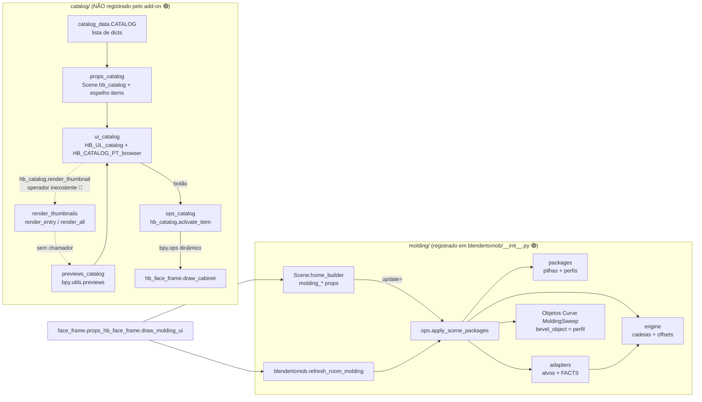
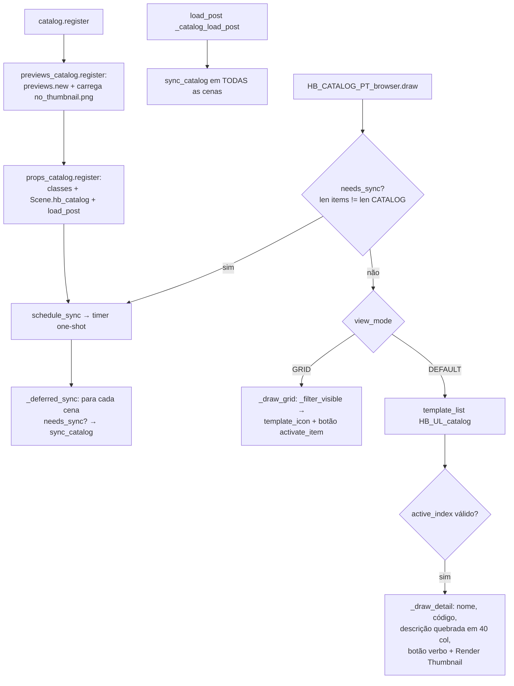
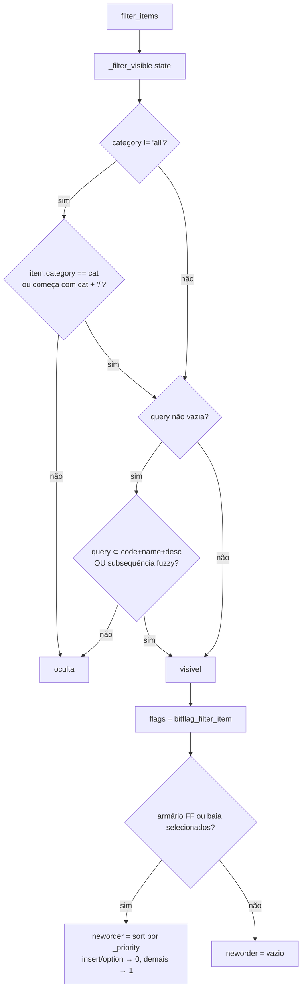
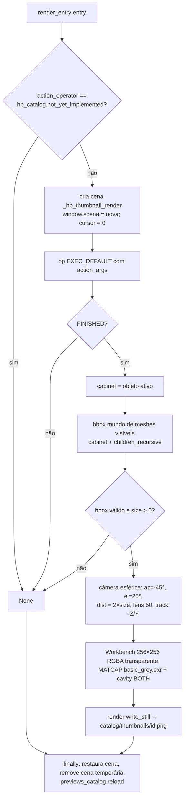
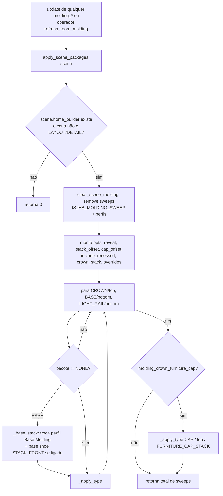
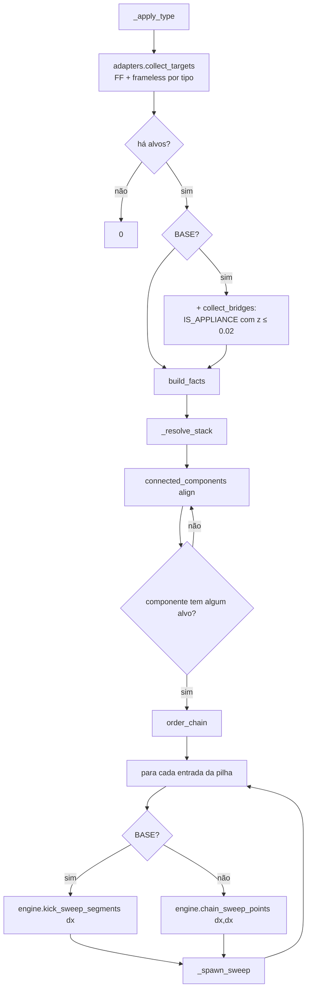
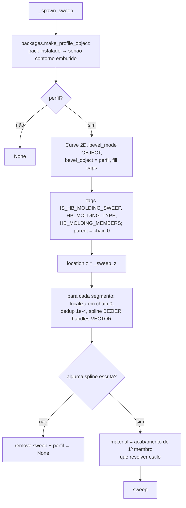

# Fluxogramas — módulo legado `catalog_molding`

> Camada legada (herdada do Home Builder 5). Pacotes: `blendertomob/catalog/` e `blendertomob/molding/`.
> Legenda: 🟢 CONFIRMADO (lido no código) · 🟡 INFERIDO · 🔴 LACUNA

## 1. Visão geral do módulo

## 2. Ciclo de vida do catálogo (register → sync → draw)

## 3. Filtro e ordenação da lista (`HB_UL_catalog.filter_items`)

## 4. Render de thumbnail (`render_thumbnails.render_entry`)

## 5. Aplicação de pacotes de moldura (visão geral)

## 6. `_apply_type` — de cabinets a sweeps

## 7. `_spawn_sweep` — criação do objeto curva

