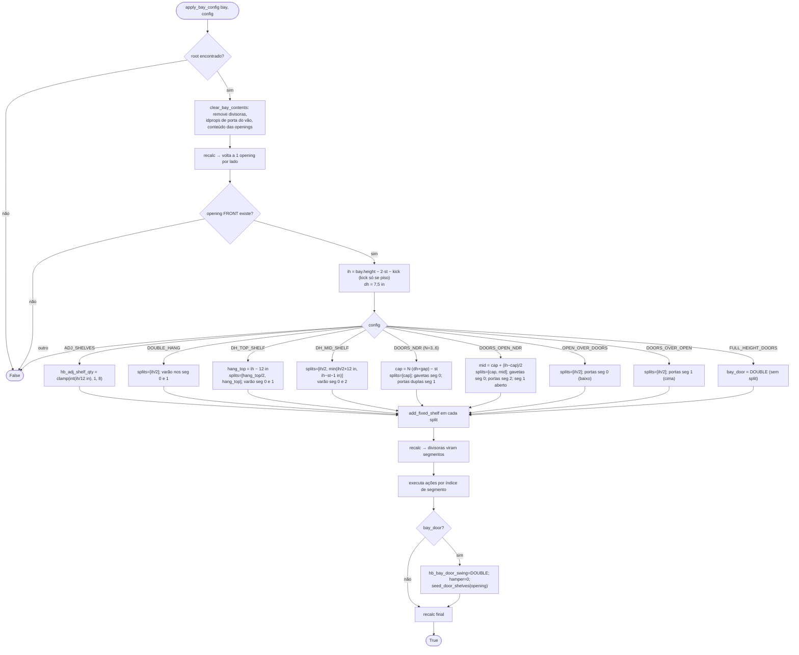

# `apply_bay_config` — presets "Change Bay" (configurações padrão de vão)

> Arquivo: `blendertomob/product_libraries/closets/types_closets.py:2117-2222` (catálogo `BAY_CONFIG_GROUPS :2065-2082`).
> Chamado por `hb_closets.change_bay` (`operators/ops_closet.py:2066-2108`) para cada vão selecionado.
> Confiança geral: 🟢 CONFIRMADO.

## Fluxograma

## Ações de segmento 🟢

| Ação | Efeito | Local |
|---|---|---|
| `_cfg_rod` | varão a 2,5 in abaixo do topo do segmento, ancorado no topo | `:2102-2103` |
| `_cfg_doors` | porta DOUBLE, não-basculante, semeia reguláveis (`seed_door_shelves`) | `:2106-2109` |
| `_cfg_hamper` | porta LEFT basculante (definida, sem uso no catálogo atual 🟡) | `:2112-2114` |
| `_cfg_drawers` | `hb_drawer_qty = N`, `hb_drawer_front_height = 7,5 in` | `:2175-2177` |

`seed_door_shelves` (`:2085-2099`): só semeia se a opening estiver vazia (sem reguláveis, gavetas, nichos ou varão); qtd =
`clamp(int(interior_h / 12 in), 1, 12)` (`default_adj_shelf_qty :1867-1875`).

## Observações

- 🟡 "Doors Open N Drawers" (`DOORS_OPEN_*`) **não** abre as portas: cria 3 segmentos (gavetas / vão aberto / portas). O comentário
  "same build with the doors shown open" (`:2142-2143`) diverge da implementação.
- 🟢 A regra de 12 in (≈305 mm) por prateleira regulável e a faixa de 12 in acima dos varões são convenções do mercado americano.
- 🟢 Cada split é escrito em Z do interior do vão (`hb_z_offset` a partir de `interior_z`); o *snap* 32 mm **não** é aplicado aqui
  (só no modal `add_part` e no *grab*).
