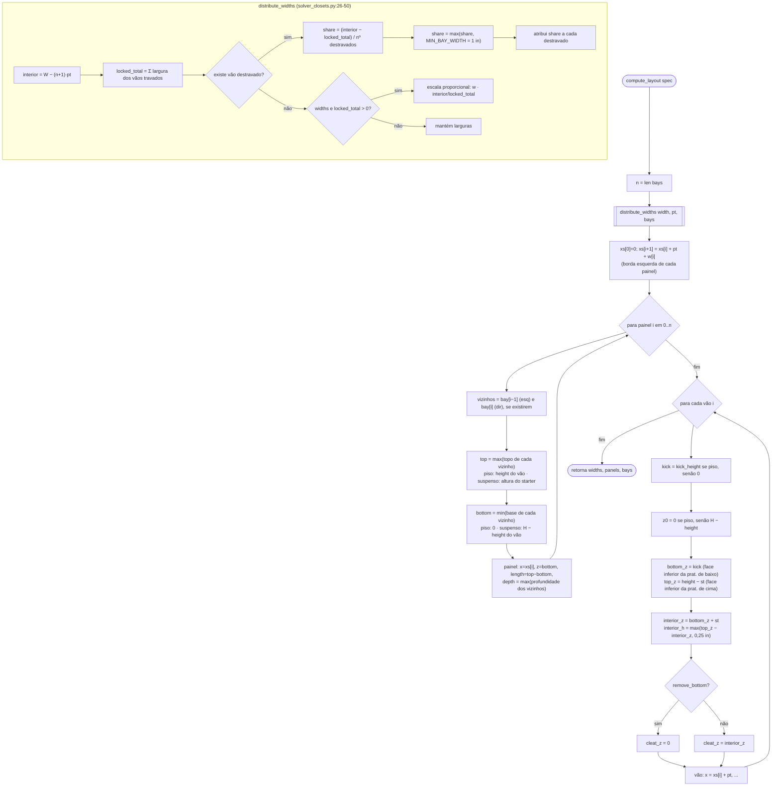

# `solver_closets.compute_layout` + `distribute_widths` — solver de distribuição de painéis e vãos

> Arquivo: `blendertomob/product_libraries/closets/solver_closets.py` (126 linhas, **sem `bpy`**, recarregável a quente).
> Chamado por `ClosetStarter.recalculate()` (`types_closets.py:492`) com o spec montado em `_spec_from_props` (`types_closets.py:434-456`).
> Confiança geral: 🟢 CONFIRMADO (lido linha a linha).

## Entrada / saída

| Campo | Origem | Significado |
|---|---|---|
| `spec.width` | `hb_closet_starter.width` | largura total do starter (m) |
| `spec.height` | `hb_closet_starter.height` | altura do envelope (piso → topo do módulo) |
| `spec.pt` / `spec.st` | `Scene.hb_closets.panel_thickness` / `shelf_thickness` | espessura de painel / prateleira (default 0,75 in = 19,05 mm) |
| `spec.kick_height` | `hb_closet_starter.toe_kick_height` | altura do rodapé |
| `spec.kick_setback` | idem | **não usado pelo solver** (usado só em `types_closets`) |
| `spec.bays[i]` | `hb_closet_bay` | `width, locked, height, depth, floor, remove_bottom, remove_cleat` |

Saída: `{'widths': [...], 'panels': [{x, z, length, depth}], 'bays': [{x, z0, width, height, depth, kick, floor, bottom_z, top_z, cleat_z, interior_z, interior_h}]}`.

## Fluxograma

## Regras embutidas

1. **Painéis compartilhados** 🟢 (`solver_closets.py:85-97`): painel *i* é o painel ESQUERDO do vão *i*; N vãos → N+1 painéis. Um painel entre um vão de piso e um vão suspenso vai do piso ao topo (altura máxima envolvente); profundidade = maior dos vizinhos.
2. **Redistribuição de largura** 🟢: vãos destravados dividem igualmente o que sobra; valor mínimo 1 in (25,4 mm). Com o mínimo ativado a soma **não fecha** e os painéis ultrapassam a largura do starter ("degrada visivelmente", docstring `:30-32`).
3. **Todos travados** 🟢 (`:44-49`): escala proporcional para fechar na largura total. Caso degenerado `locked_total == 0` (todos travados com largura 0) mantém larguras sem ajuste 🟡.
4. **Vão de piso vs. suspenso** 🟢: o envelope de um vão de piso começa no piso (o rodapé fica dentro do envelope); o suspenso é ancorado no topo do starter (`z0 = H − height`).
5. **Altura interna** 🟢: `interior_h = height − kick − 2·st`, piso em 0,25 in (6,35 mm) para evitar valores negativos.
6. **Cleat** 🟢: acompanha a prateleira inferior; sem prateleira inferior desce para a base do envelope.

## Exemplo numérico (Base default) 🟢/🟡

W = 80 in (2032 mm), 2 vãos (placement usa `auto_bay_qty(80in) = ceil(80/42) = 2`, `types_closets.py:1749-1754`), pt = 19,05 mm:
`interior = 2032 − 3·19,05 = 1974,85 mm` → cada vão 987,4 mm. H = 819 mm, kick = 96 mm:
`bottom_z = 96`, `interior_z = 115,05`, `top_z = 799,95`, `interior_h = 684,9 mm`.
