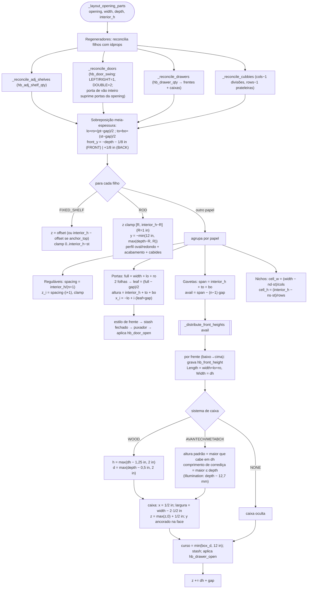

# `ClosetStarter._layout_opening_parts` — portas, gavetas, prateleiras, varões e nichos

> Arquivo: `blendertomob/product_libraries/closets/types_closets.py:691-904` (+ regeneradores `:1011-1183`,
> `_distribute_front_heights :1813-1831`, `drawer_boxes_closets.size_box :65-85`, `_position_front_pull :908-1009`).
> Confiança geral: 🟢 CONFIRMADO.

## Fluxograma

## `_distribute_front_heights` 🟢 `types_closets.py:1813-1831`

- Frentes travadas (`hb_front_locked=1`) mantêm a altura; destravadas dividem `avail − Σ travadas` igualmente, com mínimo **2 in (50,8 mm)**.
- Todas travadas → escala proporcional para caber em `avail` (análogo vertical de `distribute_widths`).

## Regra derivada: gaveteiro "fechado" por prateleira 🟢

`add_drawers` (`operators/ops_closet.py:1954-1974`) e `apply_bay_config` (`types_closets.py:2138-2140`) colocam a prateleira de
tampa em `cap = qty·(fh + gap) − st`. Substituindo no layout: `span = cap + (st − gap)`, `avail = span − (qty−1)·gap = qty·fh`
→ cada frente sai exatamente com `fh` (7,5 in por padrão). O idprop `hb_drawer_front_height` **não** dimensiona as frentes
diretamente; só posiciona a tampa.

## Puxadores (`_position_front_pull`) 🟢 `types_closets.py:908-1009`

| Tipo | X | Y (na frente) | Rotação |
|---|---|---|---|
| gaveta | centro | centro (`center_pulls_on_drawer_front`) ou `altura − 1,5 in − meia-barra` | (−90°,0,0) |
| basculante (hamper) | centro | `altura − 1,5 in − meia-barra` | (−90°,0,0) |
| porta | lado oposto à dobradiça: `offset` = meia largura do montante (5 peças) ou 2 in | regra Base/Tall/Upper referida ao piso (abaixo) | (−90°,0,90°) |

Regra de altura da porta: alvo = 45 in do piso. Se a base da porta ≥ 45 in → convenção *Upper* (`1,5 in + meia-barra` acima da borda
inferior); se o alvo passar do topo → convenção *Base* (`altura − 1,5 in − meia-barra`); senão, altura do alvo. Frentes do lado BACK
(ilha dupla) ficam **sem puxador** (pendente, `:914-915, 925-930`).
