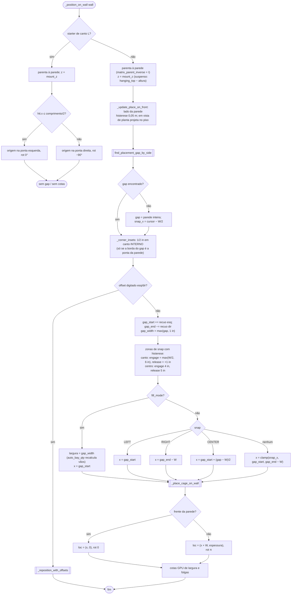

# `hb_closets_OT_place_starter._position_on_wall` — encaixe do starter na parede

> Arquivo: `blendertomob/product_libraries/closets/operators/ops_closet.py:795-947` (+ `_corner_insets :724-755`,
> `_reposition_with_offsets :694-722`, `_place_cage_on_wall :949-972`, `_update_place_on_front :768-793`).
> Usa `PlacementMixin.find_placement_gap_by_side` de `hb_placement` (fora do módulo). Confiança geral: 🟢 CONFIRMADO.

## Fluxograma

## Regras

- 🟢 `auto_bay_qty(width) = clamp(ceil(width / 42 in), 1, 9)` (`types_closets.py:1749-1754`): nenhum vão passa de 42 in (1066,8 mm).
- 🟢 Recuo automático de 1/2 in (12,7 mm) em cantos internos (`const_closets.py:73`, `ops_closet.py:868-885`); um offset digitado
  substitui o recuo só do seu lado.
- 🟢 Offsets em *fill mode* **aparam** a largura; largura digitada é preservada e apenas deslocada (`:694-722`).
- 🟢 Ilhas fora da parede: folgas medidas por raios em planta (3 por face) até paredes/armários; *detentes* em 30/36/42/48 in com
  janela de 1 in; Shift desliga (`ops_closet.py:132-167, 1025-1052`).
- 🟢 Após confirmar, `_detect_corner_closet_neighbor` (`:170-288`) procura starters em paredes perpendiculares (90° ± 5°, faixa de
  altura sobreposta, canto a ≤ 8 in, borda a ≤ 1 in) e abre `set_corner_clearance` (folga default 12 in + pontes).
