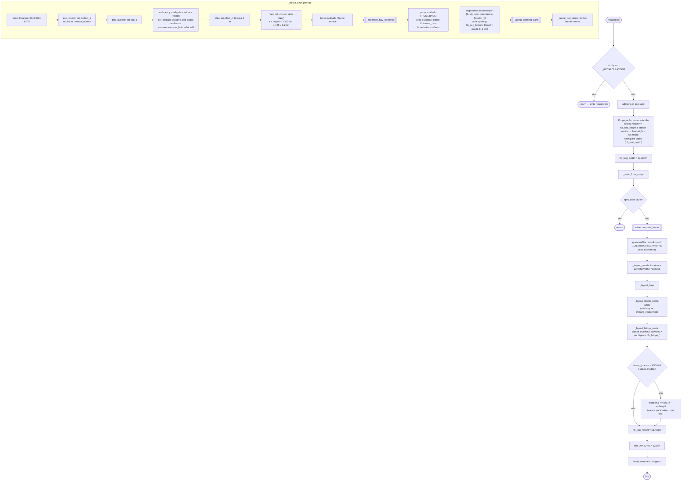

# `ClosetStarter.recalculate` — orquestrador sem drivers (props → solver → objetos)

> Arquivo: `blendertomob/product_libraries/closets/types_closets.py:458-521` (+ `_layout_panels :523`, `_layout_bays :532-689`,
> `_reconcile_bay_openings :1194-1242`, `_layout_starter_parts :1244-1269`, `_layout_bridge_parts :1279-1339`).
> Confiança geral: 🟢 CONFIRMADO.

## Fluxograma



## `_reconcile_bay_openings` (divisoras → segmentos) 🟢 `types_closets.py:1194-1242`

```mermaid
flowchart TD
    A([início]) --> B[Para cada opening do vão]
    B --> C{filho é FIXED_SHELF<br/>e não é preview?}
    C -- sim --> D["reparenta ao vão;<br/>hb_z_offset = seg_bottom + offset<br/>(ancorado no topo: seg_h − offset)<br/>hb_anchor_top=0; herda lado"]
    C -- não --> B
    D --> B
    B -- fim --> E[para cada lado]
    E --> F["want = nº divisoras do lado + 1"]
    F --> G{openings > want?}
    G -- sim --> G1[move filhos da opening extra para openings[0]<br/>remove a opening] --> G
    G -- não --> H{openings < want?}
    H -- sim --> H1[cria ClosetOpening 'Opening k'] --> H
    H -- não --> I[renumera hb_opening_index]
```

## Notas

- **Sem drivers** 🟢: todas as dimensões são escritas por Python a cada recálculo (`types_closets.py:1-8`); o custo cresce com o nº de peças (recalcula o starter inteiro a cada edição) 🟡.
- **Guardas de reentrância** 🟢 (`:105-106`): `set()` de `id(obj)` em nível de módulo; o `id()` de wrappers Python pode ser reaproveitado após exclusão 🟡.
- **Âncora de topo dos suspensos** 🟢 (`:511-515`): edição de altura desloca a origem para baixo; mover com G não é afetado porque só compara com `hb_last_height`.
- Conteúdo de uma abertura fundida é **re-hospedado** na opening de menor índice, não descartado 🟢 (`:1229-1233`).
