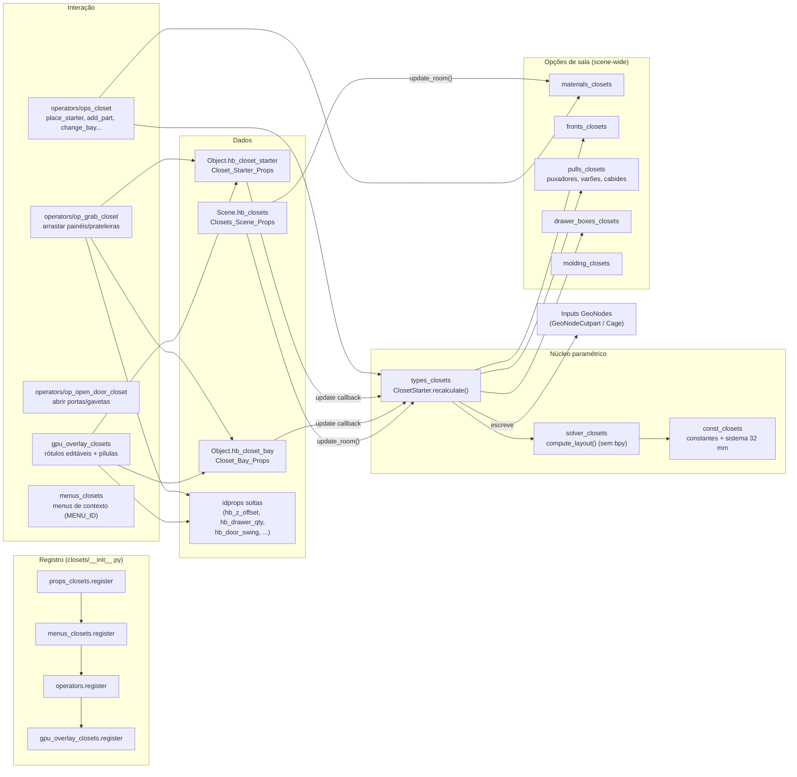
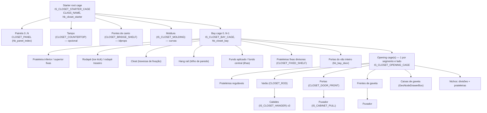
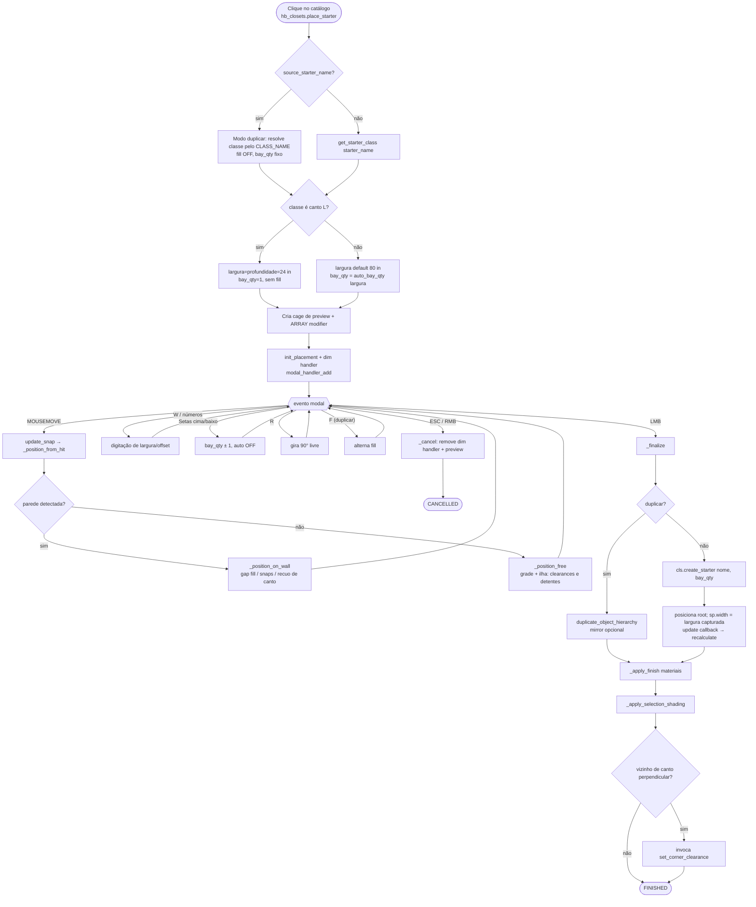
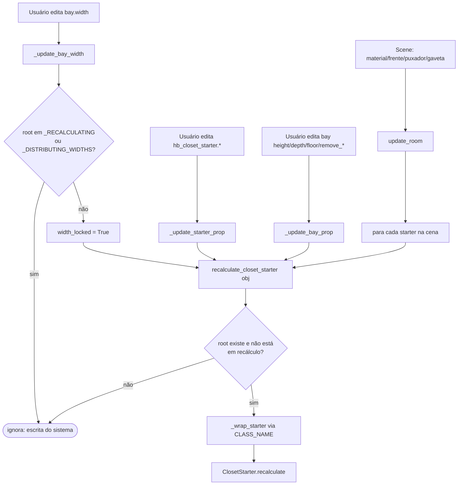
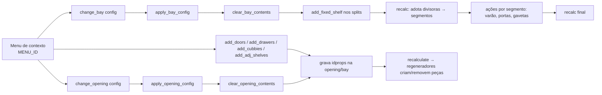
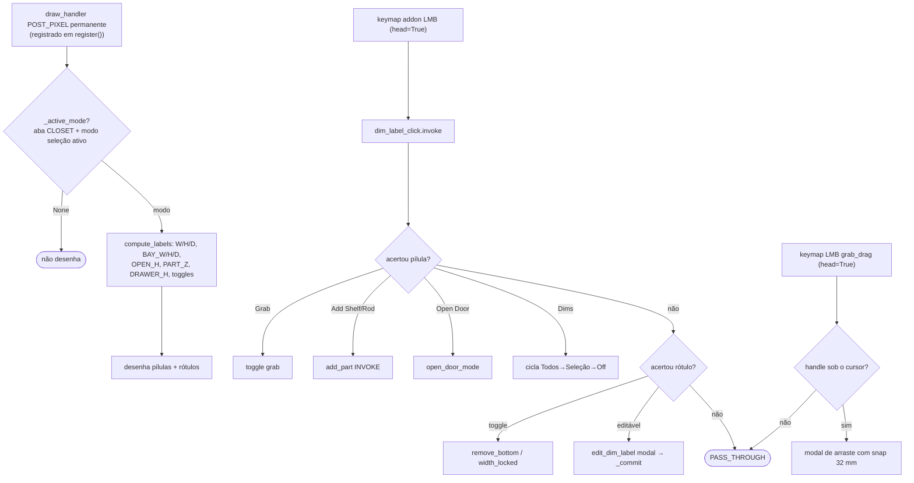

# Fluxogramas — módulo legado `closets` (fork Home Builder 5)

> Escopo: `blendertomob/product_libraries/closets/` (17 arquivos .py, ~9,7 mil linhas).
> Legenda de confiança: 🟢 CONFIRMADO (lido no código) · 🟡 INFERIDO · 🔴 LACUNA.
> Fluxos detalhados por função: ver `legacy-closets-compute_layout.md`, `legacy-closets-recalculate.md`,
> `legacy-closets-layout_opening_parts.md`, `legacy-closets-apply_bay_config.md`, `legacy-closets-position_on_wall.md`.

## 1. Visão geral da arquitetura do módulo 🟢

## 2. Hierarquia de objetos de um starter 🟢

`types_closets.py:10-17`

## 3. Ciclo de vida: colocação de um starter 🟢

`operators/ops_closet.py:446-552` (invoke), `1226-1330` (modal), `1334-1409` (finalize)

## 4. Propagação de edição (props → recalc) 🟢

`props_closets.py:68-94`, `types_closets.py:1914-1921`

## 5. Configuração de conteúdo de vão / abertura 🟢

`types_closets.py:2117-2272`, `operators/ops_closet.py:1893-2064`

## 6. Camada GPU passiva (overlay + grab + abrir porta) 🟢

`gpu_overlay_closets.py:549-611, 836-929`, `operators/op_grab_closet.py:281-427`, `operators/op_open_door_closet.py:92-220`

