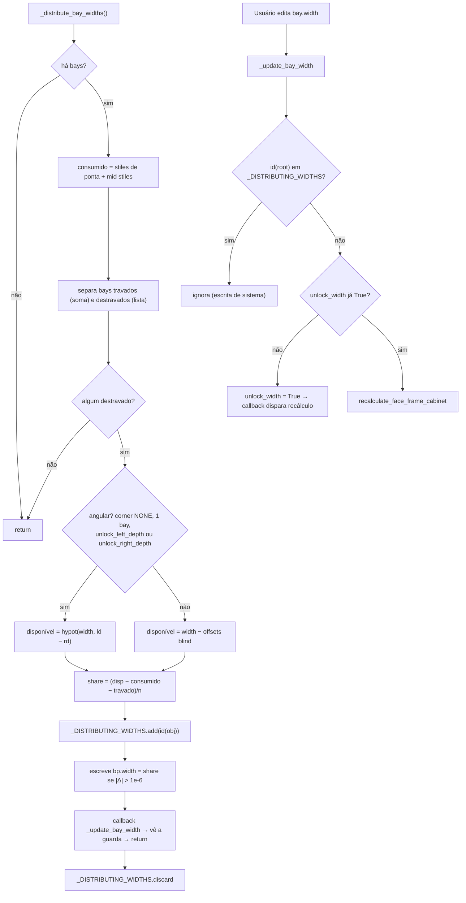

# `FaceFrameCabinet._distribute_bay_widths` + auto-lock `_update_bay_width`

> Arquivos: `blendertomob/product_libraries/face_frame/types_face_frame.py:1641-1725`,
> `props_hb_face_frame.py:4031-4056`. Confiança: 🟢 CONFIRMADO.

## Assinaturas
- `FaceFrameCabinet._distribute_bay_widths(self) -> None`
- `_update_bay_width(self: Face_Frame_Bay_Props, context) -> None`

## Fórmula
```
consumido   = left_stile_width + right_stile_width + Σ mid_stile_widths[i].width   (i < nº bays − 1)
travado     = Σ bay.width  (bays com unlock_width = True)
disponível  = hypot(width, left_depth − right_depth)                  se angular (corner NONE, 1 bay, unlock_*_depth)
            = width − blind_left − blind_right                        caso contrário
              (blind_X = blind_amount_X só se stile_type_X == 'BLIND' e blind_X ligado e amount > 0)
share       = (disponível − consumido − travado) / nº bays destravados
```

## Fluxograma



## Observações
- **Sem validação de share negativo** nem largura mínima: se os travados excederem o disponível, bays destravados recebem
  largura negativa (nenhum clamp no código). 🟢 (ausência lida) — o limite `MIN_BAY_WIDTH = 2"` existe só no modal de arraste
  (`operators/op_modify_cabinet.py:44`). 🟢
- Blind com ângulo não é suportado ("blind plus angled isn't supported yet", `solver_face_frame.py:1583`). 🟢
- Mesmo padrão (locked/unlocked + share) repete-se em `_redistribute_split_node`, `solver._redistribute_sizes`,
  `types_face_frame_corner._solve_section_heights` e no layout de painéis de appliance. 🟢
