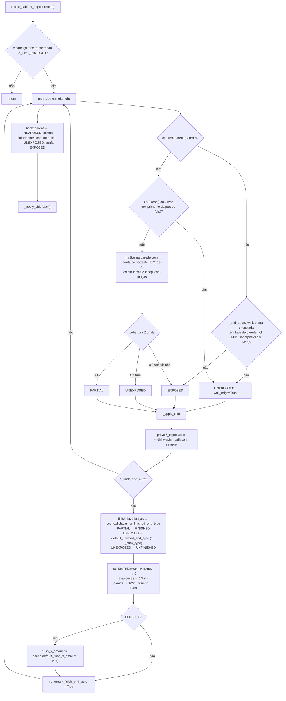

# `exposure.recalc_cabinet_exposure` — detecção de lados expostos e acabamento automático

> Arquivo: `blendertomob/product_libraries/face_frame/exposure.py:142-476`. Confiança: 🟢 CONFIRMADO.

## Assinaturas
- `recalc_cabinet_exposure(cab_obj) -> None` (`:443`)
- `_side_exposure(cab_obj, side) -> (state, dishwasher_adjacent, wall_edge)` (`:218`)
- `_back_exposure(cab_obj) -> 'UNEXPOSED'|'EXPOSED'` (`:358`)
- `_resolve_finish_type(scene_props, state, dishwasher, side) -> FIN_END id` (`:374`)
- `_resolve_scribe(state, dishwasher, wall_edge, finish) -> float` (`:399`)
- `_apply_side(cab, side, state, dishwasher, wall_edge, scene_props) -> None` (`:416`)

## Fluxograma

## Explicação
- **Prioridade**: lava-louças > parcial > exposto > não exposto (docstring `:5-8`). 🟢
- **Auto flag**: editar o enum de acabamento ou o scribe na UI desliga `*_finish_end_auto`
  (`props_hb_face_frame.py:3983-4009`); a exposição só reescreve lados com auto ligado e religa o flag ao final porque suas
  próprias escritas disparam os callbacks que o desligam. 🟢
- **Efeito no solver**: `left/right_scribe_offset` usa o acabamento: FINISHED → 0, PANELED → 3/4", FLUSH_X/BEADBOARD/SHIPLAP → 1/4",
  demais → scribe digitado (`solver_face_frame.py:379-417`). 🟢
- Cada `setattr` dispara `_update_cabinet_dim` (recálculo completo) fora de `suspend_recalc` → até ~9 recálculos por gabinete. 🟡 (desempenho)
- Premissa geométrica: lados detectados em X local da parede (`cab_obj.location.x`), assumindo gabinetes sem rotação relativa à parede. 🟡
