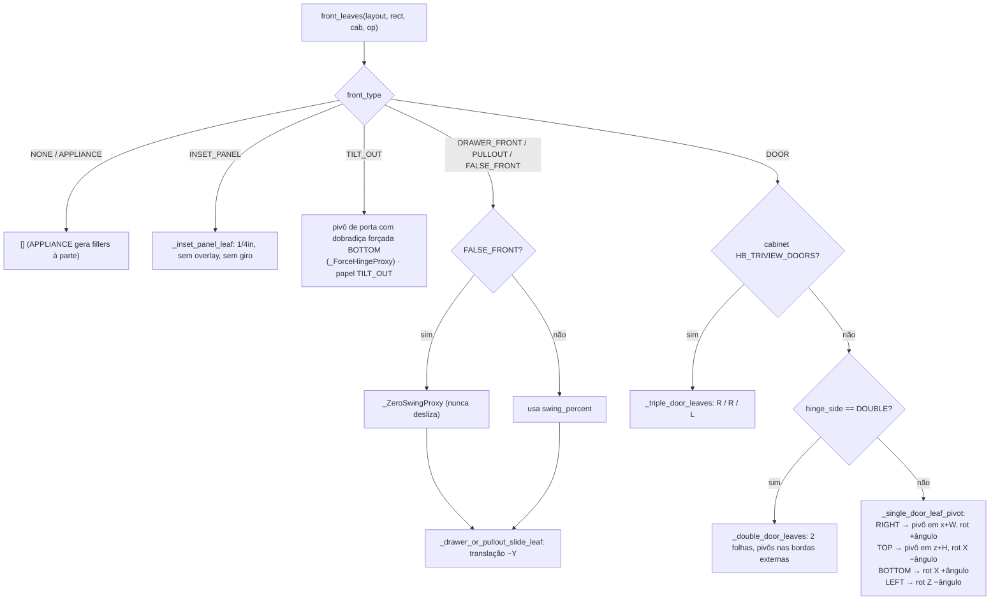

# `solver_face_frame.front_leaves` — geometria de portas, gavetas e frentes

> Arquivo: `blendertomob/product_libraries/face_frame/solver_face_frame.py:3232-3705`. Confiança: 🟢 CONFIRMADO.

## Assinaturas
- `front_leaves(layout, rect, cab_props, opening_props) -> list[leaf]` (`:3593`)
- `_door_panel_size(rect, cab_props, opening_props) -> (width, height)` (`:3285`)
- `resolved_overlay(cab_props, opening_props, side) -> float` (`:3232`)
- `appliance_filler_widths(rect, opening_props) -> (left, right)` (`:3667`)
- leaf = `{role, name, pivot_position, pivot_rotation, part_position, part_dims(length,width,thickness), [hinge], [frame_override], [pivot_anchor_position]}`

## Fórmulas
```
vão_largura  = cage_dim_x − reveal_left − reveal_right
vão_altura   = cage_dim_z − reveal_top − reveal_bottom
overlay(lado)= opening.<lado>_overlay se unlock_<lado>_overlay senão cab.default_<lado>_overlay
porta_W      = vão_largura + ov_left + ov_right
porta_H      = vão_altura  + ov_top  + ov_bottom
base_y       = −fft (ou 0 em PANEL) − DOOR_TO_FRAME_GAP(1/8") + default_door_inset_amount
ângulo       = swing_percent × 100°                     (DOOR_MAX_SWING_ANGLE)
slide gaveta = swing_percent × max(0, cage_dim_y + back_thickness − 1")
DOUBLE       : folha = (porta_W − 1/8") / 2
TRI-VIEW     : folha = (porta_W − 2×1/8") / 3 ; stiles internos zerados; quadro 1.25"
INSET_PANEL  : painel 1/4" do tamanho exato do vão, face traseira no plano traseiro da moldura
```

## Fluxograma



## Filler de appliance (`appliance_filler_widths`)
- `include_fillers` desligado → (0, 0).
- `set_appliance_width` ligado → cada filler = `(vão − min(appliance_width, vão)) / 2`.
- Desligado → fillers informados; se a soma exceder o vão, escala proporcional. 🟢 (`:3667-3704`)

## Observações
- Pivô separado da peça: animação de abertura (open mode) só mexe no pivô, sem recalcular o gabinete
  (`operators/op_open_mode.py:1-15`). 🟢
- `DOOR_TO_FRAME_GAP = 1/8"` duplicado como número mágico em `Face_Frame_Cabinet_Style.assign_style_to_cabinet`
  (`props_hb_face_frame.py:1680`) — precisa ficar em sincronia. 🟢
