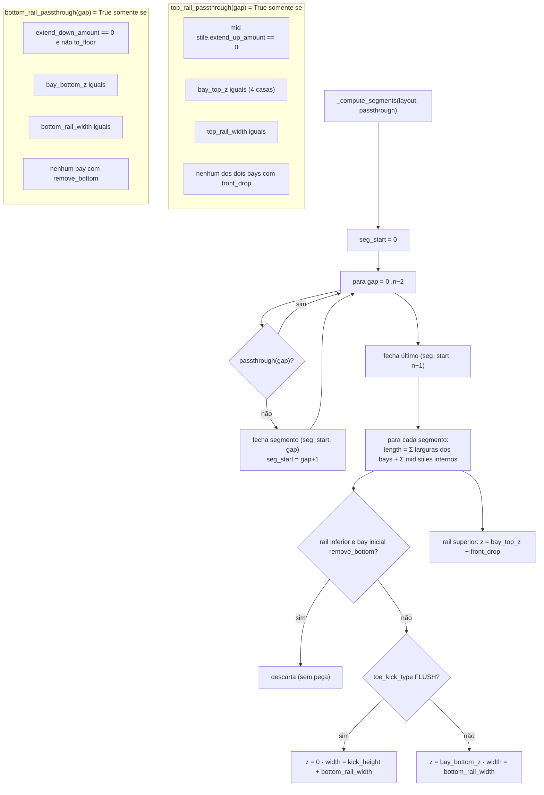

# Segmentação de rails e dimensionamento de mid stiles (`top_rail_segments`, `bottom_rail_segments`, `mid_stile_dims`)

> Arquivo: `blendertomob/product_libraries/face_frame/solver_face_frame.py:1305-1456` (segmentos) e `:1743-1809` (mid stile).
> Confiança: 🟢 CONFIRMADO.

## Assinaturas
- `top_rail_passthrough(layout, gap_index) -> bool` / `bottom_rail_passthrough(layout, gap_index) -> bool`
- `_compute_segments(layout, passthrough_fn) -> list[(start_bay, end_bay)]`
- `top_rail_segments(layout) -> list[dict(start_bay,end_bay,x,y,z,length,width,thickness)]`
- `bottom_rail_segments(layout) -> list[dict]`
- `mid_stile_position(layout, gap_index) -> (x,y,z)` / `mid_stile_dims(layout, gap_index) -> (length,width,thickness)`

## Fluxograma



## Mid stile (um por gap, nunca destruído)
```
bottom_z = min(bay_bottom_z(a), bay_bottom_z(b))
           + bottom_rail_width(a)   se o bottom rail atravessa o gap
           − extend_down_amount
           → 0 se to_floor
top_z    = max(bay_top_z(a), bay_top_z(b))
           − top_rail_width(a)      se o top rail atravessa o gap
           + extend_up_amount
length   = top_z − bottom_z ; width = mid_stile_widths[gap].width ; thickness = fft
```
🟢 `solver_face_frame.py:1772-1809`

## Explicação
A estratégia "B — rails preguiçosos por segmento" (docstring `:14-22`): um rail físico cobre a maior sequência contígua de
bays compatíveis; quebra onde alturas, larguras de rail, front drop, remove_bottom ou extensões do mid stile diferem. O
reconciliador (`types_face_frame.py:4926`) apaga rails cuja `hb_segment_start_bay` não existe mais e cria os faltantes. 🟢
