# `recalculate_face_frame_cabinet` + `FaceFrameCabinet.recalculate` — pipeline de recálculo

> Arquivo: `blendertomob/product_libraries/face_frame/types_face_frame.py:1842-2531` (método) e `:8745-8777` (entrada segura),
> `:81-107` (`suspend_recalc`). Confiança geral: 🟢 CONFIRMADO.

## Assinaturas
- `recalculate_face_frame_cabinet(obj) -> None` — aceita qualquer descendente; sobe até a raiz.
- `suspend_recalc()` — context manager com contagem de profundidade; acumula nomes em `_PENDING_RECALC_NAMES`.
- `FaceFrameCabinet.recalculate(self) -> None`.

## Fluxograma

```mermaid
flowchart TD
    A["update callback de prop / operador"] --> B["recalculate_face_frame_cabinet(obj)"]
    B --> C["find_cabinet_root: sobe parents até tag IS_FACE_FRAME_CABINET_CAGE"]
    C --> D{"raiz encontrada?"}
    D -- não --> X["return"]
    D -- sim --> E{"_RECALC_SUSPEND_DEPTH > 0?"}
    E -- sim --> F["adiciona root.name em _PENDING_RECALC_NAMES<br/>(drenado ao sair do suspend mais externo)"]
    E -- não --> G{"id(root) em _RECALCULATING?"}
    G -- sim --> X
    G -- não --> H["_wrap_cabinet: CLASS_NAME → WRAP_CLASS_REGISTRY<br/>(fallback FaceFrameCabinet)"]
    H --> I["cabinet.recalculate()"]
    I --> I1["Dim X/Y/Z do cage = width/depth/height"]
    I1 --> I2["_distribute_bay_depths → heights → kick_heights → rails"]
    I2 --> I3["_distribute_bay_widths"]
    I3 --> I4["_distribute_split_sizes (árvore de cada bay)"]
    I4 --> I5["layout = FaceFrameLayout(obj)"]
    I5 --> I6["top/bottom rail segments → _reconcile_rails<br/>front drop fillers"]
    I6 --> I7{"_has_carcass()?"}
    I7 -- sim --> I8["segments de fundo/costas; se _has_toe_kick:<br/>kick subfront, finish kick, returns, loose ladder;<br/>blind panels; BASE/LAP: stretchers · UPPER/TALL: top sólido"]
    I7 -- não --> I9["listas vazias (PANEL)"]
    I8 --> J["loop por filhos diretos: despacho por hb_part_role"]
    I9 --> J
    J --> J1{"IS_MANUAL_PART ou modifier GN ausente?"}
    J1 -- sim --> J2["pula (parte congelada pelo usuário)"]
    J1 -- não --> J3["gira stiles/rails pelo ângulo da moldura (angled)<br/>escreve location + Length/Width/Thickness do solver"]
    J3 --> J4["bay cage → _update_bay_cage → openings/fronts/interiores"]
    J4 --> K{"_has_carcass()?"}
    K -- sim --> K1["painéis aplicados, fundo acabado, flush X, full overlay stiles,<br/>painéis texturizados, finish bay, extensão/returns de lateral acabada"]
    K1 --> K2["cortador angular, back extension, bottom extension (UPPER)"]
    K --> L["anotações de appliance, furniture top, hutch back, wedge, etc."]
    K2 --> L
    L --> M["_reapply_cabinet_style (estilo de porta/material nas frentes recriadas)"]
    M --> N["_reapply_selection_mode_highlights"]
    N --> O["remove id(root) de _RECALCULATING"]
    O --> P["_reconcile_standalone_panel (só PanelFaceFrameCabinet / FF&Doors independentes)"]
```

## Explicação
- **Sem drivers**: toda a propagação dimensional é imperativa (props → solver → inputs GN das partes). 🟢 (`types_face_frame.py:1-16`)
- **Guardas de reentrância**: `_RECALCULATING` evita recursão via callbacks disparados pelas próprias escritas;
  `_DISTRIBUTING_WIDTHS` diferencia escrita de sistema de edição do usuário (auto-lock). `suspend_recalc` coalesce N
  recálculos em 1 por gabinete (`:81-107`). 🟢
- **Ordem obrigatória**: profundidades/alturas antes de larguras; larguras de bays antes da árvore; árvore antes do layout. 🟢 (`:1856-1869`)
- **Reconciliação por identidade**: rails por `hb_segment_start_bay`, mid stiles por `hb_mid_stile_index`, openings por
  `obj.name`; frentes, pivôs, puxadores, splitters e backings são **apagados e recriados** a cada recálculo
  (`:5927-5975`, `:5785-5830`). 🟢
- **Escape manual**: `IS_MANUAL_PART` (parte) e `IS_MANUAL_FRONT` (opening) excluem do reescrita paramétrica (`:1998-2020`, `:5954`). 🟢
- Exceções dentro do dreno de `suspend_recalc` são engolidas (`except Exception: pass`, `:103-106`) — falhas silenciosas. 🟢

## Riscos
- `id(root)` como chave de guarda depende de o Blender reutilizar a mesma instância Python para o mesmo ID; recomendável
  `as_pointer()` ou nome. 🟡
- Recriação de objetos a cada recálculo deixa malhas órfãs até salvar/recarregar e invalida referências Python
  (ver `docs/rag/project/04_armadilhas.md:13`). 🟡
