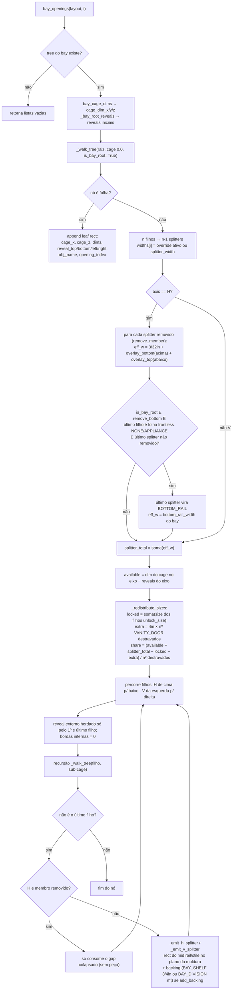

# `solver_face_frame.bay_openings` / `_walk_tree` / `_redistribute_sizes` — distribuição de vãos e aberturas

> Arquivo: `blendertomob/product_libraries/face_frame/solver_face_frame.py:2816-3205`. Confiança geral: 🟢 CONFIRMADO.

## Assinaturas
- `bay_openings(layout, bay_index) -> {'leaves': [...], 'splitters': [...], 'backings': [...]}` (`:3171`)
- `_walk_tree(node, layout, bay_index, cage_x, cage_z, cage_dim_x, cage_dim_y, cage_dim_z, reveals, leaves, splitters, backings, is_bay_root=False) -> None` (`:2993`)
- `_redistribute_sizes(children, available, splitter_total) -> list[float]` (`:2816`)
- `_bay_root_reveals(layout, bay_index) -> dict(top,bottom,left,right)` (`:2763`)

## Fluxograma

## Explicação
1. **Retângulo de partida**: o cage do bay cobre a cavidade da carcaça (mais larga que o vão da moldura). `_bay_root_reveals`
   calcula a diferença entre cage e vão: `top = cage_dim_z − (height − top_rail − eff_bottom_rail − kick_height − front_drop)`,
   `left/right = distância da face interna da lateral/divisória até a borda do stile`, `bottom = 0` (topo do fundo = topo do
   bottom rail). Em `PANEL` todos os reveals são zero (`:2774-2775`). 🟢
2. **Distribuição igualitária com travas**: filhos com `unlock_size=True` mantêm o valor; os demais dividem o resto
   igualmente. É o mesmo algoritmo de `_distribute_bay_widths` (bays) e de `_solve_section_heights` (cantos). 🟢
3. **Regra da porta de vaidade**: filho destravado com `SIZE_ROLE == 'VANITY_DOOR'` recebe `share + 4"` (`VANITY_DOOR_EXTRA_WIDTH`, `:2813`). 🟢
4. **Mid rail removido**: o membro some (sem peça nem backing) e o espaço vira `3/32" + overlays adjacentes`, fazendo as frentes
   ficarem a 3/32" uma da outra (`MID_RAIL_REMOVED_GAP`, `:3255`; lógica `:3055-3062`). Só vale para eixo H. 🟢
5. **Rail inferior "promovido"**: bay com `remove_bottom` cujo vão inferior é frontless (NONE/APPLIANCE, ex.: geladeira) tem o
   último splitter construído como `BOTTOM_RAIL` com a largura do bottom rail do bay (`:3063-3074`). 🟢
6. **Saídas em coordenadas locais do bay**; `_update_openings_in_bay` casa as folhas com objetos existentes por `obj_name`
   (in-place) e apaga/recria splitters e backings a cada recálculo (`types_face_frame.py:5715-5815`). 🟢

## Divergência conhecida (risco)
`FaceFrameCabinet._redistribute_split_node` (`types_face_frame.py:1763`) grava os tamanhos "exibidos" usando
`n_splitters × splitter_width` uniforme e `ff_height = height − top_rail − bottom_rail − kick`, **sem** considerar overrides
por membro (`splitter_widths`), membros removidos, `remove_bottom` (bottom rail efetivo 0) nem `front_drop`. O solver
recalcula a geometria corretamente, mas o `size` armazenado de filhos destravados pode divergir do construído. 🟢 (diferença lida)
/ 🟡 (impacto: valores exibidos e o valor "congelado" quando o usuário trava).
