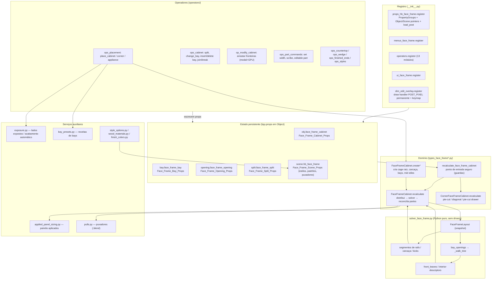
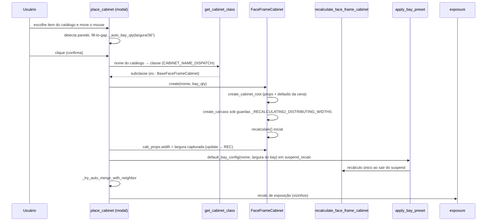
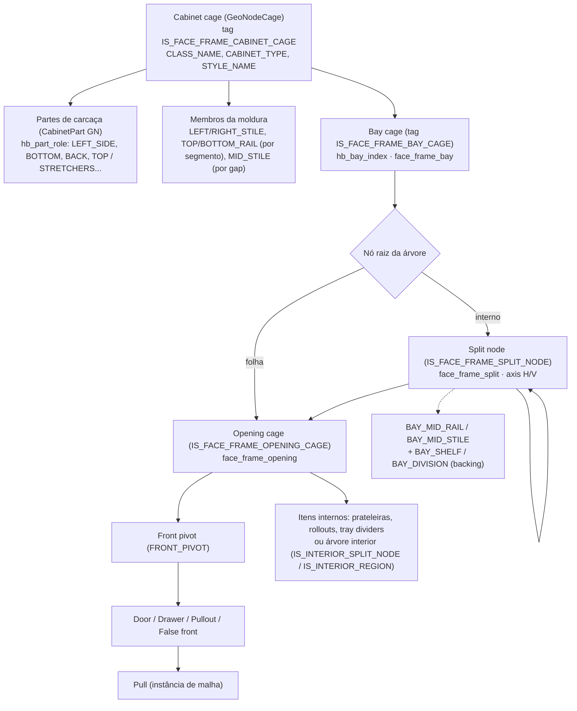
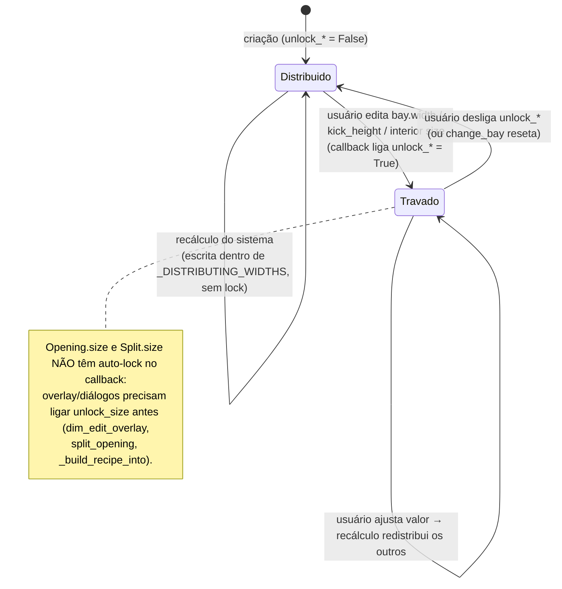

# Fluxogramas — módulo legado `face_frame` (fork Home Builder 5)

> Camada legada: `blendertomob/product_libraries/face_frame/` (31 arquivos, ~61 mil linhas).
> Gerado pelo Archaeologist (Reversa), nível DETALHADO. Legenda de confiança: 🟢 CONFIRMADO · 🟡 INFERIDO · 🔴 LACUNA.
> Fluxogramas por função: `legacy-face_frame-solver_walk_tree.md`, `legacy-face_frame-recalculate.md`,
> `legacy-face_frame-distribute_bay_widths.md`, `legacy-face_frame-rail_segments.md`,
> `legacy-face_frame-front_leaves.md`, `legacy-face_frame-exposure.md`.

## 1. Visão geral (arquitetura interna do módulo) 🟢

## 2. Ciclo de vida de um gabinete (colocação → recálculo) 🟢

## 3. Árvore de objetos de um gabinete (estrutura de dados na cena) 🟢

## 4. Hierarquia de classes 🟢

```mermaid
classDiagram
    class GeoNodeCage
    class CabinetPart
    class FaceFrameCabinet {
        +default_width 36in
        +default_height 34.5in
        +default_depth 24in
        +default_cabinet_type BASE
        +single_placement False
        +create_cabinet_root(name)
        +create_carcass(has_toe_kick, bay_qty)
        +insert_bay(anchor_index, direction)
        +delete_bay(bay_index)
        +recalculate()
        +_has_toe_kick() False
        +_has_carcass() True
    }
    GeoNodeCage <|-- FaceFrameCabinet
    FaceFrameCabinet <|-- BaseFaceFrameCabinet
    BaseFaceFrameCabinet <|-- FloatingBaseFaceFrameCabinet
    BaseFaceFrameCabinet <|-- SinkFaceFrameCabinet
    BaseFaceFrameCabinet <|-- FurnitureFaceFrameCabinet
    FurnitureFaceFrameCabinet <|-- FiveDrawerDresserCabinet
    FurnitureFaceFrameCabinet <|-- SixDrawerDresserCabinet
    FurnitureFaceFrameCabinet <|-- NightStandFaceFrameCabinet
    FurnitureFaceFrameCabinet <|-- ThreeDrawerNightStandCabinet
    FurnitureFaceFrameCabinet <|-- WindowSeatFaceFrameCabinet
    FaceFrameCabinet <|-- UpperFaceFrameCabinet
    UpperFaceFrameCabinet <|-- BookcaseUpperFaceFrameCabinet
    UpperFaceFrameCabinet <|-- HutchUpperFaceFrameCabinet
    UpperFaceFrameCabinet <|-- StandardRecessedMedicineCabinet
    UpperFaceFrameCabinet <|-- MedicineCabinetFaceFrameCabinet
    MedicineCabinetFaceFrameCabinet <|-- OverstoolCabinetFaceFrameCabinet
    MedicineCabinetFaceFrameCabinet <|-- TriViewMedicineCabinetFaceFrameCabinet
    FaceFrameCabinet <|-- TallFaceFrameCabinet
    TallFaceFrameCabinet <|-- RefrigeratorCabinet
    TallFaceFrameCabinet <|-- BuiltInTallFaceFrameCabinet
    TallFaceFrameCabinet <|-- BookcaseFaceFrameCabinet
    BookcaseFaceFrameCabinet <|-- BookcaseStorageUnitFaceFrameCabinet
    FaceFrameCabinet <|-- LapDrawerFaceFrameCabinet
    FaceFrameCabinet <|-- PanelFaceFrameCabinet
    PanelFaceFrameCabinet <|-- FaceFrameAndDoorsCabinet
    PanelFaceFrameCabinet <|-- MirrorFrameFaceFrameCabinet
    PanelFaceFrameCabinet <|-- TubSkirtFaceFrameCabinet
    FaceFrameCabinet <|-- LegProductFaceFrameCabinet
    FaceFrameCabinet <|-- FloatingShelfFaceFrameCabinet
    FaceFrameCabinet <|-- ValanceFaceFrameProduct
    FaceFrameCabinet <|-- CornerFaceFrameCabinet
    CornerFaceFrameCabinet <|-- BasePieCutCabinet
    CornerFaceFrameCabinet <|-- UpperPieCutCabinet
    CornerFaceFrameCabinet <|-- BaseDiagonalCabinet
    CornerFaceFrameCabinet <|-- UpperDiagonalCabinet
    CornerFaceFrameCabinet <|-- TallDiagonalCabinet
    CornerFaceFrameCabinet <|-- BasePieCutDrawerCabinet
    CabinetPart <|-- MiscPart
    CabinetPart <|-- DoorPart
    class HalfWallFaceFrameProduct
    class SupportFrameFaceFrameProduct
    note for FurnitureFaceFrameCabinet "Subclasses de Furniture, BookcaseUpper, Hutch e BookcaseStorageUnit NÃO estão em WRAP_CLASS_REGISTRY: no recálculo via callback são embrulhadas como FaceFrameCabinet base (ver regra FACE_FRAME-R34)"
```

Fontes: `types_face_frame.py:941` (FaceFrameCabinet), `:6940-8467` (subclasses), `types_face_frame_corner.py:211,2828-2960`,
`types_face_frame.py:8636-8680` (WRAP_CLASS_REGISTRY), `types_face_frame_corner.py:2979` (registro de cantos).

## 5. Máquina de estados de "lock" de tamanhos (auto-lock on edit) 🟢

Fontes: `props_hb_face_frame.py:4031` (`_update_bay_width`), `:4059`, `:4080`, `:5976-5984`, `operators/ops_cabinet.py:2020-2062`.
