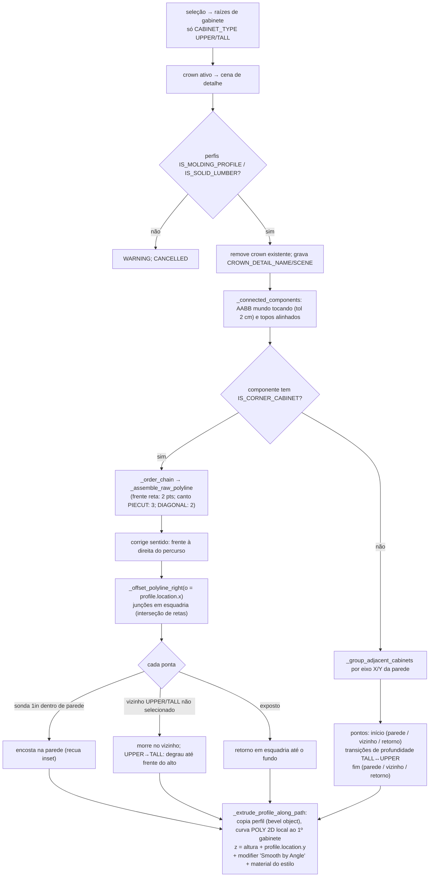

# `hb_frameless.assign_crown_to_cabinets` — moldura superior (crown) extrudada

Local: `blendertomob/product_libraries/frameless/operators/ops_crown.py` 🟢
- `execute` — `:342-362`; `_assign_crown` — `:364-434`
- grupos em linha: `_group_adjacent_cabinets` `:597-655` → `_create_crown_for_group` `:1190-1288`
- cadeias com canto: `_connected_components` `:724-739` → `_order_chain` `:741-773` → `_create_crown_for_chain` `:979-1099`
- extrusão comum: `_extrude_profile_along_path` `:1101-1188`
- variante sala inteira: `hb_frameless_OT_assign_crown_to_room` `:1291-1320`
Mesma mecânica (sem cadeia de canto) em `ops_toe_kick.py:259-678` e `ops_upper_bottom.py:231-645`.

Legenda: 🟢 CONFIRMADO · 🟡 INFERIDO · 🔴 LACUNA.

## Regras

- 🟢 Somente gabinetes `UPPER` e `TALL` recebem crown (`:354-356`, `:571-572`); rodapé decorativo só `BASE`/`TALL` (`ops_toe_kick.py:310-312`).
- 🟢 O deslocamento do perfil no plano do detalhe define o comportamento: `location.x < 0` → *inset* (recuo), `> 0` → *extend* (projeção); `location.y` → offset de altura (`:991-997`, `:1109`, `:1198-1216`).
- 🟢 Adjacência: topos a ±2 cm (`:575`), bordas a ±2 cm; parede: bbox com espessura < 0,2 m e tolerância 5 cm (`:478-544`).
- 🟢 Crown é filho do **primeiro** gabinete da cadeia e é curva estática (não acompanha redimensionamento).
- 🟢 Material = acabamento (não rotacionado) do estilo `CABINET_STYLE_INDEX` do primeiro gabinete (`:1175-1186`).
- 🟡 O node group "Smooth by Angle" é carregado de `datafiles/assets/nodes/geometry_nodes_essentials.blend` (`:1160-1170`); se o caminho mudar na versão do Blender o modificador fica sem node group, silenciosamente.
- 🟢 Canto sem `Left/Right Depth` usa fallback 24in (`:799-800`).
- 🟢 A cena de detalhe inicial desenha seção de 4in do canto superior da lateral, porta com gap 1/8in, overlay `mt − 1/16in` e linha de teto a `default_top_cabinet_clearance` (12in) — valores fixos com TODO (`:109-237`).
