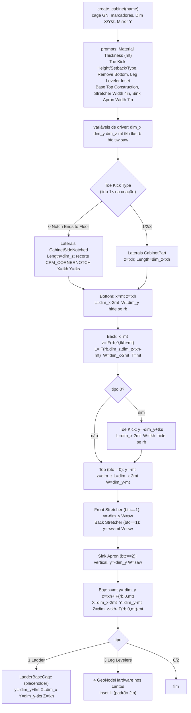

# `Cabinet.create_base_carcass(name)` — geração da caixa inferior

Local: `blendertomob/product_libraries/frameless/types_frameless.py:125-313` 🟢
Variantes: `create_tall_carcass` (`:315-455`), `create_upper_carcass` (`:457-535`),
`create_lap_drawer_carcass` (`:645-777`), `CornerCabinet.create_corner_base_carcass` (`:2472-2631`).

Legenda: 🟢 CONFIRMADO · 🟡 INFERIDO · 🔴 LACUNA.

## Regras extraídas

| Peça | Posição | Comprimento (Length) | Largura (Width) | Espessura | Conf. |
|---|---|---|---|---|---|
| Lateral esq. (tipo 0) | origem, rot Y −90° | `dim_z` | `dim_y` | `mt` | 🟢 `:148-156` |
| Lateral (tipos 1-3) | z=`tkh` | `dim_z-tkh` | `dim_y` | `mt` | 🟢 `:169-190` |
| Base (Bottom) | x=`mt`, z=`tkh` | `dim_x-2mt` | `dim_y` | `mt` | 🟢 `:193-203` |
| Fundo (Back) | x=`mt`, z=`tkh+mt` | `dim_z-tkh-mt` | `dim_x-2mt` | `mt` (fundo cheio, não 3/6 mm) | 🟢 `:206-216` |
| Rodapé (Toe Kick) | y=`-dim_y+tks` | `dim_x-2mt` | `tkh` | `mt` | 🟢 `:220-231` |
| Tampo (btc=0) | y=`-mt`, z=`dim_z` | `dim_x-2mt` | `dim_y-mt` | `mt` | 🟢 `:235-246` |
| Travessas (btc=1) | frente y=`-dim_y`; trás y=`-sw-mt` | `dim_x-2mt` | `sw`=4in | `mt` | 🟢 `:249-276` |
| Avental de pia (btc=2) | vertical, frente | `dim_x-2mt` | `saw`=7in | `mt` | 🟢 `:279-289` |
| Vão (Bay) | x=`mt`, z=`tkh+mt` | X=`dim_x-2mt` | Y=`dim_y-mt`, Z=`dim_z-tkh-2mt` | — | 🟢 `:292-300` |

Observações:
- 🟢 A construção é "laterais passantes": base, fundo, tampo e rodapé ficam **entre** as laterais (`dim_x-2·mt`).
- 🟢 O fundo tem a mesma espessura da caixa (`mt`) e fica embutido entre laterais — não há rebaixo/canal para fundo fino (HDF 3/6 mm usual no Brasil).
- 🟢 Diferença alta×base: no gabinete alto o fundo desconta mais um `mt` (`Length = ...-mt`, `:401`) e o tampo tem largura `dim_y` e sem recuo `y` (`:422-431`).
- 🟢 Superior (`create_upper_carcass`): sem rodapé; fundo `z=mt`, `Length=dim_z-2mt`; vão `Z=dim_z-2mt` (`:501-535`).
- 🟡 O tipo de rodapé é lido de `self.obj.get('Toe Kick Type', 0)` só na criação (`:144`); mudar o prompt depois não troca laterais entalhadas↔retas nem cria/remove o painel de rodapé (a geometria fica inconsistente até recriar o gabinete). `ops_defaults.update_toe_kick_prompts` (`operators/ops_defaults.py:19-26`) altera o índice mesmo assim.
- 🔴 Ladder Style é só uma gaiola marrom placeholder ("peças reais serão implementadas depois", `:1608-1619`).
