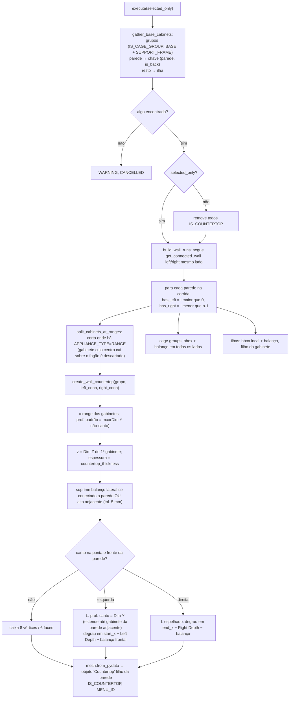

# `hb_frameless.add_countertops` / `create_wall_countertop` — bancadas

Local: `blendertomob/product_libraries/frameless/operators/ops_countertop.py` 🟢
- operador `hb_frameless_OT_add_countertops` — `:614-672`
- `gather_base_cabinets` — `:82-145`; `build_wall_runs` — `:148-192`
- `split_cabinets_at_ranges` — `:28-79`; `find_adjacent_tall_cabinets` — `:195-232`
- `create_wall_countertop` — `:235-482`; `create_group_countertop` — `:485-556`; `create_island_countertop` — `:559-611`

Legenda: 🟢 CONFIRMADO · 🟡 INFERIDO · 🔴 LACUNA.

## Regras

| Parâmetro | Padrão | Conf. |
|---|---|---|
| `countertop_thickness` | 1.5in (38,1 mm) | 🟢 `props_hb_frameless.py:1680-1683` |
| Balanço frontal | 1in (25,4 mm) | 🟢 `:1685-1688` |
| Balanço lateral (pontas expostas) | 1in | 🟢 `:1690-1693` |
| Balanço traseiro | 0 | 🟢 `:1695-1698` |
| Tolerância de adjacência a alto | 5 mm | 🟢 `ops_countertop.py:213` |

- 🟢 A bancada é **malha estática** (não paramétrica): não acompanha mudanças de largura/altura; é preciso rodar o operador de novo (que apaga e recria todas quando não é "selecionados").
- 🟢 Profundidade fallback 0,6 m se não houver gabinetes (`:280`).
- 🟢 No verso da parede não há forma em L (`:316`).
- 🟢 Bancada não recebe material; recortes (cuba/cooktop) via `countertop_boolean_cut` — modificador BOOLEAN `DIFFERENCE`, solver `'EXACT'` (válido no 5.2: FLOAT/EXACT/MANIFOLD — `docs/rag/blender-api/corpus/bpy.types.BooleanModifier.md#bpy.types.BooleanModifier.solver`) (`:692-735`).
- 🟡 `z` usa só `Dim Z` do primeiro gabinete e ignora `location.z` do gabinete; gabinetes com alturas diferentes na mesma corrida geram bancada na altura do primeiro.
- 🟡 Espessura, balanços e material não seguem padrão brasileiro (granito/quartzo 20–30 mm + saia; balanço ~20–30 mm) — são defaults americanos.
