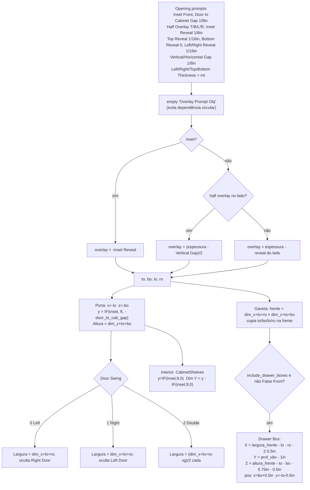

# Sobreposição (overlay) de frentes — `CabinetOpening` + `Doors.create` + gaveteiro

Locais 🟢:
- `CabinetOpening.add_properties_front_overlays` — `types_frameless.py:1156-1169`
- `CabinetOpening.add_properties_front_overlay_calculations` — `:1178-1210`
- `Doors.create` — `:1271-1328`; `Drawer.create` — `:1405-1443`
- `CabinetDoor.create` (puxador) — `:1734-1782`; `CabinetDrawerFront.add_drawer_box` — `:1867-1926`
- Canto: `CornerCabinet.add_corner_doors` — `:2326-2446`

Legenda: 🟢 CONFIRMADO · 🟡 INFERIDO · 🔴 LACUNA.

## Fórmulas (todas em metros no código, padrões definidos em polegadas)

| Grandeza | Fórmula | Padrão (in → mm) | Conf. |
|---|---|---|---|
| Overlay total (full) | `t − reveal` | 0.75−0.0625 = 0.6875in (17,46 mm) topo/laterais; base 0.75in | 🟢 `:1205-1208` |
| Meia sobreposição | `(t − vg)/2` | (0.75−0.125)/2 = 0.3125in (7,94 mm) | 🟢 |
| Inset | `−inset_reveal` | −0.125in (−3,18 mm) | 🟢 |
| Folga porta-caixa (Y) | `-door_to_cab_gap` | 0.125in (3,18 mm) | 🟢 `:1304` |
| Espessura da frente | `Front Thickness` | 0.75in (19,05 mm) | 🟢 `:1274` |
| Porta dupla | `(dim_x+lo+ro−vg)/2` | vg 0.125in | 🟢 `:1307` |
| Prateleiras | z₁ = `(dim_z − mt·qty)/(qty+1)`, passo array = z₁+mt; recuo 0.25in; folga clip 0.125in de cada lado | | 🟢 `:1228-1264` |
| Gaveta — folgas | lateral 0.5in, topo 0.75in, traseira 1in, fundo 0.5in | 12,7/19,05/25,4/12,7 mm | 🟢 `:1898-1902` |
| Puxador porta X | Base: `length − pvl_base − pull_len/2` · Tall: `pvl_tall + pull_len/2` · Upper: `pvl_upper + pull_len/2` | pvl 1.5in / 45in / 1.5in | 🟢 `:1779` |
| Puxador porta Y | `IF(mirror_y, −width+hhl, width−hhl)` | hhl 2in | 🟢 `:1780` |
| Puxador gaveta | `IF(center_pull, length/2, length − hhl − pull_len/2)`; horizontal centrado | | 🟢 `:1861-1862` |
| Comprimento padrão do puxador sem objeto | 0.1016 m (4in) | | 🟢 `:1755` |

## Regras e observações

- 🟢 Os prompts de espessura (`Left/Right/Top/Bottom Thickness`) iniciam em `default_carcass_part_thickness`, mas **não** são ligados por driver ao `Material Thickness` do gabinete; `ops_defaults.update_material_thickness_prompts` (`operators/ops_defaults.py:31-55`) propaga manualmente.
- 🟢 `Doors` define `Vertical Gap` duas vezes (em `create` `:1275` e em `add_properties_front_overlays` `:1168`) — a segunda chamada sobrescreve com o mesmo valor.
- 🟢 Canto pie-cut usa a espessura `mt` diretamente (sem prompts por lado) e prompt `Half Overlay Outer`/`Outer Reveal` (`:2352-2383`); Door Swing 0/1 esconde o puxador da porta oposta (`:2436-2446`).
- 🟢 Estilo de porta 5 peças exige largura ≥ 2·stile+1in e altura ≥ 2·rail+1in (+mid rail se altura > 45.5in) — `props_hb_frameless.py:1080-1093`. Portas > 45.5in (1155,7 mm) recebem travessa intermediária centralizada automaticamente (`:1119-1130`).
- 🟡 O estilo de gabinete (FULL/HALF/INSET) só altera `Inset Front`/`Half Overlay *` quando `assign_style_to_cabinet` roda; não é persistido como driver.
