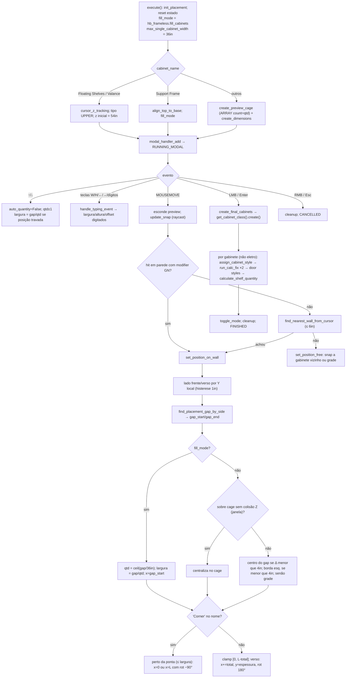

# `hb_frameless_OT_place_cabinet` — inserção modal em parede/piso

Local: `blendertomob/product_libraries/frameless/operators/ops_placement.py:270-1863` 🟢
Base: `WallObjectPlacementMixin` (`:60-268`) ← `hb_placement.PlacementMixin` (módulo externo).
Entrada: `hb_frameless.draw_cabinet` (`:1927-1977`) mapeia nome → `cabinet_type`/`is_appliance`.

Legenda: 🟢 CONFIRMADO · 🟡 INFERIDO · 🔴 LACUNA.

## Regras

- 🟢 Largura máxima por gabinete no preenchimento automático: 36in (914,4 mm); `qtd = ceil(gap/36in)` (`:1057-1063`, `:1690`).
- 🟢 Snap de centro: 4in (101,6 mm) do centro do gap; snap à borda esquerda se < 4in (`:1258-1267`).
- 🟢 Parede mais próxima (fallback): 6in (152,4 mm) (`:1085`).
- 🟢 Z de inserção: UPPER = `default_wall_cabinet_location` (54in); Lap Drawer = `base_h − top_drawer_front_height`; coifa = 54in fixo ("36in fogão + 18in"); Support Frame = `base_h − altura`; demais 0 (`:464-488`).
- 🟢 Altura da coifa = `ceiling_height − 54in` (`:490-499`).
- 🟢 Mapeamento nome→classe: "Base Drawer" gera `3 Drawers`; "Base Door Drw" gera `Door Drawer`; "Tall Stacked"/"Upper Stacked" ligam `is_stacked`; nomes com "Pie Cut Corner"/"L-Shape Corner"/"Diagonal Corner" + Base/Tall/Upper → classes de canto (`:1455-1509`).
- 🟢 `props.base_exterior` (enum com padrão 'Door Drawer') **não é usado**: o exterior vem de `default_exterior` da instância (`types_frameless.py:555-570`).
- 🟢 `run_calc_fix` é chamado 2× por gabinete como contorno do bug Blender #133392 (drivers de netos) (`:1837-1839`).
- 🟡 O modal começa em `execute()` (não há `invoke`), funcionando porque é chamado com `'INVOKE_DEFAULT'`; chamado via `EXEC_DEFAULT` entraria em modal sem evento válido.
- 🟢 O cursor é restaurado em ambos os caminhos de saída; não há `draw_handler` neste operador (cotas são objetos GN).
