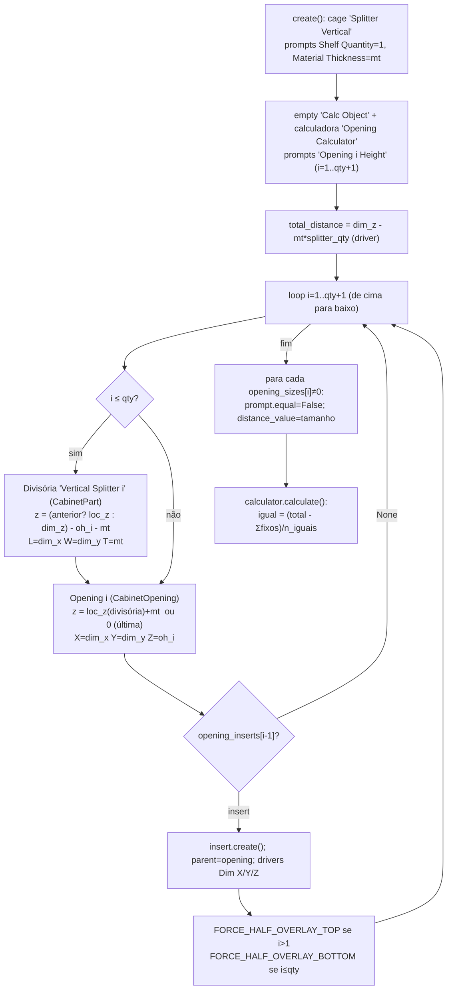

# `SplitterVertical.create()` — divisão vertical de vãos com calculadora

Local: `blendertomob/product_libraries/frameless/types_frameless.py:918-1026` 🟢
Espelho horizontal: `SplitterHorizontal.create` (`:1031-1140`). Mesma mecânica em
`InteriorSplitterVertical/Horizontal` (`:2050-2277`). Calculadora: `hb_props.py:253-332` (módulo externo).

Legenda: 🟢 CONFIRMADO · 🟡 INFERIDO · 🔴 LACUNA.

## Regras

- 🟢 Nº de vãos = `splitter_qty + 1`; `opening_sizes` usa **0 = altura igual** (rateio), lista de cima para baixo (`:926-928`).
- 🟢 Altura útil total = `dim_z − mt·splitter_qty` (`:963`). Rateio: `(total − Σ fixos)/qtd_iguais` (`hb_props.py:294-330`).
- 🟢 A calculadora não é driver: só recalcula quando `calculate()` roda (criação ou operador); mudar `Dim Z` depois não redistribui até rodar a calculadora de novo. 🟡 (dependente de `pc_prompts.run_calculator`, módulo externo).
- 🟢 Bug latente: `SplitterVertical.create` acessa `self.opening_sizes[i-1]` sem checar comprimento (`:1021`); o horizontal checa (`:1135`). Se a lista for menor que `qty+1` → `IndexError`.
- 🟢 A variável `shelf` é reatribuída a `previous_splitter` mesmo na última iteração (`:986`), sem efeito prático porque não há nova divisória.
- 🟢 Os marcadores `FORCE_HALF_OVERLAY_*` impedem que `assign_style_to_cabinet` sobrescreva a meia-sobreposição entre vãos adjacentes (`props_hb_frameless.py:766-782`).
- Usos de fábrica: gaveta sobre porta (`BaseCabinet.add_drawer_door`, `:578-591`, topo = `top_drawer_front_height` 6in), pilha de gavetas (`:593-620`), alto empilhado (fundo = `tall_cabinet_split_height` 54in, `:810-814`), superior empilhado (topo = 15in, `:898-902`), geladeira (fundo = `refrigerator_height` 62in e vão vazio, `:860-864`), eletro embutido 30in (`ops_opening.py:273-276`).
