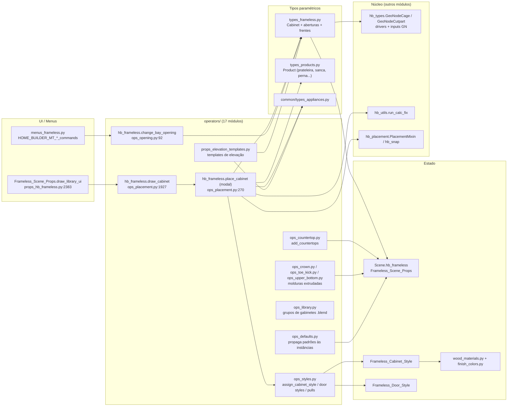
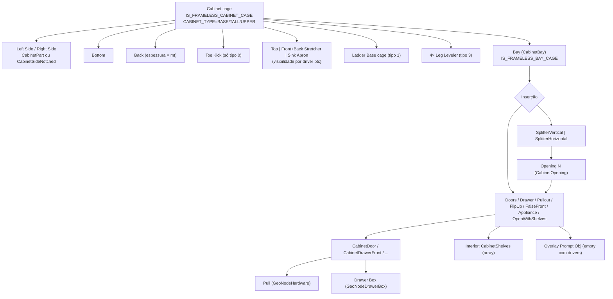
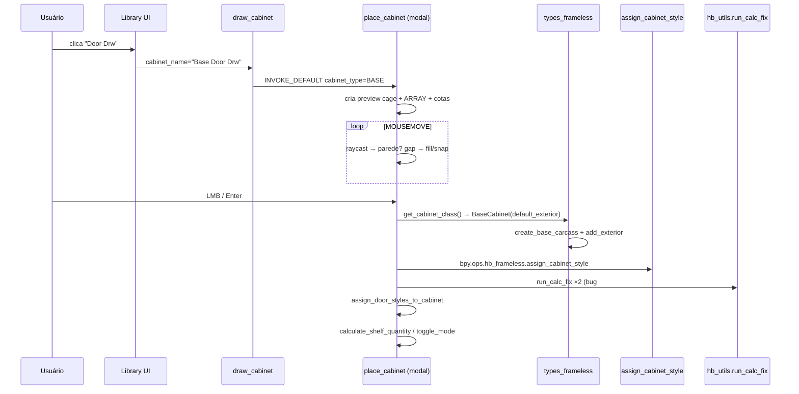
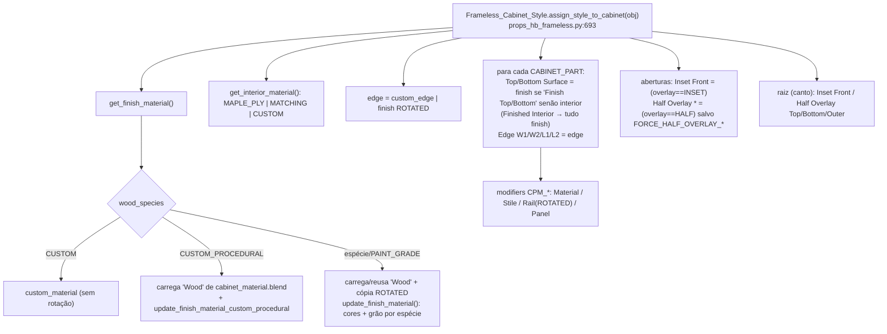
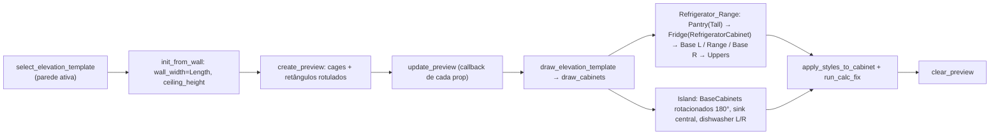

# Fluxogramas — módulo legado `frameless`

Camada legada (fork do Home Builder 5). Pacote: `blendertomob/product_libraries/frameless/`
(26 arquivos `.py`, ~23 mil linhas). Biblioteca de gabinetes **sem quadro frontal** (estilo europeu / 32 mm,
porém parametrizada em polegadas no fork americano).

Legenda de confiança: 🟢 CONFIRMADO (lido no código) · 🟡 INFERIDO · 🔴 LACUNA.

Arquivos de detalhe por função:
- [`legacy-frameless-create_base_carcass.md`](legacy-frameless-create_base_carcass.md) — geração da caixa inferior (laterais, base, fundo, rodapé, tampo/travessas, vão).
- [`legacy-frameless-splitter_vertical.md`](legacy-frameless-splitter_vertical.md) — divisores com calculadora de vãos (gavetas/portas empilhadas).
- [`legacy-frameless-front_overlay.md`](legacy-frameless-front_overlay.md) — cálculo de sobreposição (overlay) e dimensionamento de portas/frentes/gavetas.
- [`legacy-frameless-place_cabinet_modal.md`](legacy-frameless-place_cabinet_modal.md) — operador modal de inserção em parede/piso.
- [`legacy-frameless-create_wall_countertop.md`](legacy-frameless-create_wall_countertop.md) — geração de tampo (bancada) por corrida de paredes.
- [`legacy-frameless-assign_crown.md`](legacy-frameless-assign_crown.md) — extrusão de moldura (crown) com cantos.

## 1. Visão geral — quem chama quem

🟢 Registro: `frameless/__init__.py:10-20` chama `props_hb_frameless.register()`, `props_elevation_templates.register()`,
`operators.register()` (17 módulos, `operators/__init__.py:20-37`) e `menus_frameless.register()`.

## 2. Hierarquia de classes (tipos paramétricos)

```mermaid
classDiagram
    direction TB
    class GeoNodeCage {
      <<hb_types>>
      create()
      var_input()
      driver_input()
      set_input()
      add_property()
    }
    class GeoNodeCutpart {
      <<hb_types>>
      add_part_modifier()
    }
    class Cabinet {
      width = 18in
      height = 34in
      depth = 24in
      default_exterior = Doors
      create_cabinet()
      create_base_carcass()
      create_tall_carcass()
      create_upper_carcass()
      add_cage_to_bay()
      _add_leg_levelers()
    }
    class BaseCabinet {
      add_exterior()
      add_doors()
      add_drawer_door()
      add_drawer_stack(n)
    }
    class LapDrawerCabinet {
      create_lap_drawer_carcass()
    }
    class TallCabinet {
      is_stacked
      add_doors()
    }
    class RefrigeratorCabinet {
      add_openings()
    }
    class UpperCabinet {
      is_stacked
      add_doors()
    }
    class CornerCabinet {
      corner_size=36in
      add_corner_doors()
      create_corner_base_carcass()
      create_corner_upper_carcass()
      add_corner_modifier()*
    }
    class DiagonalCornerBaseCabinet
    class PieCutCornerBaseCabinet
    class DiagonalCornerTallCabinet {
      stub
    }
    class PieCutCornerTallCabinet
    class DiagonalCornerUpperCabinet {
      stub
    }
    class PieCutCornerUpperCabinet
    class CabinetBay
    class SplitterVertical {
      splitter_qty
      opening_sizes
      opening_inserts
    }
    class SplitterHorizontal {
      splitter_qty
      opening_sizes
      opening_inserts
    }
    class CabinetOpening {
      half_overlay_flags
      add_properties_front_overlays()
      add_properties_front_overlay_calculations()
    }
    class Doors {
      door_pull_location
    }
    class FlipUpDoor
    class Drawer
    class Pullout
    class FalseFront
    class Appliance {
      appliance_name
    }
    class OpenWithShelves
    class CabinetInterior
    class CabinetShelves
    class InteriorSplitterVertical
    class InteriorSplitterHorizontal
    class InteriorSection
    class LadderBaseCage
    class CabinetPart
    class CabinetSideNotched
    class CabinetFront {
      assign_door_style()
      get_pull_object()
    }
    class CabinetDoor
    class CabinetFlipUpDoor
    class CabinetDrawerFront {
      add_drawer_box()
    }
    class CabinetPulloutFront {
      add_drawer_box()
    }
    class Product {
      create_product()
    }
    class FloatingShelf
    class Valance
    class SupportFrame
    class HalfWall
    class Leg
    class TallLeg
    class UpperLeg
    class Panel
    class MiscPart

    GeoNodeCage <|-- Cabinet
    Cabinet <|-- BaseCabinet
    Cabinet <|-- LapDrawerCabinet
    Cabinet <|-- TallCabinet
    Cabinet <|-- RefrigeratorCabinet
    Cabinet <|-- UpperCabinet
    Cabinet <|-- CornerCabinet
    CornerCabinet <|-- DiagonalCornerBaseCabinet
    CornerCabinet <|-- PieCutCornerBaseCabinet
    CornerCabinet <|-- DiagonalCornerTallCabinet
    CornerCabinet <|-- PieCutCornerTallCabinet
    CornerCabinet <|-- DiagonalCornerUpperCabinet
    CornerCabinet <|-- PieCutCornerUpperCabinet
    GeoNodeCage <|-- CabinetBay
    GeoNodeCage <|-- SplitterVertical
    GeoNodeCage <|-- SplitterHorizontal
    GeoNodeCage <|-- CabinetOpening
    CabinetOpening <|-- Doors
    CabinetOpening <|-- FlipUpDoor
    CabinetOpening <|-- Drawer
    CabinetOpening <|-- Pullout
    CabinetOpening <|-- FalseFront
    CabinetOpening <|-- Appliance
    CabinetOpening <|-- OpenWithShelves
    GeoNodeCage <|-- CabinetInterior
    CabinetInterior <|-- CabinetShelves
    CabinetInterior <|-- InteriorSplitterVertical
    CabinetInterior <|-- InteriorSplitterHorizontal
    GeoNodeCage <|-- InteriorSection
    GeoNodeCage <|-- LadderBaseCage
    GeoNodeCutpart <|-- CabinetPart
    CabinetPart <|-- CabinetSideNotched
    CabinetPart <|-- CabinetFront
    CabinetFront <|-- CabinetDoor
    CabinetFront <|-- CabinetFlipUpDoor
    CabinetFront <|-- CabinetDrawerFront
    CabinetFront <|-- CabinetPulloutFront
    GeoNodeCage <|-- Product
    Product <|-- FloatingShelf
    Product <|-- Valance
    Product <|-- SupportFrame
    Product <|-- HalfWall
    Product <|-- Leg
    Product <|-- TallLeg
    Product <|-- UpperLeg
    Product <|-- Panel
    CabinetPart <|-- MiscPart
```

🟢 Todas as heranças lidas em `types_frameless.py` (linhas 8–2921) e `types_products.py` (8–938).
🔴 `DiagonalCornerTallCabinet.create` (`types_frameless.py:2808-2811`) e `DiagonalCornerUpperCabinet.create`
(`:2869-2872`) só criam a gaiola — sem caixa nem portas (stubs). A UI de canto diagonal está comentada
(`props_hb_frameless.py:1945-1965`).

## 3. Árvore de objetos de um gabinete (composição em tempo de execução)

🟢 Montado por `Cabinet.add_cage_to_bay` (`types_frameless.py:52-63`), `SplitterVertical.create` (`:940-1026`),
`Doors.create` (`:1271-1328`), `CabinetDrawerFront.add_drawer_box` (`:1867-1926`).

## 4. Fluxo de criação de um gabinete (do clique à cena)

🟢 `ops_placement.py:1934-1977` (draw_cabinet), `:1825-1851` (confirmação), `:1455-1509` (fábrica de classes).

## 5. Estilos, materiais e cores

🟢 `props_hb_frameless.py:636-798`, `wood_materials.py:22-228`, `finish_colors.py:207-253`.

## 6. Templates de elevação

🟢 `props_elevation_templates.py:1401-1478` (operadores), `:566-775` (Refrigerator_Range.draw_cabinets), `:1136-1284` (Island.draw_cabinets).
🟡 `range_hood_type='RAISE_UPPER'` apenas une as uppers sobre o fogão — não eleva nada; `range_hood_height` só aparece na UI (`:866-869`).
