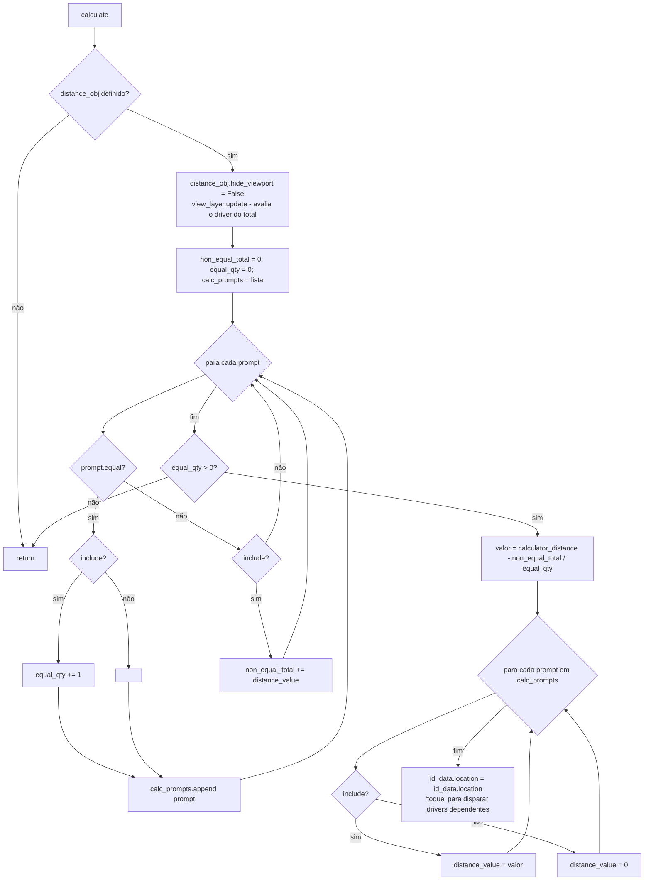

# `Calculator.calculate` — distribuição de medidas entre prompts

Local: 🟢 `blendertomob/hb_props.py:294-320`. Estrutura: `Calculator` (`hb_props.py:249-320`) com coleção de
`Calculator_Prompt` (`hb_props.py:227-246`); o total vem do driver em `distance_obj.home_builder.calculator_distance`
criado por `set_total_distance` (`hb_props.py:253-257`). Uso real: 🟢 `product_libraries/frameless/types_frameless.py:953-1026`
("Opening Calculator" que divide a altura do vão entre divisórias: total = `dim_z - mt*qtd`).

**Regra (HB_CORE-R15).** 🟢 Prompts marcados "igual" e incluídos recebem partes iguais do que sobra do total depois de
subtrair os prompts de valor fixo incluídos. Prompts "igual" excluídos ficam com 0. Prompts fixos não mudam. Sem prompts
"igual", nada é recalculado.

**Observações.**
- 🟢 Não há proteção contra resultado negativo (valores fixos maiores que o total).
- 🟢 `hide_viewport = False` é permanente; o objeto de cálculo é um empty de tamanho 0,001 (`types_frameless.py:951-952`).
- 🔴 Os operadores `pc_prompts.add_calculator_prompt`, `pc_prompts.edit_calculator` e `pc_prompts.run_calculator`,
  usados em `Calculator.draw` (`hb_props.py:264-280`), não estão definidos em `blendertomob/` (grep sem resultado de
  `bl_idname`). `remove_calculator_prompt` é um stub (`hb_props.py:291-292`).
