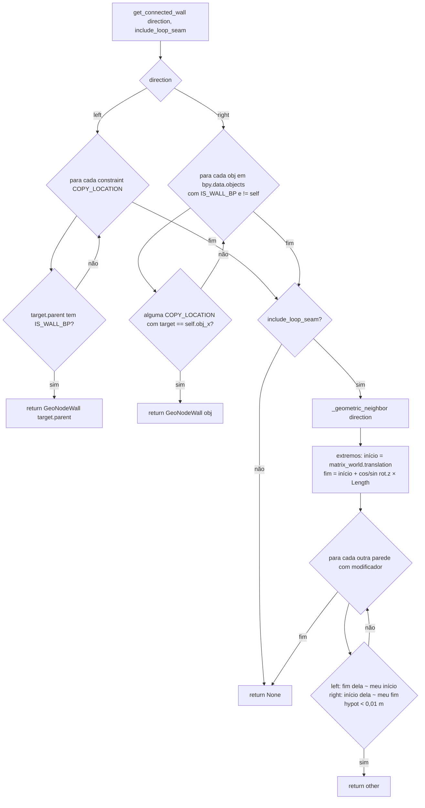

# `GeoNodeWall.get_connected_wall` / `_geometric_neighbor` — vizinhança entre paredes

Local: 🟢 `blendertomob/hb_types.py:486-522` e `:524-561`. Conexão criada por `connect_to_wall`
(`hb_types.py:480-484`): a parede nova recebe uma restrição `COPY_LOCATION` apontando para o empty `obj_x` da parede
anterior. O `obj_x` fica em `location.x = Length` por driver (`hb_types.py:454-466`).

**Regra (HB_CORE-R08).** 🟢 A vizinhança é primeiro topológica (cadeia de restrições) e, opcionalmente, geométrica
(coincidência de extremos no plano XY do mundo, tolerância de 0,01 m). A busca geométrica existe porque a cadeia de
restrições não atravessa a "costura" de um cômodo fechado; a docstring avisa que quem percorre a cadeia não deve usar
`include_loop_seam`, senão o laço não termina (`hb_types.py:492-499`).

**Observações.**
- 🟢 A busca à direita é O(n × restrições) sobre `bpy.data.objects`, incluindo objetos de outras cenas.
- 🟡 Só a rotação Z entra no cálculo dos extremos; paredes inclinadas em X/Y seriam avaliadas errado.
- 🟢 Exceções em `get_input('Length')` são engolidas (`except Exception`), e a parede é ignorada.
