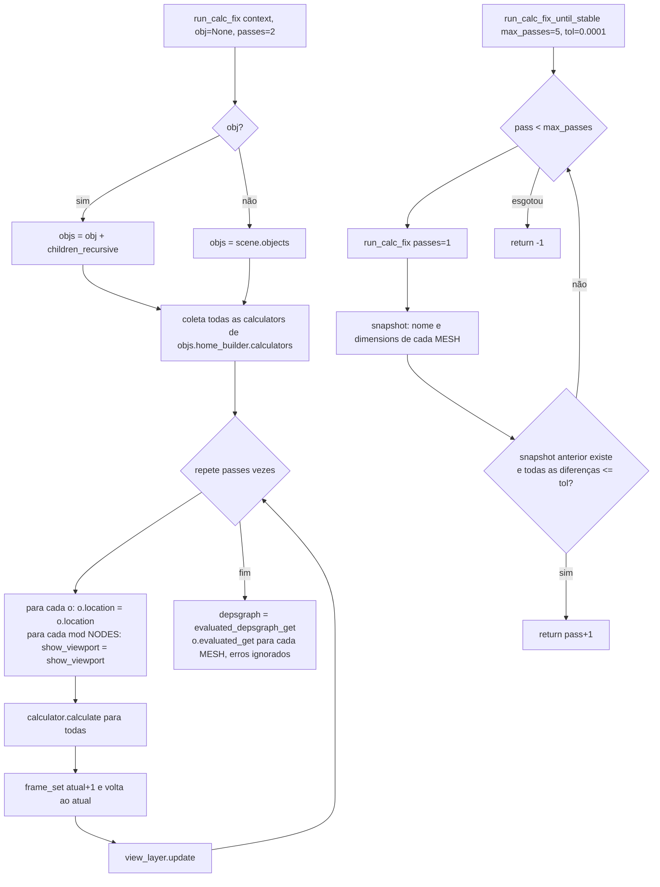

# `run_calc_fix` / `run_calc_fix_until_stable` — forçar reavaliação de drivers

Local: 🟢 `blendertomob/hb_utils.py:190-246` e `:249-297`. Contorno documentado no código para o bug do Blender
#133392 (drivers de "netos" não atualizam). Chamado em cerca de 61 pontos do pacote (grep).

**Regra (HB_CORE-R21).** 🟢 Cada passada "toca" transformações e modificadores, recalcula as calculadoras, provoca uma
mudança de frame e atualiza a view layer. A versão "until stable" compara `dimensions` de meshes com tolerância de 0,1 mm
por até 5 passadas; retorna o número de passadas ou -1.

**Observações.**
- 🟢 `frame_set` dispara `frame_change_pre/post` de outros add-ons e altera o frame duas vezes: custo O(passes × objetos).
- 🟡 A comparação usa `zip` na ordem de coleta; se objetos forem criados ou removidos entre passadas, os pares podem ficar
  desalinhados.
- 🟡 Sem contexto de janela (modo background), `context.view_layer` funciona, mas os efeitos de redesenho não se aplicam.
