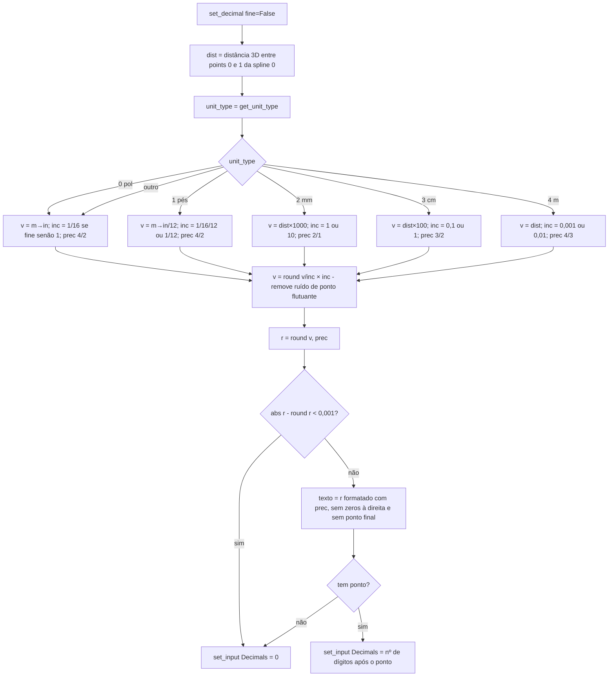

# `GeoNodeDimension.set_decimal` — precisão decimal da cota

Local: 🟢 `blendertomob/hb_types.py:732-798`; unidade em `get_unit_type` (`hb_types.py:692-712`).

**Regras (HB_CORE-R11, R12).**
- 🟢 `get_unit_type`: sistema `METRIC` → `MILLIMETERS`=2, `CENTIMETERS`=3, `METERS`=4, outra unidade métrica=3;
  `IMPERIAL`/`NONE` → 0 (polegadas). O valor 1 (pés) nunca é devolvido, embora `set_decimal` o trate.
- 🟢 O valor é "encaixado" no incremento de snap da unidade (grosso ou fino) antes de contar decimais.

**Observações.**
- 🟢 No modo grosso em mm, o incremento é 10 mm (cota "arredonda" para centímetro), com precisão 1; na prática, cotas em
  mm não fino sempre ficam com 0 decimais.
- 🟡 `get_unit_type` ignora `scene.btm_settings.btm_unit`, que o sistema moderno de unidades consulta
  (`data/units.py:57-64`); as duas camadas podem divergir quanto à unidade exibida.
