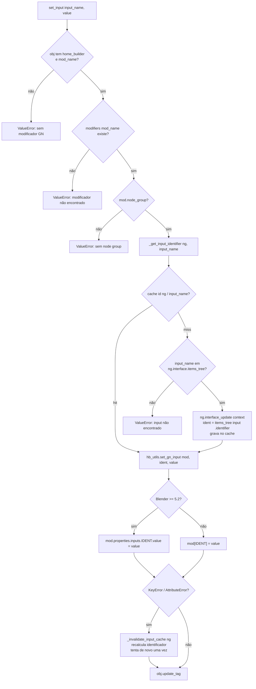

# `GeoNodeObject.set_input` / `get_input` — acesso a inputs de Geometry Nodes

Local: 🟢 `blendertomob/hb_types.py:325-360` (set), `:362-390` (get), cache em `:21-50`; ponte de versão em
`blendertomob/hb_utils.py:13-28`. `CabinetPartModifier.set_input/get_input` (`hb_types.py:914-962`) seguem o mesmo
algoritmo, mas usam `self.mod` (modificador adicional) em vez de `obj.home_builder.mod_name`.

**Explicação.** 🟢 O identificador do socket (`Socket_N`) é resolvido pelo nome do input e guardado em cache por
`id(node_group)` para evitar `interface_update` (comentário cita ~0,45 ms por chamada, `hb_types.py:12-20`). Se o
identificador em cache falhar, o cache do grupo é descartado e há uma única nova tentativa. Após a escrita, `update_tag()`
força a reavaliação no depsgraph (`hb_types.py:356-360`).

**Riscos.**
- 🟡 `id(node_group)` é o `id()` do wrapper Python do `NodeTree`; wrappers podem ser recriados e ids reciclados após GC.
  A nova tentativa cobre identificadores inexistentes, mas não uma colisão que devolva um identificador válido de outro
  grupo (escrita silenciosa no socket errado).
- 🟢 Existe um segundo cache idêntico em `blendertomob/compat.py:4-39`, e `compat.set_gn_input(mod, input_name, value)`
  recebe **nome** enquanto `hb_utils.set_gn_input(mod, identifier, value)` recebe **identificador** — mesmo nome de
  função, semântica diferente. A camada `hb_core` não importa `compat` (grep).
