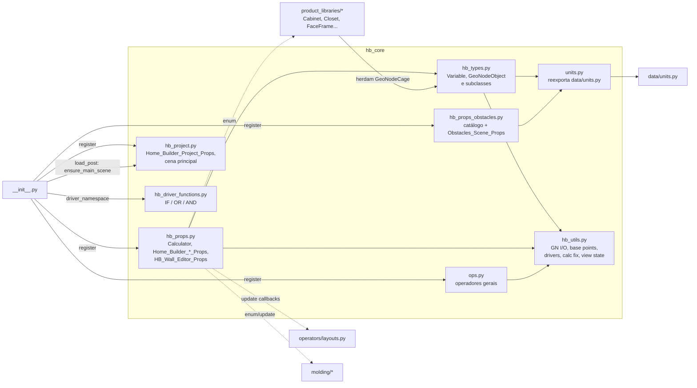
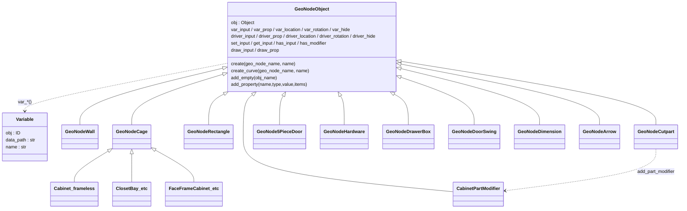
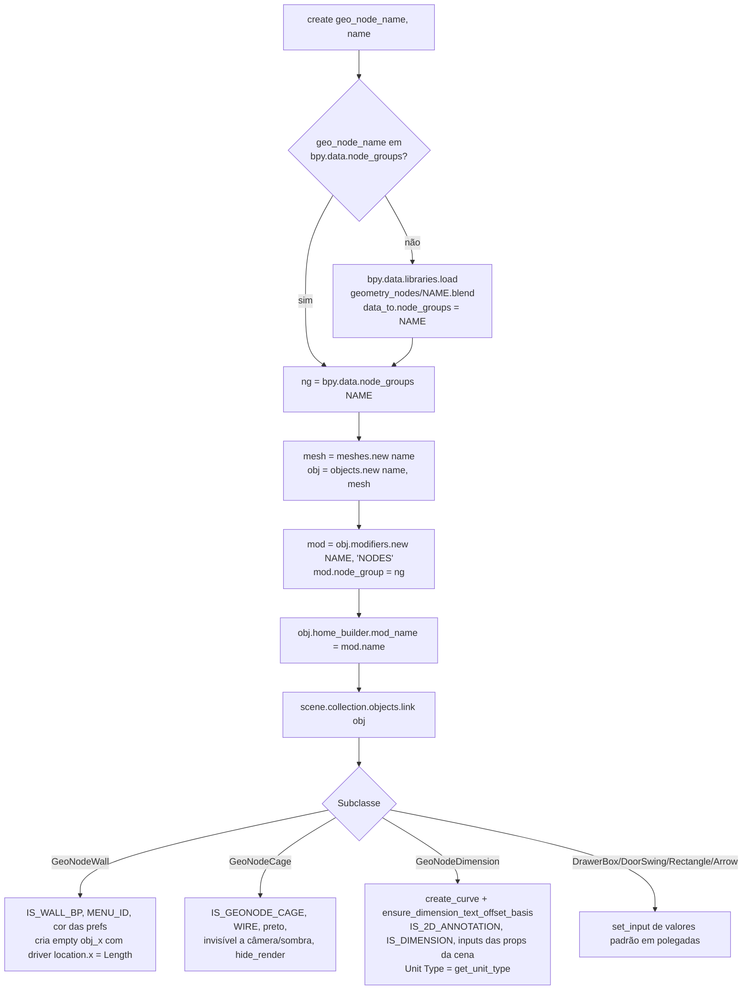
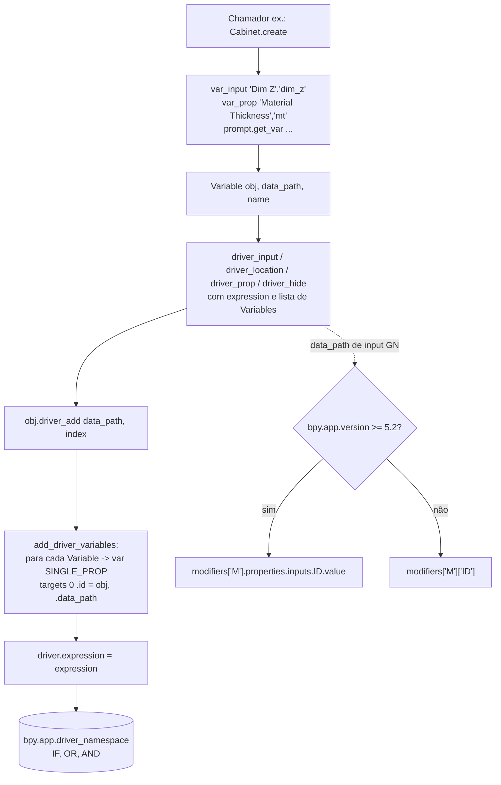
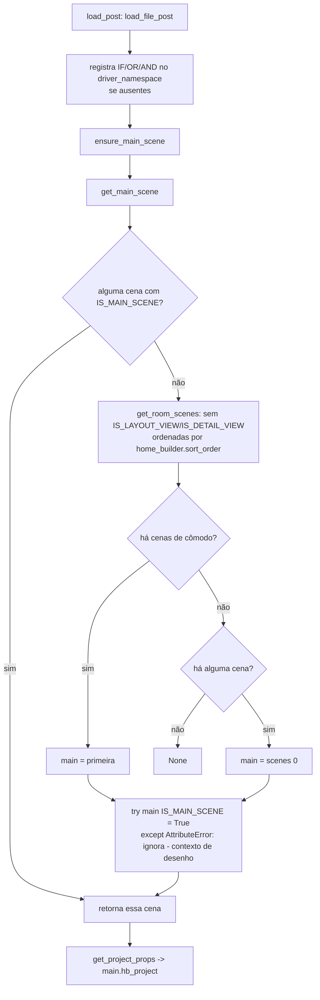
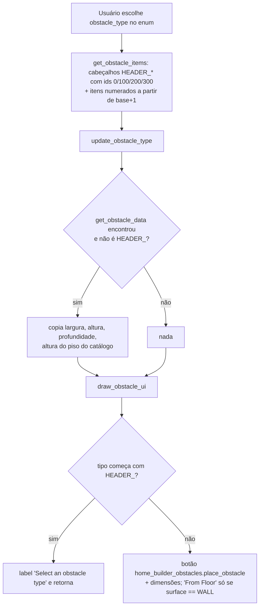
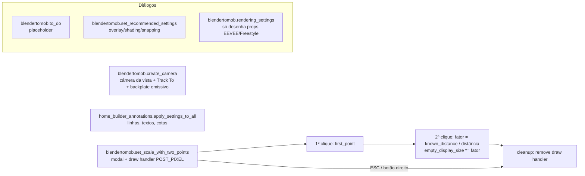

# Fluxogramas — `hb_core` (camada legada Home Builder 5)

Módulo núcleo da camada legada: modelo de objetos paramétricos baseados em Geometry Nodes (`GeoNodeObject` e subclasses),
sistema de drivers (`Variable` + `add_driver_variables`), calculadoras de distribuição (`Calculator`), PropertyGroups
`home_builder` (Object/Scene/WindowManager), projeto/cena principal, obstáculos, unidades e operadores gerais.

Legenda de confiança: 🟢 CONFIRMADO (lido no código) · 🟡 INFERIDO · 🔴 LACUNA.

Fluxos detalhados por função:

- [`legacy-hb_core-set_input.md`](legacy-hb_core-set_input.md) — escrita/leitura de inputs de GN com cache de identificadores
- [`legacy-hb_core-calculator_calculate.md`](legacy-hb_core-calculator_calculate.md) — distribuição de medidas "iguais"
- [`legacy-hb_core-run_calc_fix.md`](legacy-hb_core-run_calc_fix.md) — contorno do bug de drivers netos (#133392)
- [`legacy-hb_core-get_connected_wall.md`](legacy-hb_core-get_connected_wall.md) — vizinhança de paredes (restrição + geometria)
- [`legacy-hb_core-set_decimal.md`](legacy-hb_core-set_decimal.md) — precisão decimal das cotas

## 1. Visão geral do módulo (dependências internas)

🟢 Baseado nos imports de `blendertomob/hb_types.py:1-6`, `hb_props.py:15-17`, `hb_props_obstacles.py:1-8`,
`hb_project.py:18-23`, `ops.py:1-8`, `units.py:1-19` e `__init__.py:58-80,212-256`.

## 2. Hierarquia de classes do modelo de objetos

🟢 `hb_types.py:59-962`; subclasses externas 🟢 por grep (`product_libraries/frameless/types_frameless.py:8`,
`closets/types_closets.py:139`, `face_frame/types_face_frame.py:766`, `hb_details.py:107`).

## 3. Criação de um objeto GeoNode (`GeoNodeObject.create`)

🟢 `hb_types.py:79-97` (mesh) e `hb_types.py:99-122` (curva POLY de 2 pontos).

## 4. Sistema de drivers (Variable → driver)

🟢 `hb_types.py:59-68,167-287`, `hb_utils.py:55-60,299-305`, `hb_props.py:238-257,382-406`.

## 5. Cena principal e projeto

🟢 `hb_project.py:143-278`, `__init__.py:58-80`.

## 6. Obstáculos — seleção de tipo

🟢 `hb_props_obstacles.py:104-145,216-252`.

## 7. Operadores gerais (`ops.py`)

🟢 `ops.py:10-685`.

