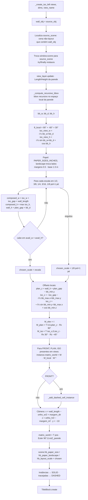

# `MultiView._create_iso_left` — prancha compacta (Iso + Planta + Elevação)

Local: `blendertomob/hb_layouts.py:2397`. Chamado por `MultiView.create` quando `'ISO' in views` (`:2277`). 🟢

## Fluxograma

## Explicação

- **Leitura no depsgraph correto** 🟢 (`:2447-2470`): como `create_scene` já trocou a janela para a cena de layout
  vazia, o método volta temporariamente para a cena de origem antes de avaliar o bbox; caso contrário, descendentes
  fora do depsgraph leriam `matrix_world` identidade e o bbox seria deslocado pela posição mundial da parede
  (comentário longo no código).
- **Projeção isométrica** 🟢 (`:2484-2495`): rotação `Rx(90°+θ) @ Rz(−45°)` com θ = −60°, expressa no referencial
  da câmera que olha para +Y. Tamanho projetado calculado analiticamente a partir do bbox.
- **Escada de escalas** 🟢 (`:2524-2543`): escolhe a MAIOR escala imperial (de 1/2"=1' até 1/8"=1') em que o
  conjunto cabe na área imprimível; se nenhuma couber, usa 1/8"=1' mesmo que transborde. 🟡 A escada é só imperial,
  embora a preferência padrão do fork seja métrica (`1:50`, `blendertomob/__init__.py:141-154`).
- **Âncora na parede** 🟢 (`:2636-2637`): a borda direita da elevação sempre cai em `página − margem direita` e a base em
  `margem inferior (1,5 in)`, qualquer que seja o tamanho da parede.
- **Instâncias por matriz** 🟢 (`:2579-2603`): `M_E = W · M_local · W⁻¹` mantém a elevação na posição nativa (identidade)
  e desloca planta/iso em coordenadas locais da parede.
- **Câmera por `matrix_world`** 🟢 (`:2655-2662`): atribuída diretamente porque `location/rotation_euler` não atualizam
  `matrix_world` antes da avaliação do depsgraph.
- Parâmetros `gap_unused`, `source_loc_unused`, `source_rot_inv_unused` são ignorados 🟢; margens esquerda/superior são
  calculadas e descartadas (`:2622`, `:2624`) 🟢.
