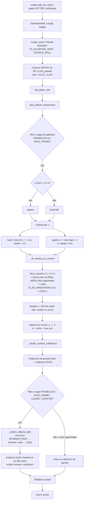

# `ElevationView.create` — elevação de parede

Local: `blendertomob/hb_layouts.py:1447` (+ `_fit_camera_to_content` `:1504`, `add_cabinet_dimensions` `:1580`,
`_create_cabinet_dimension` `:1636`, `_create_content_collections` `:1681`, `_collect_objects_split` `:1752`). 🟢
Chamado por `home_builder_layouts.create_elevation_view` e `create_all_elevations` (`blendertomob/operators/layouts.py:302`, `:368`).

## Fluxograma

## Explicação

- **Classificação de gabinetes para cotas** 🟢 (`:1613-1617`): limiar fixo de 1,2 m (48") sobre a posição Z local do
  cage decide se o gabinete é "superior" (cota acima) ou "base/alto" (cota abaixo). Só filhos DIRETOS da parede com
  `IS_FRAMELESS_CABINET_CAGE`/`IS_FACE_FRAME_CABINET_CAGE` recebem cota — closets não (🟢 `:1595`).
- **Cotas** 🟢: `GeoNodeDimension` com comprimento no ponto 1 do spline = `Dim X` do cage; afastadas 2" à frente da
  parede (`-units.inch(2)` em Y local); `Leader Length` ±4". O objeto é renomeado para `Dim_<cage>` porque
  `create_curve` ignora o nome (`:1641-1645`) e é removido de qualquer cena onde foi linkado por `bpy.context.scene`.
- **Enquadramento** 🟢: margem 10% do maior lado; `ortho_scale = max(largura, altura)` — ignora a razão de aspecto do
  papel (🟡 conteúdo muito alto/estreito pode ser cortado em papel paisagem, pois ortho_scale aplica-se ao lado maior
  da resolução).
- **Divergência com `update()`** 🟢 (`:1780-1801`): a atualização recalcula a câmera com outra regra (y = −2 m, margem
  fixa 0,2 m, sem cotas nem filhos) e não reconstrói collections nem cotas.
- As collections de conteúdo linkam os OBJETOS ORIGINAIS da sala (sem cópia); a vista é uma instância de collection 🟢.
