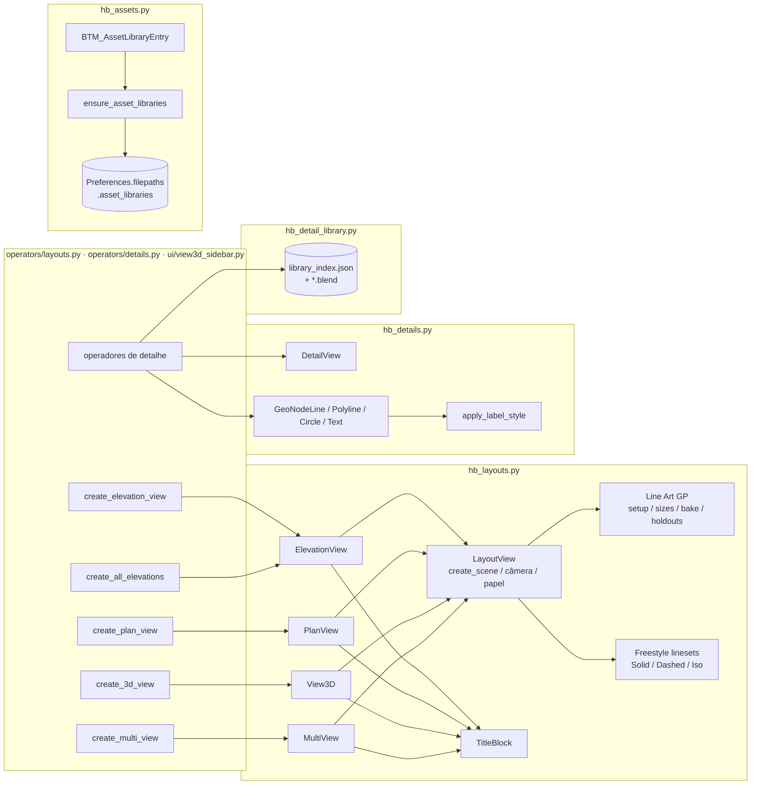
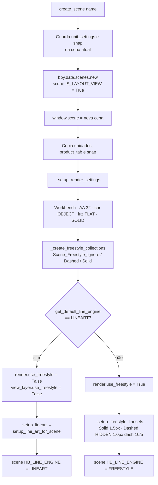
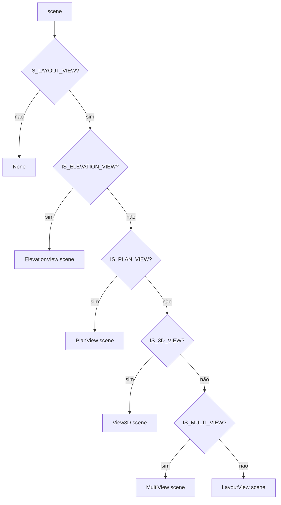
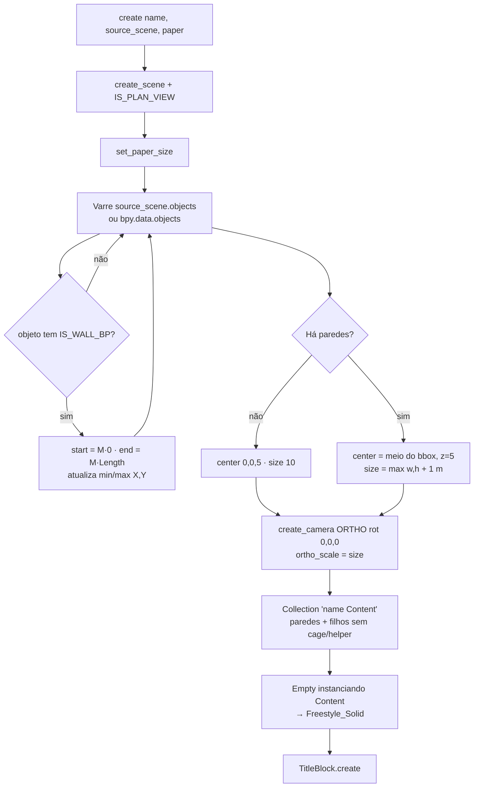
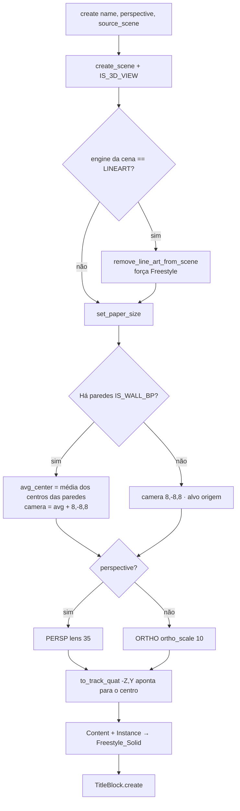
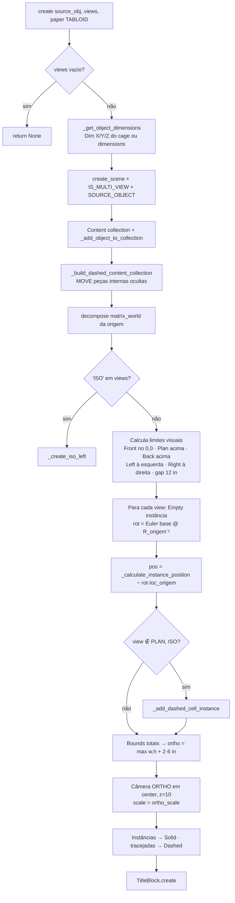
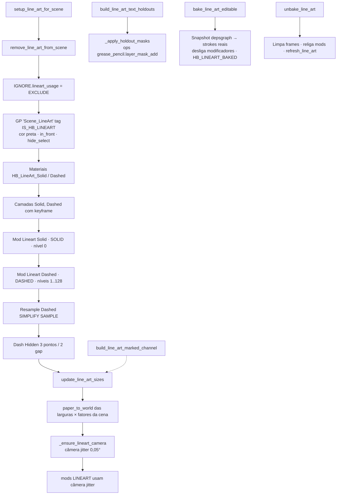
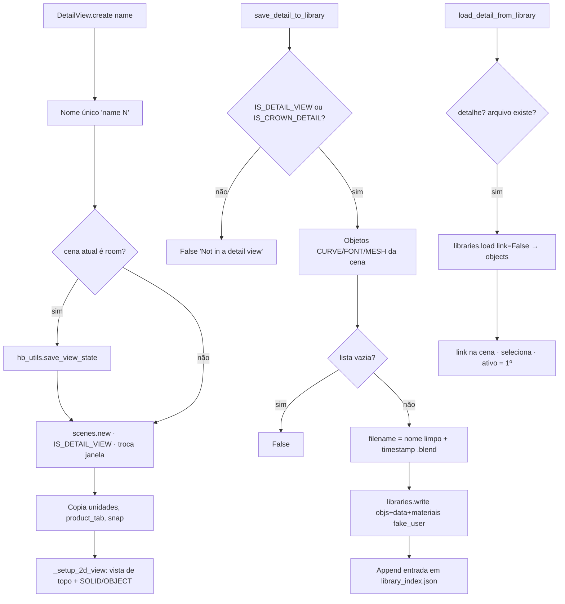
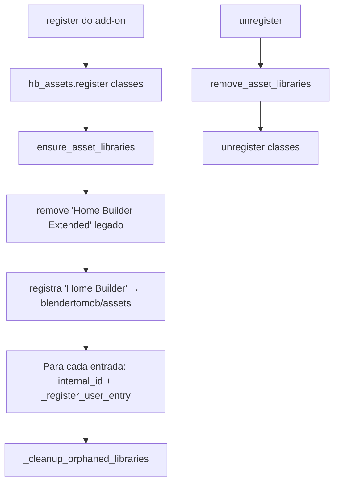

# Fluxogramas — módulo legado `hb_layouts`

> Camada legada (fork do Home Builder 5). Arquivos: `blendertomob/hb_layouts.py`, `blendertomob/hb_details.py`,
> `blendertomob/hb_detail_library.py`, `blendertomob/hb_assets.py`.
> Legenda de confiança: 🟢 CONFIRMADO · 🟡 INFERIDO · 🔴 LACUNA.

## 1. Visão geral do módulo 🟢

## 2. Criação de uma cena de layout (base comum) 🟢

`LayoutView.create_scene` (`blendertomob/hb_layouts.py:1141`) → `_setup_render_settings` (`:1194`).

## 3. Tipos de vista e despacho 🟢

`get_layout_view_from_scene` (`blendertomob/hb_layouts.py:2960`).

## 4. PlanView.create 🟢

`blendertomob/hb_layouts.py:1819`.

## 5. View3D.create 🟢

`blendertomob/hb_layouts.py:1992`.

## 6. MultiView.create — layout em cruz 🟢

`blendertomob/hb_layouts.py:2205`. O ramo ISO desvia para `_create_iso_left` (ver `legacy-hb_layouts-create_iso_left.md`).

## 7. Pipeline Line Art (Grease Pencil) 🟢

## 8. Detalhes 2D e biblioteca de detalhes 🟢

## 9. Registro de bibliotecas de assets 🟢

Detalhe em `legacy-hb_layouts-ensure_asset_libraries.md`.

