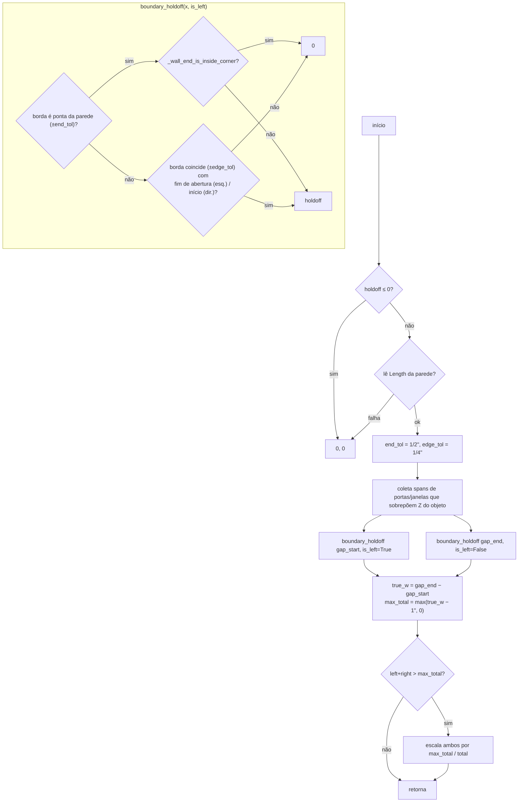

# `PlacementMixin.compute_gap_holdoffs` — recuo por borda do vão

Local: `blendertomob/hb_placement.py:1191-1270` 🟢 (usa `_wall_end_is_inside_corner`, `l.1143-1189`).
Assinatura: `(wall_obj, gap_start, gap_end, holdoff, place_on_front=True, wall_thickness=0.0, object_z_start=None, object_height=None) -> (left_holdoff, right_holdoff)`.

Define quanto o gabinete deve ficar afastado de cada borda do vão. `wall_thickness` é recebido mas **não é usado** no corpo 🟢.

## `_wall_end_is_inside_corner(wall_geo, side, place_on_front)`

🟢 `l.1156-1189`: canto interno ⇔ existe vizinha (`include_loop_seam=True`) e a direção da vizinha que **se afasta** do vértice compartilhado tem produto escalar > 1e-4 com a normal do lado de colocação (`-Y` local para frente, `+Y` para trás). Pontas abertas e cantos externos (convexos) retornam `False` → recebem recuo.

Regras resumidas:
- Canto interno e borda de gabinete vizinho → recuo 0 (corrida encosta).
- Ponta aberta, canto externo ou borda de porta/janela que se sobrepõe verticalmente → recuo `holdoff`.
- Os dois recuos são escalados juntos para deixar pelo menos 1" útil.
