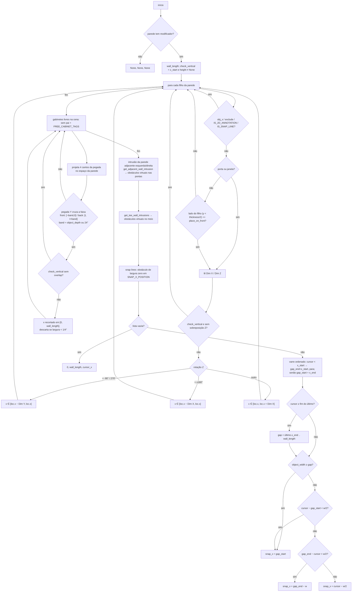

# `PlacementMixin.find_placement_gap_by_side` — busca de vão com lado da parede

Local: `blendertomob/hb_placement.py:918-1141` 🟢
Assinatura: `(wall_obj, cursor_x, object_width, place_on_front, wall_thickness, object_z_start=None, object_height=None, object_depth=None, exclude_obj=None) -> (gap_start, gap_end, snap_x)`; retorna `(None, None, None)` se a parede não tem modificador GN (`l.946-948`).

Versão "ciente do lado" de `find_placement_gap` (`l.502`). Monta uma lista de obstáculos `(x_start, x_end, obj)` no eixo X local da parede, ordena e escolhe o vão que contém `cursor_x`.

## Pontos de atenção

- 🟢 Portas/janelas (`IS_ENTRY_DOOR_BP`, `IS_WINDOW_BP`) bloqueiam os dois lados da parede (`l.969-974`).
- 🟢 O lado do filho é decidido só por `location.y < wall_thickness/2` (`l.972`).
- 🟢 Tolerância de rotação: 0,1 rad (~5,7°) (`l.1000-1003`).
- 🟡 A varredura assume obstáculos não sobrepostos: `gap_start = x_end` é sobrescrito a cada obstáculo cujo início ≤ cursor, então um obstáculo curto depois de um longo que o engloba pode "encolher" `gap_start` para trás. Se o cursor estiver dentro de um obstáculo, `gap_start` > cursor e o objeto encosta na borda direita desse obstáculo.
- 🟢 O teste "além do último" usa `children[-1][1]` (fim do último *por início*), não o maior fim (`l.1127`).
- 🟡 Filhos sem `home_builder.mod_name` entram com largura 0 (obstáculo pontual) (`l.978-986`).
