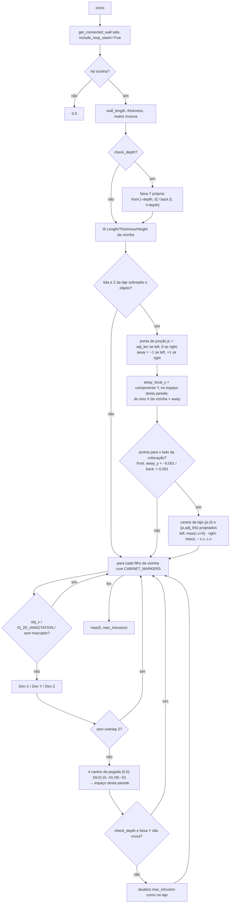
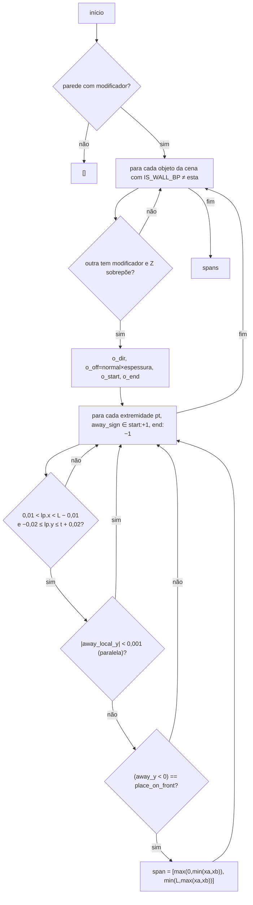

# `PlacementMixin.get_adjacent_wall_intrusion` e `get_tee_wall_intrusions` — invasão de paredes vizinhas

## `get_adjacent_wall_intrusion`

Local: `blendertomob/hb_placement.py:672-826` 🟢
Assinatura: `(wall_obj, side, object_z_start=None, object_height=None, object_depth=None, place_on_front=True) -> float` (≥ 0). `side ∈ {'left' (x=0), 'right' (x=wall_length)}`.

Calcula quanto (em metros, ao longo do X local desta parede) a parede vizinha **e** os gabinetes dela invadem o vão na ponta indicada. Tudo é feito projetando cantos com `matrix_world` para o espaço local desta parede, sem enumerar casos de rotação.

Regra-chave 🟢 (`l.722-730`): em canto interno, a corrida na face traseira precisa começar depois da espessura da vizinha; na face frontal típica a laje fica fora da faixa e a intrusão é 0.

## `get_tee_wall_intrusions`

Local: `blendertomob/hb_placement.py:828-916` 🟢 — retorna lista de `(x_start, x_end)`.

- 🟢 `END_MARGIN = 0.01 m` e `FACE_TOL = 0.02 m` (`l.868-869`).
- 🟢 Nada é armazenado: calculado a cada chamada, não fica obsoleto quando paredes se movem (`l.838-840`).
- 🟡 Custo O(nº de objetos da cena) por chamada, e `find_placement_gap` chama duas vezes (front e back) (`l.529-536`), executado a cada MOUSEMOVE.
