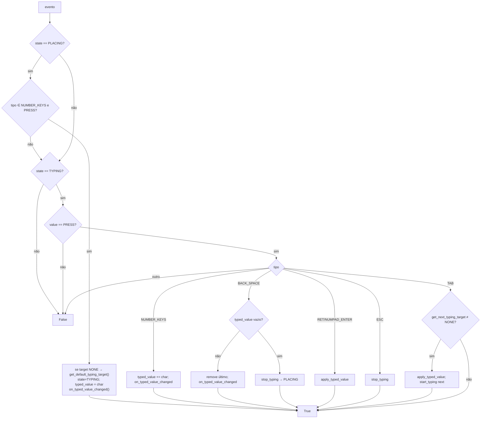
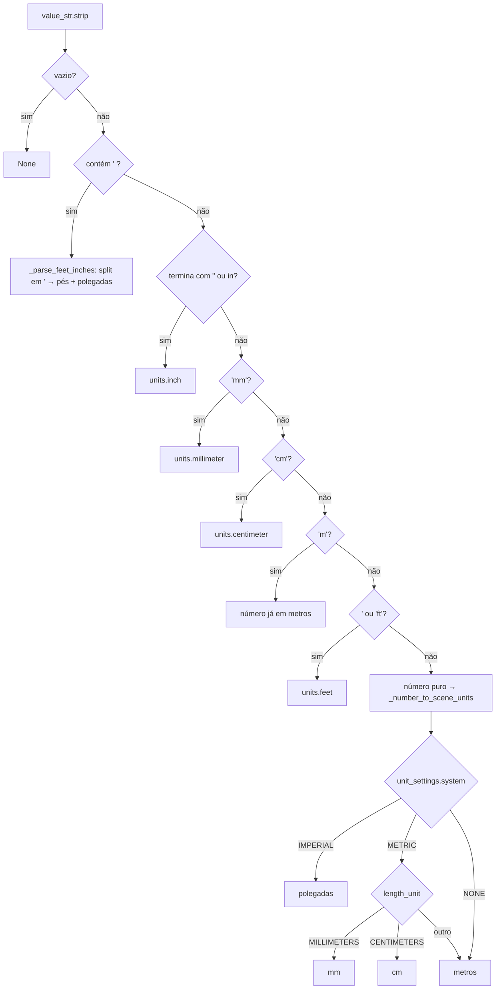

# `PlacementMixin.handle_typing_event` + `parse_typed_distance` — entrada numérica

Locais: `blendertomob/hb_placement.py:191-250` (eventos) e `283-388` (parser) 🟢.

## Tratamento de teclas

Pontos 🟢: ESC em modo TYPING é **consumido** (só sai da digitação, não cancela o operador); o 2º ESC cai no consumidor e cancela. Um PRESS de número no estado PLACING só inicia digitação se `event.value == 'PRESS'`.

O consumidor frameless sobrescreve `handle_typing_event` (`frameless/ops_placement.py:85-183`) acrescentando `LEFT_ARROW`/`RIGHT_ARROW` (offset esquerdo/direito), `W` (largura) e `H` (altura) 🟢.

## Parser de distância

`_extract_number` aceita `"a b/c"` (misto, exige espaço), `"a/b"` e float puro; `ValueError`/`ZeroDivisionError` → `None` (`l.333-336`).

Achados 🟢:
- O ramo `endswith("'")` (`l.324`) é inalcançável: qualquer `'` já cai em `_parse_feet_inches` (`l.304`).
- `NUMBER_KEYS` (`l.55-64`) só produz `0-9 . - /`. Espaço, aspas e letras de unidade não são digitáveis pelo modal, logo, na prática, apenas números puros e frações simples (`3/4`) chegam ao parser; frações mistas e sufixos de unidade só funcionam se o consumidor montar a string por outro caminho (🟡).
- Número puro em sistema imperial é sempre polegada, mesmo que `length_unit` seja pés (`l.377-379`).
