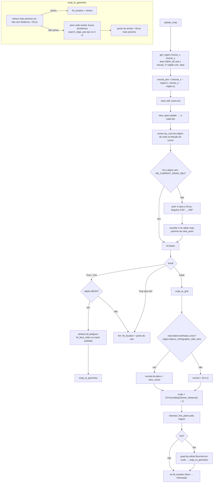

# `hb_snap.main` / `best_hit` / `snap_to_grid` — raycast e snapping de cursor

Local: `blendertomob/hb_snap.py:193-210` (main), `48-82` (best_hit), `100-145` (snap a geometria), `153-191` (grade) 🟢.
Chamado por `PlacementMixin.update_snap` (`hb_placement.py:158-173`), que antes converte o mouse para coordenadas da região sob o cursor (`hb_snap.get_region`, `hb_snap.py:10-29`).

Efeitos colaterais no operador (`self`): `hit_location`, `hit_face_index`, `hit_object`, `view_point`, `hit_grid`.

## Utilitários de grade para valores

- 🟢 `snap_value_to_grid(value, unit_settings=None, fine=False)` (`hb_snap.py:212-236`): imperial 1" (fino 1/16"); demais sistemas 10 mm (fino 1 mm); `round(value/grid)*grid`.
- 🟢 `snap_vector_to_grid` (`l.239-254`): aplica em X e Y, mantém Z.

## Achados

- 🟢 `HB_CURRENT_DRAW_OBJ` (propriedade custom) exclui do raycast o objeto sendo desenhado.
- 🟢 No fallback do anel, `view_point` retornado é o do **último** raio (`l.82`), não o do raio vencedor (diferença desprezível, mesma origem em perspectiva; 🟡 em ortográfica a origem varia com o pixel).
- 🟡 `Scene.ray_cast` devolve `index = -1` quando os dados originais não estão disponíveis (`docs/rag/blender-api/corpus/bpy.types.Scene.md#bpy.types.Scene.ray_cast`); `snap_to_object` indexa `data.polygons[self.hit_face_index]` no mesh **avaliado** — com `-1` pegaria o último polígono, e em objetos com modificadores GN o índice pode não corresponder ao mesh avaliado.
- 🟢 `context.view_layer.update()` a cada MOUSEMOVE (`l.50`) — custo alto em cenas grandes, mas coerente com `docs/rag/project/04_armadilhas.md` (dados desatualizados).
- 🟢 Se `get_region` retornar `None` no `init_placement` (sem viewport 3D) e também no `update_snap`, `self.region.x` falha com `AttributeError` (`hb_placement.py:169-172`).
