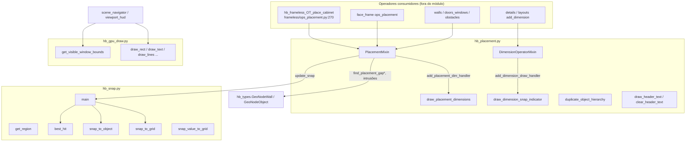
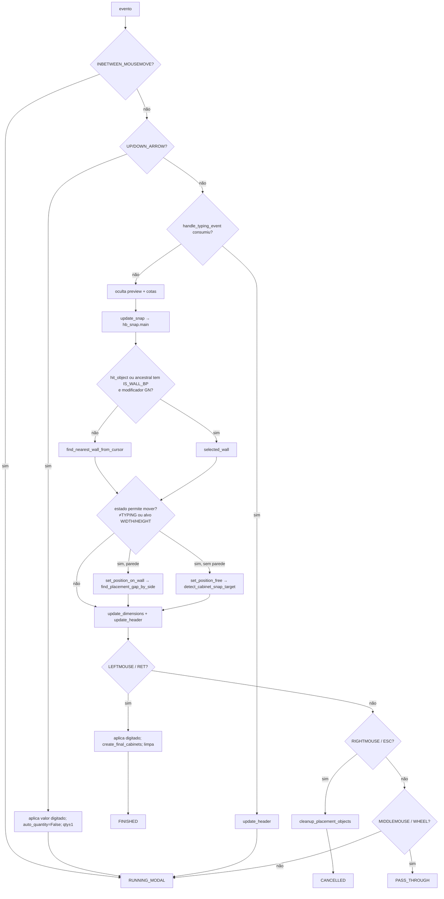
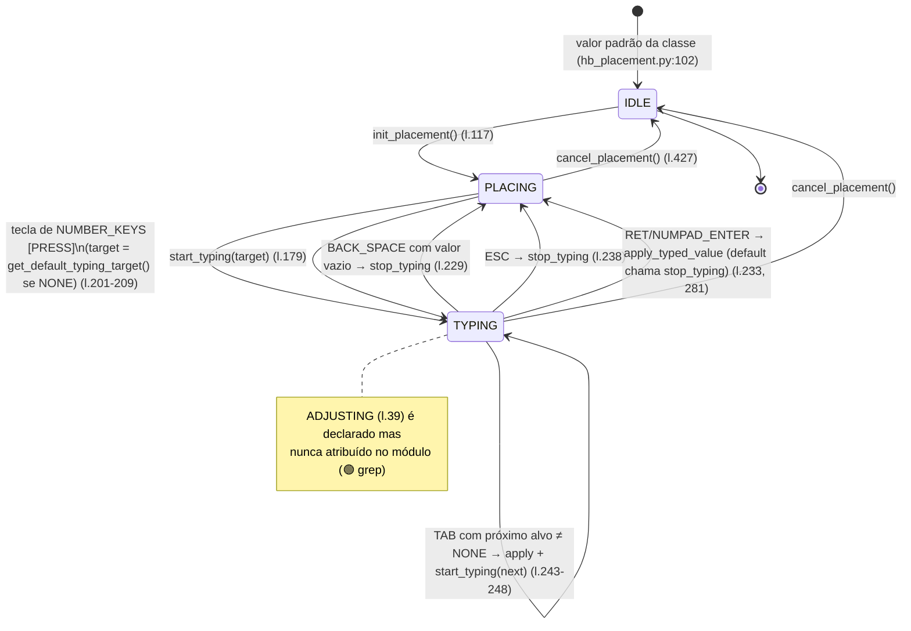
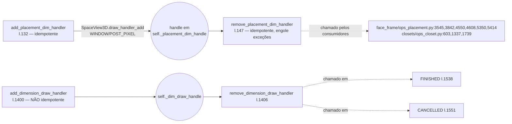
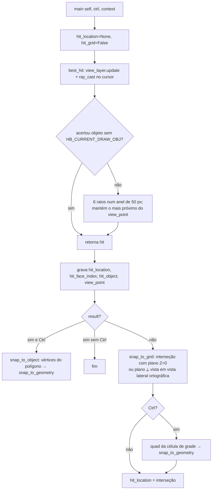

# Fluxogramas — módulo legado `hb_placement` (fork Home Builder 5)

Arquivos: `blendertomob/hb_placement.py`, `blendertomob/hb_snap.py`, `blendertomob/hb_gpu_draw.py`.

> Legenda de confiança: 🟢 CONFIRMADO (lido no código) · 🟡 INFERIDO · 🔴 LACUNA

O módulo **não registra operadores próprios** 🟢 (não há `bpy.types.Operator` nem `register()` em nenhum dos três arquivos). Ele fornece:

- `PlacementMixin` (`hb_placement.py:81`) — base de estado + entrada numérica + consultas de colisão/gap em paredes, herdada por ~15 operadores modais (paredes, portas/janelas, obstáculos, detalhes 2D, layouts, gabinetes frameless/face-frame, closets).
- `DimensionOperatorMixin` (`hb_placement.py:1360`) — máquina de 3 cliques para cotas (FIRST → SECOND → OFFSET).
- `hb_snap` — raycast com busca em anel, snap a vértice/aresta e à grade.
- Desenho GPU: `draw_placement_dimensions` (`hb_placement.py:1712`), `draw_dimension_snap_indicator` (`hb_placement.py:1642`) e primitivas compartilhadas de `hb_gpu_draw.py`.

## 1. Visão geral (dependências e fluxo de um tick modal)



## 2. Tick modal típico de um consumidor do `PlacementMixin`

Baseado no consumidor representativo `hb_frameless_OT_place_cabinet.modal` (`product_libraries/frameless/operators/ops_placement.py:1729-1863`) 🟢.



## 3. Máquina de estados do posicionamento (`PlacementState` × `TypingTarget`)



## 4. Máquina de estados do `DimensionOperatorMixin`

```mermaid
stateDiagram-v2
    [*] --> FIRST : init_dimension_state() (l.1381)
    FIRST --> SECOND : LEFTMOUSE com current_point\nfirst_point=copy; create_preview_dimension (l.1516-1522)
    SECOND --> OFFSET : LEFTMOUSE\nsecond_point (com ortho se ativo) (l.1524-1532)
    OFFSET --> [*] : LEFTMOUSE → finalize_dimension;\nremove handler; limpa header → FINISHED (l.1534-1540)
    FIRST --> [*] : RIGHTMOUSE/ESC → cancel_dimension → CANCELLED
    SECOND --> [*] : RIGHTMOUSE/ESC → CANCELLED
    OFFSET --> [*] : RIGHTMOUSE/ESC → CANCELLED (l.1549-1553)
    state Ortho {
        OFF --> AUTO : tecla O
        AUTO --> HORIZONTAL : tecla O
        HORIZONTAL --> VERTICAL : tecla O
        VERTICAL --> OFF : tecla O
        AUTO --> HORIZONTAL : 1º apply com |dx|≥|dy| (fixa)
        AUTO --> VERTICAL : 1º apply com |dx|<|dy| (fixa)
    }
```

## 5. Ciclo de vida dos draw handlers



🟡 Não existe `cancel()` no mixin: se o operador for abortado pelo Blender (ex.: troca de arquivo durante o modal), nenhum dos dois handlers é removido pelo módulo — depende do consumidor.

## 6. `hb_snap.main` — resolução do ponto sob o cursor



Ver detalhes em `legacy-hb_placement-snap_main.md`.
