# `wood_hoods._build_custom` — coifa de madeira CUSTOM

`blendertomob/product_libraries/common/wood_hoods.py:1326-1499` 🟢

```mermaid
flowchart TD
    A(["_build_custom(hood)"]) --> O["opts = _get_custom_opts: _CUSTOM_DEFAULTS<br/>+ hood['WOOD_HOOD_CUSTOM_OPTS'] (migra panel_rail_width)"]
    O --> Q{"angle_front ou angle_sides?"}
    Q -- Não: RETA (driven) --> S1["band = mantle_height se include_mantle"]
    S1 --> S2["left/right paneled end? → _paneled_end<br/>(False se Dim Y − mt − 2·sw ≤ 0 ou Dim Z − brw − trw ≤ 0)"]
    S2 --> S3["_build_hood_box(band, band_proj = max(mantle_depth − 3/4&quot;, 0),<br/>include_front = not include_front_panel,<br/>include_*_side = not paneled_end)"]
    S3 --> S4{"band > 0 e mantle molding?"}
    S4 -- Sim --> S4a["_mantle_molding (mesh estático, 45° em planta)"]
    S4 --> S5{"include_shiplap?"}
    S4a --> S5
    S5 -- Sim --> S5a["_add_wrap_shiplap(fz = band)"]
    S5 --> S6{"include_front_panel?"}
    S5a --> S6
    S6 -- Sim --> S6a["_front_face_frame: montantes, travessas,<br/>n−1 mid stiles; por baia: PANEL (1/4&quot;) /<br/>OVERLAY_DOOR / INSET_DOOR (folga 1/8&quot;)<br/>porta via door_builder.door_layout (pares → drivers);<br/>≤ layout_min_size → SLAB"]
    S6 --> S7
    S6a --> S7["_liner_shelf(fan cutout, front_ext = mantle proj<br/>se band>0 e floor_height ≤ 0)"]

    Q -- Sim: INCLINADA (static) --> T1["H = max(Dim Z, 1&quot;); td = clamp(top_depth, 1&quot;, D);<br/>tw = clamp(top_width, 2·mt + 2&quot;, W); side_in = (W − tw)/2"]
    T1 --> T2["top_h = clamp(top_height, 0, H − fz − 1&quot;)<br/>prof = _FrontProfile(W, D, H, td, side_in, top_h, bottom_h = fz)"]
    T2 --> T3["mantle_dep = mantle_depth se band>0 e > 1/8&quot;<br/>setback = mt · ln / span  (3/4&quot; perpendicular → recuo horizontal)"]
    T3 --> T4{"include_front_panel?"}
    T4 -- Sim --> T4a["_custom_sloped_frame (layout em comprimento de arco s);<br/>False se s1−s0 ≤ brw+trw ou W−2·side_in ≤ (n+1)·sw"]
    T4 --> T5
    T4a --> T5["paneled ends só na seção inclinada:<br/>_angled_paneled_end (False se min(D,td) − setback − 2·sw ≤ 0<br/>ou (zb − z0b) − brw − trw ≤ 1&quot;)"]
    T5 --> T6["side(): Lower (zona do mantle, se sem assembly),<br/>Side inclinado (se não paneled), Upper (se zb < H)"]
    T6 --> T7{"framed_front?"}
    T7 -- Sim --> T7a["_sloped_bay_fronts: portas/painéis trapezoidais<br/>no plano inclinado (door_builder)"]
    T7 -- Não --> T7b["Hood Front inclinado (prisma 3/4&quot; pela normal)"]
    T7a --> T8["Front Upper (se zb < H), Hood Top"]
    T7b --> T8
    T8 --> T9{"mantle assembly?"}
    T9 -- Sim --> T9a["Mantle Front / Sides / Top (mesh boxes)"]
    T9 --> T10
    T9a --> T10["mantle molding opcional"]
    T10 --> T11["_liner_shelf: floor_z clamp [0, H − 2&quot;];<br/>shrink = max(D + y_at(floor+mt), 0) (+setback);<br/>front_ext = mantle_dep (se no fundo) − shrink"]
    T11 --> T12{"include_shiplap?"}
    T12 -- Sim --> T12a["_wrap_shiplap(prof, fz): cursos board + 1/8&quot;,<br/>1/2&quot; proud, dividido nas quebras do perfil"]
```

## Explicação

- **Reta = driven, inclinada = estática** 🟢 (`:1457-1459`, `:1329-1331`): coifas com ângulo são malhas
  construídas no tamanho atual do cage; só acompanham redimensionamento porque o diálogo de prompts reconstrói a
  cada `check()` (`:2059-2061`).
- `_FrontProfile` 🟢 (`:1082-1157`): perfil por partes — reto até `z0b` (altura do mantle), inclinado até `zb`,
  reto até o topo. Mapeia altura → plano frontal (`y_at`), afunilamento lateral (`x_in_at`), comprimento de arco
  (`s_at`/`z_at`) e offset em meia-esquadria nas quebras (`off_at`).
- Recorte do ventilador (liner shelf) via modificador `CPM_CUTOUT` com drivers, centralizado no interior e
  deslocado por `fan_cutout_offset` limitado a ±slack; recorte ≤ 0 → prateleira sólida 🟢 (`:545-564`).
- Sobreposição das portas overlay vem da `_OVERLAY_TABLE` do estilo de armário; estilo inset/sem estilo → 1/2"
  em todos os lados 🟢 (`:445-459`).
