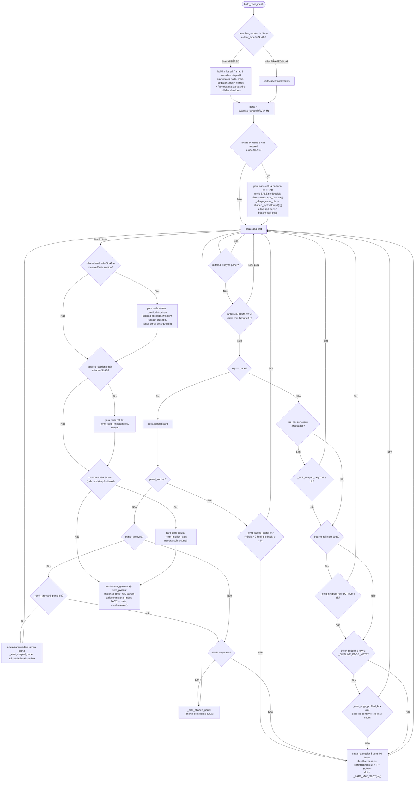

# `door_builder.build_door_mesh` — construção da porta

`blendertomob/product_libraries/common/door_builder.py:1202-1404` 🟢

Assinatura: `build_door_mesh(mesh, info, width, height, thickness, materials=None, outer_section=None,
inner_section=None, panel_section=None, inner_rail_section=None, inner_stile_section=None, member_section=None,
applied_section=None, applied_scope='ALL', panel_grooves=None, mullion=None, shape=None) -> None`
(efeito colateral: substitui a geometria de `mesh`).

Espaço de saída (cutpart local da frente): altura da porta em **+X** a partir da borda inferior, largura em
**−Y** com a borda ESQUERDA em y=0 (cutpart com Mirror Y), face frontal em **z = thickness** 🟢 (`:1208-1215`).
Mapeamento interno de cada emissor: `(x_porta, z_porta, v) → (z_porta, −x_porta, T − v)` 🟢 (`:272-276`, `:369-371`).

## Explicação

- **Três construções** 🟢: *FRAMED* (padrão: montantes/travessas como caixas retangulares, perfil interno como
  **sticking strip aplicado** varrido em volta de cada abertura, `:1363-1376`); *MITERED* (`member_section`:
  todo o membro é um perfil, varrido com meia-esquadria, `:1249-1253`, `:250-321`); *APPLIED* (moldura decorativa
  adicional por abertura, `:1377-1384`, com `applied_scope='RAILS'` só em cima/baixo, `:373-399`).
- **Cadeia de fallback por peça** 🟢: raised → grooved → shaped flat → shaped rail → edge-profiled → caixa simples.
  Toda função emissora devolve `False` quando a geometria não cabe e a peça cai para a caixa simples.
- **Slots de material** 🟢: 0 = stile (inclui slab, mid_stile e barras de mullion), 1 = rail (inclui mid_rail e
  strips de sticking das travessas), 2 = panel (`:232-235`, `:432-433`, `:1050`).
- **Mitered ignora** `shape`, sticking e applied, mas **aceita mullion** 🟢 (`:1267`, `:1366`, `:1379`, `:1385-1388`).
- **Arcos**: o chamador alarga a travessa pelo rise para preservar a largura de catálogo na crista 🟢
  (`:1241-1242`; consumidor `props_hb_face_frame.py` usa `shape_rise`).
- **Z-fighting**: barras curvas escalonadas em profundidade `(i+1)·0.0002 m` 🟢 (`:1045-1050`).
