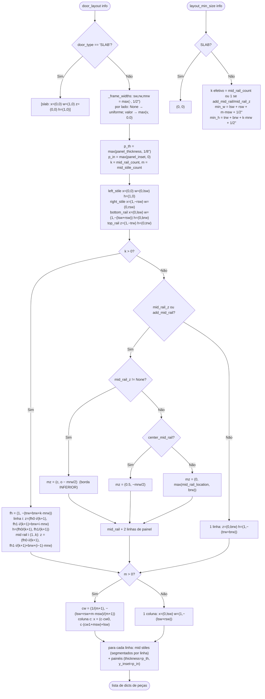

# `door_builder.door_layout` / `layout_min_size` — layout paramétrico da porta

`blendertomob/product_libraries/common/door_builder.py:69-227` 🟢

Todo retângulo de peça é **linear** na largura W ou altura H da porta, como par `(coef, offset)`:
`valor = coef·W + offset` (x/w contra W; z/h contra H) 🟢 (`:14-19`). Isso permite dois realizadores:
estático (`evaluate_layout`, `:215-227`) e com drivers (coifa: compõe os pares em expressões de driver,
`wood_hoods.py:659-749`).

## Explicação

- Precedência do trilho do meio 🟢: `mid_rail_count > 0` vence; senão `mid_rail_z` (par explícito de linha de
  centro) vence `add_mid_rail/center_mid_rail/mid_rail_location` (`:61-65`, `:161-190`).
- Construção de "porta de seis painéis": mid rails correm a largura inteira do campo; mid stiles são
  segmentados por linha de painel e topam nas travessas 🟢 (`:127-130`, `:200-207`).
- Largura por lado 0.0 é honrada (gera membro de largura zero que os realizadores pulam) para portas espelhadas
  que se encostam 🟢 (`:52-55`, `:1303-1304`).
- **Fallback slab**: `layout_min_size` é consumido pela coifa (`wood_hoods.py:729-731`, `:883-886`, `:994-996`,
  `:1304-1307`): se a porta ≤ mínimo, `info = dict(info, door_type='SLAB')`. As frentes de armário usam um
  mínimo PRÓPRIO mais rígido (+1" em vez de +1/2") em `props_hb_face_frame.py` 🟢 — divergência registrada.
