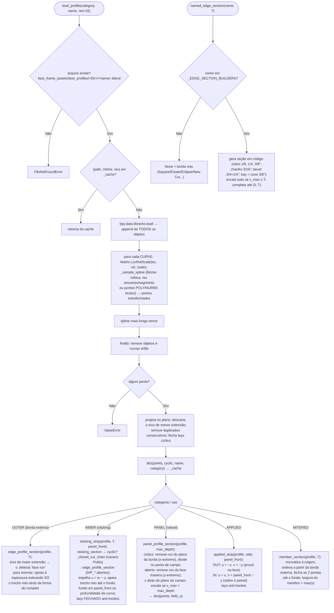

# `door_profiles` — perfis .blend → seções de varredura (u, v)

`blendertomob/product_libraries/common/door_profiles.py` 🟢

Espaço de varredura comum: **u ≥ 0** através da face, medido a partir da borda do membro (para dentro);
**v ∈ [0, thickness]** através da espessura, a partir da face frontal 🟢 (`:12-17`, `:537-540`).

## Explicação

- Diretórios por categoria 🟢 (`:31-37`): OUTER→"Outer Profiles", INNER→"Inner Profiles", PANEL→"Panel Profiles",
  APPLIED→"Applied Profiles", MITERED→"Mitered Profiles"; raiz `face_frame/face_frame_assets/door_profiles`
  (`:27-29`).
- **Cache invalidado por mtime**: editar o .blend do perfil vale no próximo build 🟢 (`:9-10`, `:101-103`).
- **Orientação detectada, não configurada**: a "face run" (trecho sobre um extremo de v) fixa o referencial 🟢
  (`:530-535`, `:564-596`). Porta mais fina que a região moldada → escala todo o eixo v (último recurso) 🟢
  (`:605-607`).
- `_closed_cut_chain` escolhe o canto cujos runs passam pela ORIGEM (desenhos ancoram face/aresta em (0,0)) e
  desempata pelo comprimento combinado 🟢 (`:208-226`).
- `profile_from_object` amostra uma curva da cena (ponteiro do estilo quando "unlock_profiles") usando
  `matrix_world` 🟢 (`:490-522`).
- **Mapeamento série → perfis NÃO está neste módulo**: `SERIES_PROFILES` / `profiles_for_series` ficam em
  `face_frame/style_options.py:5100-5157` 🟢 e apenas nomeiam arquivos desta biblioteca.
