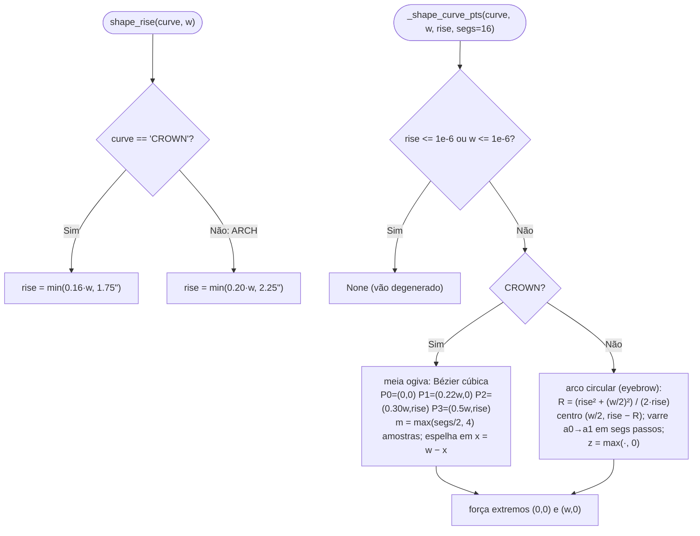
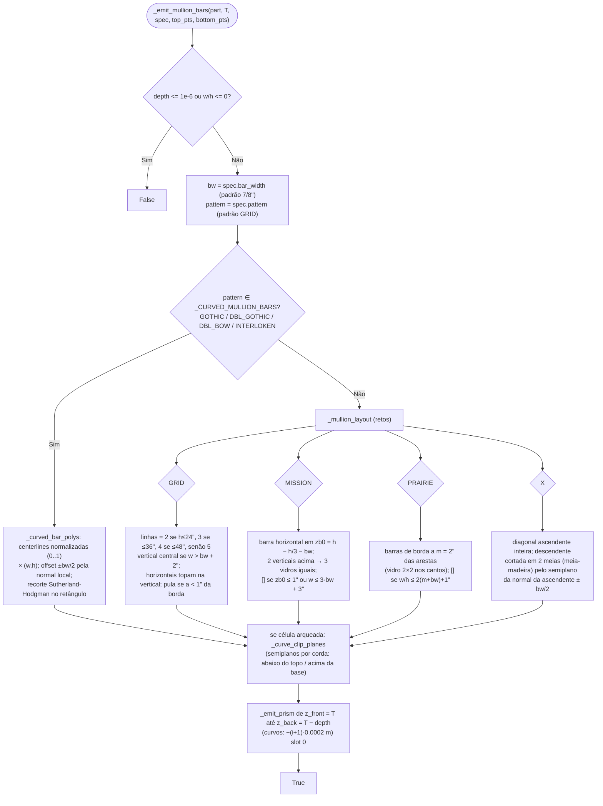

# Mullions (retos e curvos) e arcos Arch/Crown

`blendertomob/product_libraries/common/door_builder.py:574-1051` 🟢

## Arcos (`shape_rise`, `_shape_curve_pts`, `_cell_perimeter`)

- `_cell_perimeter` gera estações anti-horárias a partir do canto inferior esquerdo; a direção de meia-esquadria é
  a bissetriz das normais esticada por `1/(1 + n1·n2)` (limitada a 0.2 no denominador), o que reduz ao clássico
  `(±1, ±1)` num retângulo 🟢 (`:621-657`).
- Quem usa: `_emit_raised_panel` (painel "catedral"), `_emit_strip_rings`, `_emit_shaped_panel`,
  `_emit_shaped_rail`, `_emit_mullion_bars` (recorte) 🟢.
- `SHAPE_KINDS` (em `face_frame/style_options.py`, fora do módulo): Arch, Crown, Double Arch, Double Crown
  (`double` → também na travessa inferior), Twin (`twin` → força 1 mid stile, um arco por vidro) 🟢.

## Mullions (`_emit_mullion_bars`)

## Explicação

- Padrões retos seguem "CWP Enhanced Panel Options" (catálogo pdf 143-144) 🟢 (`:683-693`); curvos foram
  traçados dos desenhos do catálogo (pdf 144) como polilinhas por **segmento** — as barras se dividem nos
  cruzamentos e as pontas são pré-estendidas para serem aparadas pelo recorte 🟢 (`:842-848`).
- Aspectos não uniformes esticam o padrão curvo (escala x·w, z·h) 🟢 (`:981-982`, `:988`).
- O recorte por cordas "sub-preenche" levemente onde a curva é convexa: barras terminam um fio antes em vez de
  atravessar a travessa 🟢 (`:803-805`).
- `bar_width`/`depth` são montados pelo consumidor: `bar_width = inch(PANEL_KINDS[..].get('bar_width', 0.875))`
  e `depth = eff_panel_inset` (o plano do vidro = recuo do painel) 🟢
  (`face_frame/props_hb_face_frame.py:3636-3641`).
