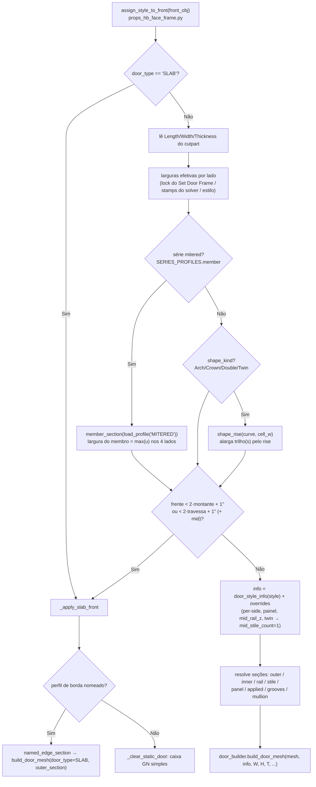
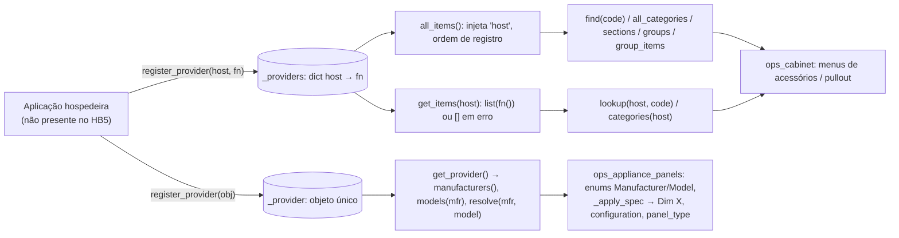

# Fluxogramas — módulo legado `product_common`

Camada legada (fork do Home Builder 5). Arquivos: `blendertomob/product_libraries/common/`
(`door_builder.py`, `door_profiles.py`, `types_appliances.py`, `wood_hoods.py`, `__init__.py`,
`Trash Pull Outs/Generic Trash Pullout.blend`) + `blendertomob/accessory_registry.py` +
`blendertomob/appliance_spec_registry.py`.

Legenda de confiança: 🟢 CONFIRMADO (lido no código) · 🟡 INFERIDO · 🔴 LACUNA.

## 1. Visão geral — quem chama quem

```mermaid
flowchart LR
    subgraph common["product_libraries/common"]
        DB["door_builder.py<br/>layout + malha de porta"]
        DP["door_profiles.py<br/>perfis .blend → seções"]
        TA["types_appliances.py<br/>Appliance + 10 subclasses"]
        WH["wood_hoods.py<br/>coifas de madeira + 3 operadores"]
    end
    AR["accessory_registry.py<br/>host → provider()"]
    AS["appliance_spec_registry.py<br/>provider único"]

    subgraph face_frame["product_libraries/face_frame (consumidor)"]
        PHF["props_hb_face_frame.py<br/>assign_style_to_front / _apply_slab_front"]
        SO["style_options.py<br/>SERIES_FRAME / SERIES_PROFILES /<br/>PANEL_KINDS / SHAPE_KINDS"]
        OC["ops_cabinet.py<br/>pullout / acessórios"]
        OAP["ops_appliance_panels.py<br/>painéis de eletrodoméstico"]
        TFF["types_face_frame.py"]
        OST["ops_styles.py / ops_part_commands.py"]
    end
    subgraph frameless["product_libraries/frameless"]
        FPL["ops_placement.py"]
        FET["props_elevation_templates.py"]
    end
    ADDON["blendertomob/__init__.py<br/>register()"]

    PHF -->|door_style_info, build_door_mesh,<br/>shape_rise, USE_PYTHON_DOORS| DB
    PHF -->|load_profile, sticking_strip,<br/>edge_profile_section, named_edge_section,<br/>panel_profile_section, applied_strip,<br/>member_section, profile_from_object, list_profiles| DP
    SO -. nomes de perfis / padrões de mullion .-> DP
    SO -. famílias ARCH/CROWN, padrões .-> DB
    WH -->|door_style_info, layout_min_size, door_layout| DB
    WH -->|get_style_props, _OVERLAY_TABLE,<br/>assign_style_to_hood (import tardio)| PHF
    WH -->|GeoNodeCutpart / GeoNodeObject| HBT["hb_types.py"]
    WH -->|get_gn_input / set_gn_input / GN_INPUTS_AS_RNA| HBU["hb_utils.py"]
    TA -->|GeoNodeCage| HBT
    TA -->|GeoNodeText| HBD["hb_details.py"]
    TFF --> TA
    FPL --> TA
    FET --> TA
    OST -->|find_hood_root, snapshot_hood_part| WH
    PHF -->|apply_finish_to_hood| WH
    OC -->|categories, get_items, lookup,<br/>all_items, find, sections, groups, group_items| AR
    OAP -->|get_provider → manufacturers/models/resolve| AS
    ADDON -->|wood_hoods.register/unregister| WH
```

🟢 Dependências confirmadas por `grep` (ex.: `product_libraries/face_frame/props_hb_face_frame.py:3184-3208`,
`product_libraries/face_frame/operators/ops_cabinet.py:11`, `.../ops_appliance_panels.py:6`,
`product_libraries/frameless/operators/ops_placement.py:1441-1447`, `blendertomob/__init__.py:54,244,269`).

## 2. Fluxo principal — frente de armário (cabinet front) via motor Python



🟢 `props_hb_face_frame.py:3175-3640` (consumidor, fora do módulo, citado apenas para contexto).

## 3. Fluxo principal — coifa de madeira (wood hood)

```mermaid
flowchart TD
    U1["Menu do eletrodoméstico HOOD"] --> O1["blendertomob.build_wood_hood<br/>(invoke_props_dialog: style)"]
    U1 --> O2["blendertomob.wood_hood_prompts<br/>(W/H/D + style + opções CUSTOM)"]
    O2 -->|check() a cada alteração / execute()| AP["_apply: set Dim X/Y/Z no cage;<br/>se CUSTOM grava WOOD_HOOD_CUSTOM_OPTS"]
    O1 --> BW["build_wood_hood(hood, style)"]
    AP --> BW
    BW --> CL["_clear_hood_parts<br/>(mantém IS_MANUAL_PART)"]
    CL --> SB["_STYLE_BUILDERS.get(style, _build_box)"]
    SB --> BOX["BOX / PENINSULA / SHELF / NICHE / MANTLE /<br/>PLANTATION / GRAND_MANTLE → _build_hood_box (driven)"]
    SB --> ANG["TRADITIONAL / VILLA / CHIMNEY → _build_angled (static mesh)"]
    SB --> SHP["SHIPLAP_* → _build_hood_box + _wrap_shiplap (static)"]
    SB --> CUS["CUSTOM → _build_custom"]
    BOX --> ST["hood['WOOD_HOOD_STYLE'] = style"]
    ANG --> ST
    SHP --> ST
    CUS --> ST
    ST --> RF["_reapply_cabinet_style_finish<br/>(style.assign_style_to_hood se STYLE_NAME)"]

    MK["Make Editable (ops_part_commands)"] --> SN["snapshot_hood_part → JSON em HOOD_PARAMETRIC_SNAPSHOT"]
    O3["blendertomob.revert_hood_part"] --> RS["restore_hood_part: recria modifier GN,<br/>inputs, drivers (migra caminho 5.2), transform"]
```

🟢 `wood_hoods.py:1762-1770`, `1526-1541`, `1773-1801`, `1804-2066`, `2193-2226`, `1635-1759`.

## 4. Fluxo — registries (catálogo externo plugável)



🟢 Nenhum `register_provider` é chamado dentro do repositório (grep) — sem provider, os menus mostram
"(no catalog)" / apenas "Manual" (`ops_cabinet.py:2314-2316`, `ops_appliance_panels.py:399-401`).

## Índice de fluxogramas detalhados

- [`legacy-product_common-build_door_mesh.md`](legacy-product_common-build_door_mesh.md) — construção da porta (obrigatório)
- [`legacy-product_common-door_layout.md`](legacy-product_common-door_layout.md) — layout paramétrico (coef, offset) + mínimo/fallback slab
- [`legacy-product_common-mullions_arcos.md`](legacy-product_common-mullions_arcos.md) — mullions retos/curvos e arcos Arch/Crown
- [`legacy-product_common-door_profiles.md`](legacy-product_common-door_profiles.md) — carga de perfis .blend → seções de varredura
- [`legacy-product_common-build_custom_hood.md`](legacy-product_common-build_custom_hood.md) — coifa CUSTOM (reta vs. inclinada)
