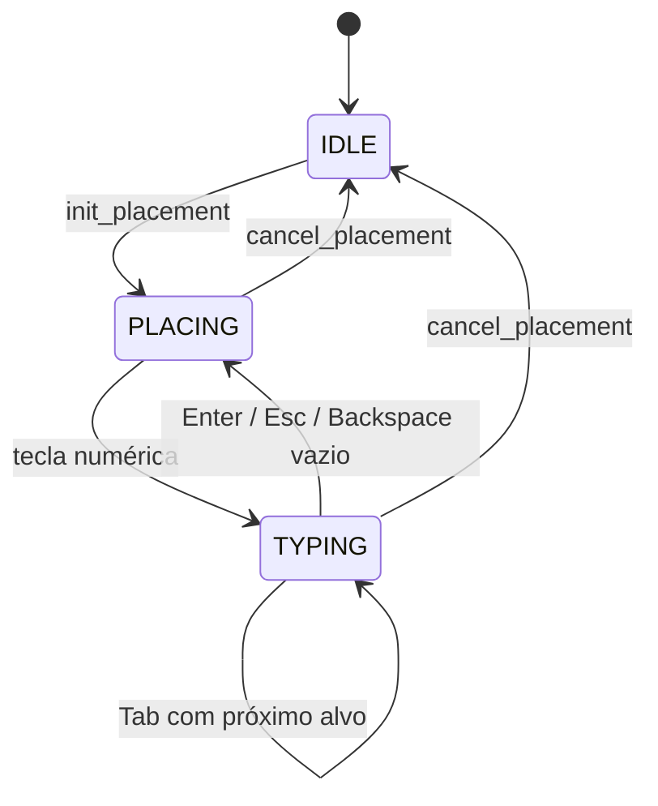

# hb_placement — Design Técnico

> Unit legada (fork do Home Builder 5). Gerado pelo **Writer** (Reversa) em 2026-09-29, nível **detalhado**.
> Complementa [`requirements.md`](requirements.md). Dados em [`data-dictionary-legacy.md#hb_placement`](../data-dictionary-legacy.md).
> Escala: 🟢 CONFIRMADO · 🟡 INFERIDO · 🔴 LACUNA. Caminhos relativos a `blendertomob/`.

## Interface

O módulo não registra classes no Blender. 🟢 Os consumidores herdam os mixins junto de `bpy.types.Operator`.

### `PlacementMixin` (`hb_placement.py:81`)

| Símbolo | Assinatura | Retorno | Observação |
|---------|-----------|---------|------------|
| `init_placement` | `(context)` | — | `PLACING`, alvo `NONE`, buffer vazio, `region = get_region(context)`, `placement_objects = []` (`:115`) 🟢 |
| `register_placement_object` | `(obj)` | — | Objeto a apagar no cancelamento (`:126`) 🟢 |
| `add_placement_dim_handler` / `remove_placement_dim_handler` | `(context)` / `()` | — | `SpaceView3D` WINDOW/POST_PIXEL, idempotentes (`:132-156`) 🟢 |
| `update_snap` | `(context, event)` | — | Região sob o mouse + `hb_snap.main` (`:158`) 🟢 |
| `start_typing` / `stop_typing` | `(target: TypingTarget, initial_value="")` / `()` | — | (`:179-190`) 🟢 |
| `handle_typing_event` | `(event)` | `bool` | `True` se consumiu o evento (`:191`) 🟢 |
| `get_default_typing_target` / `get_next_typing_target` | `()` | `TypingTarget` | Hooks; padrões `LENGTH` / `NONE` (`:252-265`) 🟢 |
| `on_typed_value_changed` / `apply_typed_value` | `()` | — | Hooks; `apply` padrão só chama `stop_typing` (`:267-281`) 🟢 |
| `parse_typed_distance` | `(value_str: str = None)` | `float \| None` (m) | `None` se vazio ou inválido (`:283-336`) 🟢 |
| `get_typed_display_string` | `()` | `str` | Rótulo + buffer (`:390`) 🟢 |
| `cancel_placement` | `(context)` | — | Apaga registrados, `IDLE`, cursor `DEFAULT` (`:410`) 🟢 |
| `get_wall_children_sorted` | `(wall_obj, exclude_obj=None, object_z_start=None, object_height=None)` | `list` | Filhos ordenados por X (`:454`) 🟢 |
| `find_placement_gap` | `(wall_obj, cursor_x, object_width, exclude_obj=None, object_z_start=None, object_height=None)` | `(gap_start, gap_end, snap_x)` | Sem lado; portas/janelas (`:502`) 🟢 |
| `find_placement_gap_by_side` | `(wall_obj, cursor_x, object_width, place_on_front, wall_thickness, object_z_start=None, object_height=None, object_depth=None, exclude_obj=None)` | `(gap_start, gap_end, snap_x)` ou `(None, None, None)` | Versão completa (`:918-1141`) 🟢 |
| `get_adjacent_wall_intrusion` | `(wall_obj, side, object_z_start=None, object_height=None, object_depth=None, place_on_front=True)` | `float ≥ 0` | Invasão da ponta pela parede vizinha (`:672-826`) 🟢 |
| `get_tee_wall_intrusions` | `(wall_obj, place_on_front=True, object_z_start=None, object_height=None)` | `list[(x0, x1)]` | Paredes em T (`:828-915`) 🟢 |
| `compute_gap_holdoffs` | `(wall_obj, gap_start, gap_end, holdoff, place_on_front=True, wall_thickness=0.0, object_z_start=None, object_height=None)` | `(left, right)` | `wall_thickness` não usado (`:1191-1270`) 🟢 |
| `find_cabinet_bp` | `(obj, marker_set=None)` | `Object \| None` | Sobe até `CABINET_MARKERS`; para em `IS_WALL_BP` (`:580`) 🟢 |
| `detect_cabinet_snap_target` | `(hit_obj, hit_location)` | `(Object, 'LEFT'\|'RIGHT')` ou `(None, None)` | (`:608`) 🟢 |
| `compute_cabinet_snap_transform` | `(snap_obj, snap_side, new_object_width)` | `(Vector, Euler)` ou `None` | (`:635-670`) 🟢 |

### `DimensionOperatorMixin` (`hb_placement.py:1360`)

| Símbolo | Assinatura | Retorno | Observação |
|---------|-----------|---------|------------|
| `init_dimension_state` | `()` | — | `FIRST`, pontos `None`, ortho off (`:1381`) 🟢 |
| `add_dimension_draw_handler` / `remove_dimension_draw_handler` | `(context)` / `()` | — | **Não idempotente** ao adicionar (`:1400-1410`) 🟢 |
| `apply_ortho_constraint` | `(point: Vector)` | `Vector` | Relativo a `first_point` (`:1438`) 🟢 |
| `cycle_ortho_mode` | `()` | — | OFF → AUTO → H → V → OFF (`:1463`) 🟢 |
| `handle_dimension_event` | `(context, event)` | `'RUNNING_MODAL' \| 'FINISHED' \| 'CANCELLED' \| 'PASS_THROUGH' \| None` | `None` = subclasse decide (`:1476-1565`) 🟢 |
| `get_snap_point` | `(context, coord: tuple)` | `(Vector \| None, (x, y), is_snapped: bool)` | Abstrato (`:1567`) 🟢 |
| `get_plane_point` | `(context, coord: tuple)` | `Vector \| None` | Abstrato (`:1582`) 🟢 |
| `create_preview_dimension`, `update_dimension_preview`, `finalize_dimension`, `cancel_dimension` | `(context)` | — | Abstratos, `NotImplementedError` (`:1597-1639`) 🟢 |

### Funções de módulo

| Símbolo | Assinatura | Retorno | Observação |
|---------|-----------|---------|------------|
| `duplicate_object_hierarchy` | `(context, source_obj)` | `Object \| None` | Usa `bpy.ops.object.duplicate` (`hb_placement.py:1273`) 🟢 |
| `draw_header_text` / `clear_header_text` | `(context, text)` / `(context)` | — | `area.header_text_set` (`:1343-1358`) 🟢 |
| `draw_dimension_snap_indicator` | `(operator, context)` | — | Callback POST_PIXEL (`:1642`) 🟢 |
| `draw_placement_dimensions` | `(operator, context)` | — | Callback POST_PIXEL (`:1712`) 🟢 |
| `hb_snap.get_region` | `(context, mouse_x=None, mouse_y=None)` | `Region \| None` | Área VIEW_3D sob o mouse (`hb_snap.py:10`) 🟢 |
| `hb_snap.main` | `(self, crtl_is_pressed, context)` | — | Preenche `hit_*`, `view_point`, `hit_grid` (`hb_snap.py:193`) 🟢 |
| `hb_snap.snap_value_to_grid` / `snap_vector_to_grid` | `(value\|vec, unit_settings=None, fine=False)` | `float` / `Vector` | (`hb_snap.py:212-254`) 🟢 |
| `hb_gpu_draw.get_visible_window_bounds` | `(area)` | `(x0, y0, x1, y1)` | (`hb_gpu_draw.py:12`) 🟢 |
| `hb_gpu_draw.draw_rect` / `draw_rect_outline` / `draw_lines` | `(shader, …, color)` | — | (`:66-114`) 🟢 |
| `hb_gpu_draw.draw_text` | `(font_id, x, y, size, color, text)` | — | `blf` (`:88`) 🟢 |

### Tipos

| Tipo | Definição |
|------|-----------|
| `PlacementState` | `Enum`: IDLE, PLACING, TYPING, ADJUSTING (`:34`) 🟢 |
| `TypingTarget` | `Enum`: NONE, LENGTH, OFFSET_X, OFFSET_RIGHT, OFFSET_Y, WIDTH, HEIGHT, DEPTH (`:42`) 🟢 |
| `PlacementDimSpec` | `namedtuple(start: Vector, end: Vector, text: str, color: RGBA \| None)` (`:17`) 🟢 |
| Obstáculo | tupla `(x_start, x_end, obj \| None)` em X local da parede 🟢 |

## Fluxo Principal

### F1. Tick modal típico (consumidor frameless, `product_libraries/frameless/operators/ops_placement.py:1729-1863`) 🟢
1. Ignora `INBETWEEN_MOUSEMOVE`.
2. Setas ↑/↓ alteram a quantidade.
3. `handle_typing_event(event)`; se consumiu, redesenha e retorna `RUNNING_MODAL`.
4. Oculta os previews e chama `update_snap(context, event)` (os previews não interferem no raycast).
5. Identifica a parede: sobe `parent` a partir de `hit_object` até `IS_WALL_BP` com modificador; senão
   `find_nearest_wall_from_cursor`.
6. Na parede: converte `hit_location` para X local, chama `find_placement_gap_by_side` e `compute_gap_holdoffs`, e
   posiciona. Livre: `detect_cabinet_snap_target` + `compute_cabinet_snap_transform`.
7. Atualiza `_placement_dim_specs` e `_facing_arrow_segments` para o desenho.
8. LMB/Enter confirma; RMB/Esc chama `cancel_placement` e remove o handler; MMB/roda → `PASS_THROUGH`.

### F2. Snap de ponto (`flowcharts/legacy-hb_placement-snap_main.md`) 🟢
1. `get_region` acha a área `VIEW_3D` sob o mouse e a primeira região com `.data`; `mouse_pos` em coordenadas da região.
2. `hb_snap.main`: `view_layer.update()`; `scene.ray_cast` pelo centro; se falha ou atinge `HB_CURRENT_DRAW_OBJ`, anel
   de 6 raios a 50 px, vence o hit mais próximo de `view_point`.
3. Hit + Ctrl + MESH: vértices do polígono `hit_face_index` no mesh avaliado → `snap_to_geometry` (vértice < 50 px;
   senão ponto de aresta por busca dicotômica ε 1e-4).
4. Sem hit: plano pela origem (normal Z ou `view_vector` em vista lateral alinhada); Ctrl → cantos da célula de grade
   `10^(round(log10(view_distance)) − 1)`; `hit_grid = True`.

### F3. Digitação (`flowcharts/legacy-hb_placement-handle_typing_event.md`) 🟢
1. Só eventos `PRESS`.
2. `PLACING` + tecla de `NUMBER_KEYS` → `start_typing(alvo ou padrão, caractere)`.
3. `TYPING`: dígito → anexa; Backspace → apaga (vazio → sai); Esc → sai; Enter → `apply_typed_value()`; Tab →
   `apply_typed_value()` e, se houver próximo alvo, `start_typing(próximo)`.
4. A cada mudança, `on_typed_value_changed()`.
5. `parse_typed_distance` aplica RN-05/RN-06 e retorna `None` em `ValueError`/`ZeroDivisionError`.

### F4. Vão por lado (`flowcharts/legacy-hb_placement-find_placement_gap_by_side.md`) 🟢
1. Parede sem modificador → `(None, None, None)`.
2. Filhos: pula `obj_x`, excluído, anotações e snap lines; portas/janelas entram sempre; demais só do mesmo lado
   (`location.y < t/2` = frente).
3. Filtro vertical se `object_z_start` e `object_height` informados.
4. Extensão X pela rotação Z (RN-13).
5. Gabinetes livres na cena: projeta os 4 cantos no espaço da parede; entra se cruza a faixa de profundidade; recorta a
   `[0, L]`; descarta < 1/4".
6. `get_adjacent_wall_intrusion('left'|'right')` → obstáculos virtuais nas pontas.
7. `get_tee_wall_intrusions` → obstáculos virtuais no meio.
8. Snap lines → obstáculo de largura zero.
9. Lista vazia → `(0, L, cursor_x)`. Senão ordena por início e varre: `cursor < x_start` → `gap_end = x_start`; senão
   `gap_start = x_end`. Cursor além do último → `[último.x_end, L]`.
10. `snap_x` por RN-18.

### F5. Intrusão de parede vizinha (`flowcharts/legacy-hb_placement-get_adjacent_wall_intrusion.md`) 🟢
1. Vizinha por `get_connected_wall(side, include_loop_seam=True)`.
2. Laje da vizinha: se protrai para o lado da colocação, a espessura projetada vira intrusão.
3. Gabinetes `CABINET_MARKERS` filhos da vizinha: cantos projetados no espaço desta parede; com filtro vertical;
   intrusão = maior avanço ao longo de X a partir da ponta.
4. Retorna o máximo (≥ 0).

### F6. Recuos (`flowcharts/legacy-hb_placement-compute_gap_holdoffs.md`) 🟢
1. `holdoff ≤ 0` → `(0, 0)`.
2. Para cada borda: se coincide com a ponta da parede (±1/2") → recuo, exceto se `_wall_end_is_inside_corner`;
   se coincide (±1/4") com borda de porta/janela com sobreposição vertical → recuo; senão 0.
3. Se `left + right > vão − 1"`, escala os dois pela mesma razão.

### F7. Encosto gabinete→gabinete 🟢
1. `find_cabinet_bp(hit_obj)` → alvo ou `None` (para em `IS_WALL_BP`).
2. Lado pelo X local do hit versus `DimX/2`.
3. `compute_cabinet_snap_transform`: offset local (LEFT `−nova_largura`, RIGHT `+DimX do alvo`), girado por
   `rotation_euler.z`, somado à localização do alvo; Z e rotação copiados.

### F8. Cota de 3 cliques 🟢
1. `init_dimension_state` + `add_dimension_draw_handler`.
2. `MOUSEMOVE`: `current_point, snap_screen_pos, is_snapped = get_snap_point(...)` (FIRST/SECOND) ou
   `get_plane_point` (OFFSET, `is_snapped = False`); ortho em SECOND se ligado; `update_dimension_preview` em
   SECOND/OFFSET; `update_dimension_header`.
3. `LEFTMOUSE`: FIRST → guarda `first_point`, `create_preview_dimension`; SECOND → `second_point`; OFFSET →
   `offset_point`, `finalize_dimension`, remove handler e header, `'FINISHED'`.
4. `O` → `cycle_ortho_mode`; RMB/Esc → `cancel_dimension`, remove handler e header, `'CANCELLED'`.
5. MMB/roda/numpad → `'PASS_THROUGH'`; demais → `None`.

### F9. Desenho das cotas de posicionamento 🟢
Para cada `PlacementDimSpec`: projeta `start/end` para a região (`location_3d_to_region_2d`); desenha linha e ticks de
6 px com `gpu.shader.from_builtin('UNIFORM_COLOR')`; rótulo em pílula deslocada na perpendicular; depois a seta de
orientação (`_facing_arrow_segments`) em amarelo, 2,5 px.

## Fluxos Alternativos

- **Sem viewport 3D (`get_region` → `None`):** `update_snap` acessa `self.region.x` → `AttributeError`. 🟢
- **`hit_face_index == -1`:** `snap_to_object` indexa `polygons[-1]` (último polígono) do mesh avaliado. 🟡
- **Cursor dentro de um obstáculo:** `gap_start` passa do cursor e o objeto encosta na borda direita do obstáculo. 🟡
- **Obstáculos sobrepostos:** um obstáculo curto depois de um longo que o engloba recua `gap_start`. 🟡
- **Filho sem `mod_name`:** entra com largura 0 (obstáculo pontual). 🟡
- **`Dim X` ilegível no encosto:** `compute_cabinet_snap_transform` retorna `None`. 🟢
- **`duplicate_object_hierarchy` fora da VIEW_3D:** `bpy.ops.object.duplicate` pode falhar no `poll`. 🟡
- **Modal abortado pelo Blender (troca de arquivo):** sem `cancel()`, os handlers ficam registrados. 🟡

## Dependências

- `hb_types` — `GeoNodeObject.get_input('Dim X'|'Dim Y'|'Dim Z')`, `GeoNodeWall.get_input('Length'|'Thickness'|'Height')`,
  `has_modifier`, `get_connected_wall(direction, include_loop_seam=True)`; import local nos métodos. 🟢
- `units` — `inch`, `feet`, `millimeter`, `centimeter`. 🟢
- Blender: `bpy`, `blf`, `gpu`, `gpu_extras.batch.batch_for_shader`, `bpy_extras.view3d_utils`,
  `mathutils` (`Vector`, `Matrix`, `geometry.intersect_line_plane`). 🟢
- Consumidores: `product_libraries/{frameless,face_frame,closets}/operators/*`, `operators/walls.py`,
  `operators/doors_windows.py`, `operators/ops_obstacles.py`, `operators/details.py`, `operators/layouts.py`,
  `operators/scene_navigator.py`, `operators/viewport_hud.py`. 🟢

## Decisões de Design Identificadas

| Decisão | Evidência no código | Confiança |
|---------|---------------------|-----------|
| Mixins Python sem estado RNA (atributos de instância, sem `bpy.props`) | `hb_placement.py:81-156,1360-1398` | 🟢 |
| Hooks sobrescritos pela subclasse (Template Method) para digitação e cota | `:252-281`, `:1567-1639` | 🟢 |
| Vão calculado por varredura 1D de intervalos no X local da parede | `:918-1141` | 🟢 |
| Obstáculos "virtuais" (`obj=None`) para cantos e T, tratados igual a filhos reais | `:1078-1114` | 🟢 |
| Lado da parede decidido apenas por `location.y < t/2` | `:972` | 🟢 |
| Tolerâncias em polegadas (1/2", 1/4", 1", 24") mesmo em projetos métricos | `:1028,1068,1217-1264` | 🟢 |
| Desenho em POST_PIXEL com shader builtin direto (fora de `compat.get_builtin_shader`) | `:1650,1756` | 🟢 |
| Raycast com anel de raios para tolerar mira imprecisa | `hb_snap.py:48-82` | 🟢 |

## Estado Interno

Tudo em atributos de instância do operador (não persistido). 🟢
- `PlacementMixin`: `placement_state`, `typing_target`, `typed_value`, `region`, `mouse_pos`, `hit_location`,
  `hit_object`, `hit_face_index`, `view_point`, `hit_grid`, `placement_objects`, `_placement_dim_handle`,
  `_placement_dim_specs`, `_facing_arrow_segments` (opcional, lido por `getattr`).
- `DimensionOperatorMixin`: `dim_state`, `first_point`, `second_point`, `offset_point`, `current_point`,
  `snap_screen_pos`, `is_snapped`, `ortho_mode`, `ortho_direction`, `_dim_draw_handle`.
- Nos objetos (ID custom props): `_HB_DUP_TOKEN` (temporário); lidos `IS_WALL_BP`, `obj_x`, `IS_2D_ANNOTATION`,
  `IS_SNAP_LINE`, `SNAP_X_POSITION`, `IS_ENTRY_DOOR_BP`, `IS_WINDOW_BP`, `HB_CURRENT_DRAW_OBJ`, marcadores de gabinete.

Máquina de estados:

## Observabilidade

- Sem logs. 🟢
- Feedback ao usuário: texto do header (`draw_header_text`), cotas de posicionamento, seta de orientação e indicador
  de snap desenhados na viewport. 🟢
- Exceções de leitura GN e de remoção de handler são engolidas (sem rastro). 🟢

## Riscos e Lacunas

- 🔴 Origem dos marcadores `HB_CURRENT_DRAW_OBJ`, `IS_SNAP_LINE`/`SNAP_X_POSITION` e `obj_x` (gravados fora do módulo).
- 🔴 Comportamento dos consumidores face_frame e closets não escavado por completo.
- 🟢 Nenhum mixin define `cancel()`; `add_dimension_draw_handler` não é idempotente.
- 🟢 `gpu.shader.from_builtin('UNIFORM_COLOR')` direto (válido no 5.2, mas fora de `compat.py`).
- 🟢 `TRI_FAN`/`LINE_LOOP` ainda válidos no 5.2 (`docs/rag/blender-api/corpus/gpu.types.md`). 🟡 candidatos a remoção futura.
- 🟢 Custo por tick: `view_layer.update()` + varredura de `scene.objects` para T e ilhas.
- 🟡 Sufixos de unidade e frações mistas não são digitáveis por `NUMBER_KEYS` (sem espaço, aspas ou letras); o parser
  completo só é exercido se o consumidor montar a string de outro jeito.
- 🟡 `view_point` do anel é o do último raio, não do vencedor (irrelevante em perspectiva).
