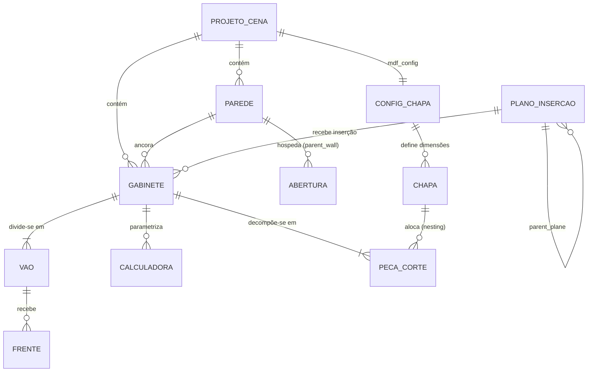

# Alma do Sistema — BlenderToMob

> Síntese executiva do projeto, gerada por `reversa-extract-soul` em 2026-09-29.
> Base: `.reversa/context/surface.json` + amostragem leve de domínio (`data/properties.py`, `hb_props.py`,
> `hb_types.py`, `cutting/part_extractor.py`, `product_libraries/*/types_*.py`) + `git log` (877 commits).
> Nível: **detalhado**. Escala: 🟢 CONFIRMADO · 🟡 INFERIDO · 🔴 LACUNA.

## 1. Propósito

O BlenderToMob é uma extensão do Blender 5.2 🟢 (`blender_manifest.toml`) que **projeta ambientes de interiores e móveis de
marcenaria paramétricos** — paredes, pisos, portas/janelas, armários, closets, molduras — e **gera a produção** a partir
do projeto: lista de peças, plano de corte otimizado em chapas de MDF e exportação JSON 🟢 (`cutting/`). Atende
**marceneiros e projetistas de móveis planejados no Brasil** 🟡 (UI em pt-BR, `data/i18n.py`, unidades em mm, chapa
padrão 2750×1830 mm, referência explícita ao Promob no README). O valor entregue é oferecer um fluxo "estilo Promob"
**gratuito e aberto (GPL-3.0)** 🟢 sobre o Blender, aproveitando renderização e modelagem nativas 🟡. Tecnicamente, o
produto é um *fork* do **Home Builder 5** (Andrew Peel, 838 dos 877 commits) 🟢 com uma camada nova `btm_*` para
paredes, planos de inserção, módulos e corte 🟢 (`c90aa8e`, `5f07bf5`).

*English summary:* a Blender 5.2 extension for parametric interior design and cabinetry, forked from Home Builder 5 and
localized for Brazilian woodworkers, that turns a 3D room layout into a cut list and an optimized MDF sheet-nesting plan.

## 2. Entidades centrais

O sistema tem **duas camadas de modelo que convivem** 🟢 (`__init__.py` importa "modern modules" e "legacy modules"):

- **Camada Home Builder (legada, `hb_*` / `product_libraries/`)**: objetos são "gaiolas" de Geometry Nodes
  (`GeoNodeObject` → `GeoNodeCage`) com propriedades em `obj.home_builder` e hierarquia via parentesco.
- **Camada BlenderToMob (moderna, `data/properties.py`)**: `PropertyGroup`s `BTM_PG_*` presos em `Object.btm_*` e
  `Scene.btm_settings`.

| # | Entidade | O que representa | Relações diretas | Confiança |
|---|----------|------------------|------------------|-----------|
| 1 | **Projeto / Cena** (`Scene.home_builder`, `Scene.btm_settings`) | O cômodo em projeto e suas configurações globais (materiais, espessuras, cotas, chapa) | 1:N Parede · 1:N Gabinete · 1:1 Configuração de Chapa · 1:6 Config. de Componente | 🟢 |
| 2 | **Parede** (`GeoNodeWall` + `BTM_PG_WallSegment` em `Object.btm_wall`) | Segmento reto com início, fim, espessura e pé-direito; encadeado em polilinha | N:1 Cena · 1:N Abertura · 1:N Gabinete (ancorado) · N:1 Piso (contorno) | 🟢 |
| 3 | **Abertura** (`BTM_PG_OpeningProperties`, `operators/doors_windows.py`) | Porta ou janela recortada na parede por booleana | N:1 Parede (`parent_wall`) | 🟢 |
| 4 | **Plano de Inserção** (`BTM_PG_InsertionPlane` em `Object.btm_plane`) | Face (piso, parede, módulo) que serve de âncora para inserir novos itens; `object_kind` classifica o objeto | N:1 Plano pai (`parent_plane`) · 1:N itens inseridos | 🟢 |
| 5 | **Gabinete / Módulo** (`Cabinet`, `FaceFrameCabinet`, closets; `BTM_PG_CabinetProperties`) | Móvel paramétrico (balcão, aéreo, torre, closet, cômoda) com largura/altura/profundidade | N:1 Parede · 1:N Vão · 1:N Frente · 1:N Peça | 🟢 |
| 6 | **Vão / Divisão** (`CabinetBay`, `SplitterVertical`, *bay presets*) | Subdivisão interna do gabinete que recebe portas, gavetas, prateleiras | N:1 Gabinete · 1:N Frente | 🟢 |
| 7 | **Frente (Porta/Gaveta)** (`GeoNode5PieceDoor`, `GeoNodeDrawerBox`, `door_builder.py`) | Porta ou gaveta com perfil, construção (moldura/almofada/vidro) e puxador | N:1 Vão · 1:1 Puxador · N:1 Perfil de porta | 🟢 |
| 8 | **Peça de Corte** (`GeoNodeCutpart` na camada legada; `NestingPart` na moderna) | Painel retangular de produção (lateral, base, fundo, prateleira, porta) com espessura, material e veio | N:1 Gabinete · N:1 Chapa (após nesting) | 🟢 |
| 9 | **Chapa** (`NestingSheet`, `BTM_PG_MDFSheetConfig`) | Chapa de MDF/MDP com refilo e kerf na qual as peças são encaixadas | 1:N Peça de Corte | 🟢 |
| 10 | **Calculadora / Prompt** (`Calculator`, `Calculator_Prompt` em `hb_props.py`) | Variáveis paramétricas por objeto que distribuem medidas (ex.: altura igual de gavetas) via drivers | N:1 Objeto (Gabinete/Vão) | 🟢 existe · 🟡 papel central |

### Diagrama de relações

## 3. Decisões fundadoras

### D1. Construir sobre o Blender como add-on Python, e não como aplicativo CAD próprio
- **Evidência:** `blendertomob/blender_manifest.toml` (`type = "add-on"`, `blender_version_min = "5.2.0"`); ponto de
  entrada único `blendertomob/__init__.py`.
- **Implicação:** o ciclo de vida é o `register()`/`unregister()` do Blender; todo estado vive em `bpy.types.*`
  (`PropertyGroup`, `PointerProperty`) e é salvo no `.blend`. Não há banco de dados, servidor nem threads tocando `bpy`.
  Cada versão do Blender pode quebrar a API — daí `compat.py`, o RAG em `docs/rag/` e o `check_api.py`. O código fica
  preso ao ritmo de versões do Blender e ao Python embarcado.
- **Confiança:** 🟢

### D2. Ser um *fork* do Home Builder 5 em vez de começar do zero
- **Evidência:** 838/877 commits de Andrew Peel (`7cb90bf` "Initial commit", 2025-12-04, seguido de "Start Migration");
  a camada BlenderToMob começa em `c90aa8e` (2026-07-22, "migracao completa para Blender to Mob") e `5f07bf5`
  ("Reintegrate legacy Home Builder 5 product libraries…").
- **Implicação:** o sistema herda bibliotecas de produto maduras (face frame, frameless, closets, portas por catálogo
  CWP), nomenclatura americana (*face frame*, *bay*, *hutch*) e o namespace `home_builder`/`hb_*`. Em contrapartida,
  convive com **duas camadas de modelo** (D5), com raízes de código duplicadas (a cópia espelhada na raiz do repositório,
  que não entra no pacote) e com uma sequência longa de correções de registro/recarga (`6effddf` … `c980b70`,
  achados A011–A018). A migração da camada legada para `btm_*` está **incompleta**.
- **Confiança:** 🟢

### D3. Modelar geometria paramétrica com Geometry Nodes guardados em `.blend`, dirigidos por drivers
- **Evidência:** `blendertomob/geometry_nodes/*.blend` (Wall, Cage, Cutpart, 5PieceDoor, DrawerBox, Dimension…);
  `hb_types.GeoNodeObject.create()` carrega o grupo de nós via `bpy.data.libraries.load` e cria um modificador `NODES`;
  `hb_driver_functions.py` e `Calculator` para medidas encadeadas.
- **Implicação:** a lógica de forma fica **fora do Python**, dentro de assets binários que só o Blender edita; a
  interface entre código e geometria são os *sockets* dos modificadores, cujo endereçamento mudou no 5.2 — por isso
  a regra de usar só `compat.get_gn_input`/`set_gn_input`/`gn_input_data_path` (CLAUDE.md). Mudanças de medida
  propagam por drivers, e não por reconstrução; depurar exige abrir o nó no Blender. Não dá para testar a geometria
  sem o Blender em execução.
- **Confiança:** 🟢

### D4. Usar modais interativos com *snapping* no viewport como principal forma de interação
- **Evidência:** `hb_snap.py`, `hb_placement.py`, `hb_gpu_draw.py`, `overlays/`, `operators/walls.py`,
  `operators/doors_windows.py`; primeiros commits "Migrate Door and Window Placement", "Migrate Cabinet Placement"
  (`23b6371`, `19de91b`); ADR `adrs/0001-modal-operator-snapping.md`.
- **Implicação:** o usuário "desenha" paredes e "arrasta" módulos em vez de preencher formulários; isso exige
  operadores modais com handlers GPU (`draw_handler_add`) que precisam ser removidos em todos os caminhos de saída,
  raycast na cena e máquinas de estado de posicionamento (`state-machines.md`). É a parte mais sensível a *crash* e a
  mudanças de API.
- **Confiança:** 🟢

### D5. Criar a camada `btm_*` em paralelo à `home_builder`, sem substituí-la
- **Evidência:** `data/properties.py` registra `Object.btm_wall/btm_plane/btm_opening/btm_cabinet` e
  `Scene.btm_settings`, enquanto `hb_props.py` registra `Object/Scene/WindowManager.home_builder`; `__init__.py`
  separa "Import modern modules" de "Import legacy modules"; `f84ba15` ("use registered Home Builder properties in
  legacy workflows").
- **Implicação:** o mesmo conceito (parede, gabinete) pode existir em duas representações. A camada moderna é a
  "voz" em pt-BR, com unidades em mm e produção; a legada, o motor de produto. Cada nova funcionalidade precisa decidir
  em qual camada se apoiar, e as pontes entre elas são poucas (ver lacuna L1).
- **Confiança:** 🟢 (a existência) · 🟡 (a intenção de coexistência permanente vs. migração gradual)

### D6. Otimizar o corte com heurística guilhotinada por prateleiras (Next-Fit Decreasing), em Python puro
- **Evidência:** `cutting/nesting.py` (`optimize_nesting`, `_can_fit_in_shelf`, `_can_create_shelf`), refilo, kerf e
  veio como parâmetros; `ff10e80` (2026-08-14); ADR `adrs/0002-nested-cutlist-algorithm.md`.
- **Implicação:** o plano de corte é **determinístico, rápido e sem dependências externas** (roda dentro do Blender),
  compatível com seccionadoras de corte guilhotinado, mas não é ótimo — aceita desperdício maior que algoritmos
  *maxrects*/*skyline* ou solvers MIP. A saída é JSON (`json_exporter.py`) e não há integração direta com máquinas.
- **Confiança:** 🟢

### D7. Localizar para o mercado brasileiro: pt-BR, milímetros e vocabulário de marcenaria local
- **Evidência:** `data/i18n.py`, `data/units.py`, `units.py`; `c90aa8e` ("suporte a metros … i18n pt-BR"); UI com abas
  CONSTRUTOR / GALERIA / CONFIGURAÇÕES (`5f07bf5`); `BTM_PG_SceneSettings.config_lateral/divisoria/base/fundo/
  prateleira/porta`; regra do CLAUDE.md "Textos de UI e comentários novos em português".
- **Implicação:** as regras de produção (espessuras de 15/6/18 mm, chapa 2750×1830 mm, refilo de 10 mm, kerf de 4 mm)
  seguem o padrão brasileiro de MDF, enquanto as bibliotecas herdadas pensam em polegadas e no padrão americano
  (*face frame*). A conversão de unidades vira responsabilidade transversal.
- **Confiança:** 🟢 (i18n, unidades) · 🟡 (público-alvo)

## 4. Lacunas

- 🔴 **L1 — Plano de corte ignora a camada legada.** `cutting/part_extractor.py` só processa objetos com
  `btm_plane.object_kind == 'MODULE'` e **sintetiza** as peças a partir de largura/altura/profundidade, sem ler as peças
  reais (`GeoNodeCutpart`) dos gabinetes do Home Builder. *Pergunta:* gabinetes das bibliotecas `face_frame`/`frameless`/
  `closets` devem entrar no plano de corte? Se sim, a fonte de verdade deve ser o `GeoNodeCutpart`?
- 🔴 **L2 — Rumo da convivência entre as duas camadas.** *Pergunta:* a meta é migrar tudo para `btm_*`, manter o Home
  Builder como motor de produto por tempo indeterminado ou aposentar a camada `btm_*` de gabinete?
- 🔴 **L3 — Specs anteriores subestimam a camada legada.** `domain.md` e `code-analysis.md` descrevem principalmente
  os 6 módulos modernos (`data`, `geometry`, `operators`, `overlays`, `ui`, `cutting`); `product_libraries/`, `catalog/`,
  `molding/` e os `hb_*.py` (a maior parte do código) não têm unidade de spec própria. `domain.md` §3 afirma ainda que "não
  há repositório Git" — hoje há 877 commits. *Pergunta:* reexecutar o Archaeologist/Writer para essas pastas?
- 🔴 **L4 — Destino da produção.** *Pergunta:* o JSON de corte alimenta qual ferramenta ou máquina (seccionadora,
  CorteCloud, planilha)? Há formato-alvo (ex.: CSV de otimizadores nacionais) a suportar?
- 🟡 **L5 — Licença e atribuição.** O manifesto declara GPL-3.0-or-later, compatível com o fork; confirmar que a
  atribuição ao Home Builder 5 e ao autor original aparece no `LICENSE`/README distribuído.

## 5. Como ler este documento

Este `soul.md` é uma síntese e não substitui:
- `inventory.md` (Scout) — mapeamento de superfície
- `code-analysis.md` e `flowcharts/` (Archaeologist) — detalhes módulo a módulo
- `domain.md`, `state-machines.md` e `adrs/` (Detective) — regras de negócio e decisões pontuais
- `architecture.md`, `c4-*.md` e `erd-complete.md` (Architect) — diagramas C4 e ERD completo
- `<unit>/requirements.md|design.md|tasks.md` (Writer) — specs executáveis
